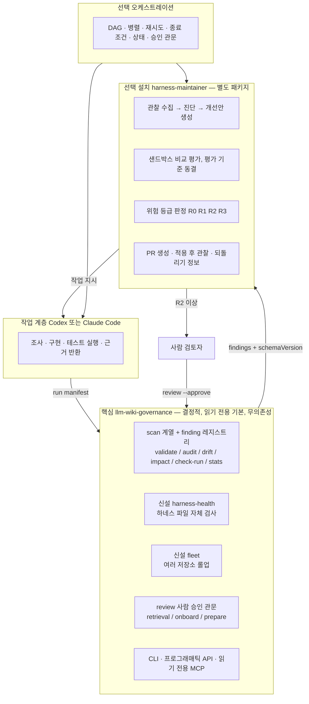
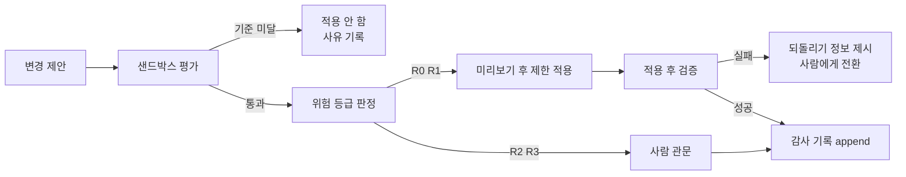

# 자기관리형 하네스 거버넌스 로드맵

> 이 문서는 2026-07-31 조사 결과에 기반한 **제안**입니다. 대부분은 아직 승인되지 않았습니다. 다만 **Phase 1의 `harness-health`는 2026-08-03에 승인돼 구현·배선까지 끝났습니다**(결정 27번 권고 (b) 채택; `fleet`은 보류). 나머지 Phase는 여전히 제안입니다.
> 이 문서의 `status`는 프론트매터가 정본입니다. 확정된 계획으로 인용하기 전에 해당 절의 근거 등급을 보십시오.
> 이미 배포된 기능의 이력은 `CHANGELOG.md`, 릴리스별 계획은 `ROADMAP.md`, 게이트 결정은 `GATE_REVIEW.md`가 소유합니다. 이 문서는 그 위에 얹는 **제품 방향** 문서입니다.

> **2026-08-03 전제 변경 — 이 문서를 읽는 두 가지 방식.** 이 저장소는 같은 날 위키 문서의 확인·승격·드리프트 해소를
> 에이전트에게 넘겼습니다(`AGENTS.md` "Wiki discipline"이 정본). 이 로드맵은 그 전에 쓰였고 **"`verified`는 사람이
> 확인했다는 뜻이다" · "복구 수단은 사람의 재승인뿐이다" · "이 저장소에서 게이트 발화를 관측할 수 있다"** 세 전제 위에
> 서 있습니다. 셋 다 이 저장소에서는 더 이상 참이 아니고, **도입처에서는 전부 그대로 참입니다.**
>
> 그래서 본문은 두 종류로 나뉩니다. **표준 규칙을 서술하는 문장**(불변 조건 목록, R3 표, 용어 사전, 위험 등록부,
> 백로그 33, G-3 안전 지표)은 이 배치에서 제자리 교정했습니다. **과거 관측·측정을 기록하는 문장과 숫자**는 그때
> 참이었던 역사적 기록이므로 **고치지 않았습니다** — 대신 오늘의 결정에 다시 쓰이는 숫자에는 그 자리에 무효 표시를
> 달았습니다(주로 A-3b 기준선, 백로그 17의 +65건, 팬아웃 표의 verified 열). 숫자를 인용하기 전에 그 표시를 확인하십시오.
>
> **가장 무거운 대가: 이 저장소는 이제 `evidence.stale`·`impact` 게이트의 관측 장소가 아닙니다.** 두 게이트는 매 배치
> 끝의 스윕으로 항상 초록이 되므로, 이 로드맵이 요구하는 측정 중 그 발화량에 의존하는 것은 **도입 저장소에서 수행해야
> 합니다.** 이 한 문장이 결정 21·24·27·28번의 선행 조건을 전부 다른 저장소로 옮깁니다.

## 0. 읽는 방법과 근거 등급

각 장은 **쉬운 설명** 한 문장으로 시작합니다. 그 아래가 기술적 설계입니다.

모든 주장에 다음 등급을 붙입니다.

- **확인됨** — 소스 파일, 명령 실행 결과, 또는 git diff로 직접 확인했습니다.
- **정황상 추정됨** — 여러 정황은 있지만 직접 기록은 없습니다.
- **확인할 수 없음** — 판단할 근거가 없습니다.
- **needs confirmation** — 사람의 결정이나 추가 측정이 필요합니다.

측정하지 않은 개선 효과는 주장하지 않습니다. 토큰·속도 헤드라인 금지 정책은 이 문서에서도 유지됩니다(근거: `BENCHMARK.md`).

---

## A. 현재 상태 요약

> 쉬운 설명: 지금 이 도구는 **문서가 낡았는지 꽤 잘 찾아냅니다.** 문제는 찾아낸 것이 아무것도 막지 못한다는 점입니다.

### A-1. 실제 역할 (확인됨)

`llm-wiki-governance`는 AI가 쓴 프로젝트 문서를 **검증하고, 드리프트를 감지하고, CI에서 강제할 수 있게 하는** 무의존성 Node CLI입니다. 자기 자신에게 적용(dogfooding)되어 있고, 실사용 저장소 4곳에도 적용되어 있습니다.

- CLI 명령 29개(디스패치 맵 28 + `mcp` 특수 처리), 프로그래매틱 동결 맵 28키, MCP 도구 17개(전부 읽기 전용)
- finding 레지스트리 54룰 + 레지스트리 미등록 발행 8종
- 런타임 의존성 0, devDependency 0, Node 하한 `>=18.18.0`
- 테스트 393건(9파일), `node --check` 구문 게이트, CodeQL

### A-2. 이미 제공되는 감지·검증·갱신 기능 (확인됨)

| 축 | 수단 | 근거 |
| --- | --- | --- |
| 문서 계약 | frontmatter 필수 13필드·enum·날짜 형식·중복 키 | `src/frontmatter.js`, `src/frontmatter-schema.js` |
| 근거 무결성 | `source_files`/`evidence`의 파일·라인·심볼·섹션 실재 확인 | `src/commands/scans.js` |
| 낡음(날짜 앵커) | `evidence.stale` — 리뷰 기준일 이후 참조 소스가 커밋됨 | `src/commands/scans.js#symbol:verifiedSourceAnchors` |
| 낡음(diff 앵커) | `impact.source_changed` — 소스는 이 diff에 있고 문서는 없음 | 같은 앵커 추출기 공유 |
| 완료 계약 | run manifest + `check-run`의 `run.*` 6룰 | `src/commands.js#symbol:checkRunCommand` |
| 사람 승인 | `review`(기본 읽기 전용, `--approve-all`에 `--yes` 강제, blocked/error 있으면 거부, 리뷰 스탬프만 = `status`·`reviewed_by`·`reviewed_at` + 이미 있는 경우 `tags` 상태 태그) | `src/commands.js` |
| 위험 다이얼 | `rules` 토글 + `rulesPreset` 3종, 민감 카테고리는 비토글 | `src/commands/findings.js#symbol:RULE_PRESETS`, `#symbol:NON_TOGGLEABLE_CATEGORIES` |
| 기계적 자동수정 | Tier A frontmatter 필드, `## Evidence` 정합, 깨진 링크 stub, block version 스탬프 | `src/commands/fix-migrate.js#symbol:runMechanicalRemediation` |
| 사용자 수정 보호 | 생성 스킬의 sha256 마커 — 한 글자만 고쳐도 영구 보존 | `src/commands/skills.js#symbol:isManagedUnmodified` |
| 에이전트 표면 | MCP가 쓰기 옵션을 **구조적으로 만들지 않음** | `src/mcp/tools.js#symbol:buildToolOptions` |
| 측정 | 프록시 벤치 + 실측 SDK 벤치 + 통제 arm | `BENCHMARK.md` |

### A-3. 기준선 실측 (2026-07-31, 확인됨)

자기 저장소:

- `stats`: 문서 51, health 77/100, verified 16(31%), needs_review 35, orphan 35
- `validate --strict`: finding 1건(`GLOSSARY.md`의 `evidence.stale`) → exit 1. **직전 커밋이 만든 진짜 드리프트를 도구가 스스로 잡았습니다.**
- `review`: needs_review 34건이 전부 `approvable` / `risk 0` / `findings 0` — 그중 33건이 릴리스 노트
- 선적재 하네스 footprint: 약 8.9k 토큰(chars/4 프록시, 진단용)

실사용 저장소 4곳:

| 저장소 | 브랜치 | 문서 | verified | health | run manifest | CI 강제 |
| --- | --- | --- | --- | --- | --- | --- |
| `sinkholemonitor-frontend` | `dev` | 22 | 22(100%) | 100 | 30(커밋됨) | 없음 |
| `roadmonitor-frontend` | `dev` | 33 | 33(100%) | 100 | 5 | 없음 |
| `csap-roadkeeper-frontend` | `aws-global` | 22 | 15(68%) | 86 | 15 | 없음 |
| `dotnine-project` | `main` | 22 | 12(55%) | 85 | 1 | 없음 |

형제 디렉터리 23개 중 위키를 가진 곳은 4곳입니다. **4곳 전부 `ci_governance: none detected`** — 4곳에서 직접 실행해 확인했습니다.

### A-3b. Phase 0 완료 시점 기준선 (2026-07-31, 읽기 전용 실측)

Phase 0 완료 조건인 "기준선 수치가 문서에 기록됨"을 채우는 값입니다. 전부 읽기 전용 측정이며, 도입 저장소에는 **아무것도 쓰지 않았습니다**(게이트 도입 후 초록 유지 여부 검증은 유지보수자 지시로 생략 — 별개 항목입니다).

자기 저장소:

| 항목 | 값 | 비고 |
| --- | --- | --- |
| `stats` | 문서 52, health 78/100, verified 17(33%), needs_review 35, orphan 35 | Phase 0 이전(51/77/16/35/35) 대비 문서 1건 증가 |
| `validate --strict` | 6건, 전부 `evidence.stale` | 사람 재기준선 대기분. **커밋 전 5건 → 커밋 후 6건**(`evidence.stale`은 git log를 보므로 미커밋 변경이 안 보임) |
| `ci_governance` | **4 blocking, 7 advisory — omission gate present** | Phase 0 이전에는 "1 found"(빈 임시 디렉터리를 검사하는 호출) |
| `needs_review` 경과일 | median 15일, mean 13일, 최장 17일 | **35건 중 31건이 릴리스 노트**(구조적 잔여). 실질 백로그는 4건 |
| 선적재 footprint(항상 로드) | **~1.44k 토큰** (CLAUDE.md 281 + index 428 + project-profile 736) | chars/4 프록시, 진단용 |
| 하네스 표면 전체(온디맨드 포함) | ~13.6k 토큰 (어댑터 1.0k + 스킬 12종 12.6k) | 스킬은 요청 시 로드 — 선적재가 아님 |
| run manifest | 11건 (gitignored) | 커밋 이력 0 |

> A-3의 "약 8.9k 토큰"과 위 두 수치는 **분모가 다릅니다**(무엇을 선적재로 셀지가 다름). 개선폭으로 비교하지 마십시오 — 앞으로는 위 두 줄(항상 로드 / 온디맨드 포함)을 기준으로 씁니다.

실사용 저장소 4곳(읽기 전용 재측정, 이번 라인에서 건드리지 않았으므로 A-3과 동일):

| 저장소 | 문서 | verified | health | needs_review | 경과일 median | 선적재 | 스킬 | manifest | ci_governance |
| --- | --- | --- | --- | --- | --- | --- | --- | --- | --- |
| `sinkholemonitor-frontend` | 22 | 22(100%) | 100 | 0 | — | ~3.8k | 6종 6.2k | 30(커밋됨) | **none detected** |
| `roadmonitor-frontend` | 33 | 33(100%) | 100 | 0 | — | ~1.9k | 12종 13.4k | 5 | **none detected** |
| `csap-roadkeeper-frontend` | 22 | 15(68%) | 86 | 7 | 1일 | ~3.4k | 12종 13.2k | 15 | **none detected** |
| `dotnine-project` | 22 | 12(55%) | 85 | 10 | 4일 | ~1.9k | 3종 2.1k | 1 | **none detected** |

이 측정에서 새로 드러난 사실 3가지:

1. **4곳 전부 여전히 `none detected`이고, 이제 그것은 더 강한 진술입니다.** 판정 기준이 "호출 존재"에서 "차단력"으로 바뀐 뒤에도 none이라는 것은, 자문용 호출만 있는 상태가 아니라 **문자 그대로 아무것도 없다**는 뜻입니다.
2. **도입 저장소의 선적재가 우리보다 큽니다**(sinkholemonitor ~3.8k, csap ~3.4k vs 우리 ~1.44k). 주범은 `index.md`입니다 — sinkholemonitor 2106 토큰 vs 우리 428. 1.27.2의 선적재 축소가 **우리 저장소에만 적용됐고 도입 저장소로 전파되지 않았다**는 뜻이며, 어댑터·진입 문서에 갱신 경로가 없다는 공백 5와 같은 뿌리입니다.
3. **"방치된 `needs_review`"는 현재 실측상 문제가 아닙니다.** csap 1일, dotnine 4일이고 우리 쪽 median 15일도 31/35가 릴리스 노트입니다. 백로그 11번(`needs_review` 드리프트 감시)의 근거를 이 수치가 **약화**시킵니다 — 우선순위를 낮출 근거입니다.

### A-4. 확인된 한계 — 5가지 구조적 공백

#### 공백 1: 경보기는 있는데 벨이 안 울린다 (확인됨)

누락(코드는 바뀌고 문서는 안 바뀜)을 exit code로 막는 명령은 `impact --since --strict` 하나입니다. 그런데 배포되는 도입 아티팩트 4종 전부 그것을 실행하지 않습니다.

| 채널 | 실제 실행 명령 | 누락 차단 |
| --- | --- | --- |
| `templates/git-hooks/pre-commit` | `validate --changed`(`--strict` 없음) | 불가 |
| `.github/actions/validate/action.yml` | `validate` 인자 배열 하드코딩 | 불가(다른 명령 실행 자체가 불가) |
| `templates/github-actions/llm-wiki-validate.yml` | `validate-frontmatter`, `validate --strict` | 불가 |
| `.github/workflows/ci.yml` | `validate-frontmatter`, `doctor` | 불가 |

`validate --changed`는 finding의 문서 경로로 필터하므로 "문서를 아예 안 고친" 누락을 원리적으로 볼 수 없습니다.

더 나쁜 점: `doctor`의 `ci_governance` 점검이 자기 저장소를 `1 found`로 보고합니다. 정규식에 걸리는 두 줄은 `consumer-install` 잡이 **빈 임시 디렉터리**를 대상으로 돌리는 tarball 스모크 테스트입니다. 나머지 스텝은 `node bin/llm-wiki.js` 형태여서 정규식에 걸리지 않습니다. 즉 **자기 위키를 검사하지도 않는 호출을 게이트로 오인**합니다(`src/commands.js#symbol:describeCiGovernance`). 없는 게이트를 있다고 보고하는 것은 안전하지 않은 방향이며, 이 기능은 아직 미릴리스라 지금 고칠 수 있습니다.

#### 공백 2: 낡음 판정이 `verified` 문서에만 걸려 있다 (확인됨)

`verifiedSourceAnchors`는 `status`가 `verified`가 아니면 즉시 `null`을 반환합니다. `drift`와 `impact`가 **둘 다** 이 함수에서 나옵니다.

- 자기 저장소는 51문서 중 35(69%)가 `needs_review` → 드리프트 감시 대상 밖입니다.
- 역설: `drift --downgrade`로 강등하면 그 문서는 **감시 대상에서 빠집니다.** 안전한 방향의 조치가 관측을 끕니다.
- `rulesPreset: strict`는 `impact.source_changed`를 승격하지 않습니다. "strict"라는 이름의 프리셋이 누락·신선도 규칙을 warning으로 둡니다.

#### 공백 3: "verified는 사람만"이 계약이 아니라 관례로 지켜진다 (확인됨 — **이 저장소에서는 2026-08-03에 전제가 제거됨**)

파일럿 저장소에서 실제로 깨진 사례를 찾았습니다.

- 커밋 `a61691c`(제목이 API 수정인 커밋)가 도메인 문서 하나를 `needs_review`에서 `verified`로 되돌렸고, `reviewed_by`/`reviewed_at`은 변경되지 않았습니다. git diff로 직접 확인했습니다.
- 같은 저장소의 매니페스트 하나는 5건의 승격을 `docStatusChanges` 배열의 자유 텍스트 필드로 기록합니다. 그런데 `check-run`이 읽는 필드는 `task`/`changedSource`/`touchedDocs`/`logAppended`/`validated`/`testEvidence`뿐입니다 — **그 승격 기록은 아무도 검증하지 않습니다.**
- 도구는 `review --approve` 경로만 스탬프하지만, frontmatter를 직접 편집하는 우회 경로를 막거나 탐지하지 않습니다. 실사용에서 그 경로가 쓰였습니다.

#### 공백 4: 제안자와 검증자가 이미 같다 (확인됨)

run manifest는 에이전트가 스스로 씁니다(Gate 26에서 "새 쓰기 표면을 만들지 않는다"는 이유로 의도적으로 결정된 사항).

- `changedSource`를 빈 배열로 신고하면 `run.doc_gap`은 원리적으로 뜰 수 없습니다.
- `testEvidence` 계약이 실제로 검사하는 것은 red/green **두 개의 비어 있지 않은 문자열의 존재**뿐입니다. 값의 진위, 형식, 실행 여부는 전혀 검증하지 않습니다.
- Gate 26이 근거 목록에 적은 `changedFiles`와의 교차검증(`src/git.js#symbol:changedFiles`)은 **구현되지 않았습니다.**
- `check-run`은 매니페스트를 **파일명 사전순 마지막**으로 고릅니다. 파일명이 `run-<task>-<타임스탬프>` 형태라 **task 이름이 타임스탬프를 지배**합니다. 실측: 자기 저장소 매니페스트 6개 중 수정시각 최신은 2026-07-30 것인데 `check-run`은 2026-07-27 것을 "최신"이라며 검사합니다(`fix`가 `feature`보다 사전순 뒤).

#### 공백 5: 하네스 자체가 거버넌스 밖에 있다 (확인됨)

| 대상 | 현재 |
| --- | --- |
| 스캔 범위 | `listTargetMarkdown`이 `docs/llm-wiki/` 하위만 봅니다. 루트의 `ROADMAP.md`·`GATE_REVIEW.md`·`VERIFICATION.md`는 위키 frontmatter를 가졌는데 검사되지 않습니다 |
| 그 결과 | `VERIFICATION.md`의 `last_updated`가 15개 릴리스 전이고 `check-run`·`review`·`impact`·retrieval을 전혀 언급하지 않는데, npm `files`에 포함돼 배포됩니다 |
| 어댑터 파일 | 마커·체크섬이 없습니다. 사용자 수정 감지 0, **갱신 경로 자체가 없습니다**(존재하면 영구 skip) |
| 실측 드리프트 | 자기 저장소 스킬 6종이 마커 v4 3종 / v5 3종으로 갈라져 있습니다. 파일럿 한 곳은 4종이 마커 없음, 다른 곳은 어댑터가 v1(1.27.2 선적재 축소 미도달) |
| 길이 상한 | 없습니다. `estimated-tokens`를 스탬프만 하고 임계값·finding이 없습니다. 길이 규칙은 하한(본문 25단어)만 있습니다 |
| 중복·충돌 | 문서·규칙·스킬 간 중복 및 모순 비교 로직이 전무합니다. 어댑터 검사는 진입점 문자열 1개 포함 여부뿐입니다(`src/commands/adapters.js#symbol:scanAdapters`) |
| 사용 흔적 | 수집하지 않습니다. 유일한 프록시는 그래프 orphan이고, 자기 저장소 35건 중 33건이 릴리스 노트입니다 |
| 되돌리기 | 없습니다. 백업·diff·원자적 쓰기가 전무하고 복구 수단은 git뿐입니다 |
| 반복 실패·루프·비용 | 개념 자체가 없습니다. `check-run`은 매니페스트 1건만 봅니다 |

### A-5. 17개 감지 희망 항목 대비 커버 (확인됨)

- **강한 커버(5)**: 참조 무결성, frontmatter 계약, verified 문서의 코드 드리프트(양방향), 완료 계약, 민감정보
- **부분 커버(3)**: 낡은 문서, 근거 없는 설명, 방치된 `needs_review`(경과일 산술이 없어 목록화까지만)
- **미커버(9)**: 지시 간 의미 충돌, 문서·스킬 중복, 길이 상한, 무관해진 템플릿, 반복 실패, 종료 조건 없는 루프, 낡은 CLI·API 예제, 하네스 비용, 규칙 강도 자기진단

### A-6. 이번 조사에서 새로 확인된 결함 (확인됨)

| # | 결함 | 근거 |
| --- | --- | --- |
| 1 | `monorepo`가 `COMMAND_OPTION_RULES`에 누락 → 아무 옵션이나 무검증 통과(29개 명령 중 유일) | `src/cli.js#symbol:COMMAND_OPTION_RULES`, 실행 확인 |
| 2 | `help monorepo`가 `Unknown help topic`으로 exit 3 | 실행 확인 |
| 3 | `PUBLIC_API.md`와 CLI help의 `prompt --task` 목록이 6종(실제 8종) | 실행 확인 |
| 4 | `explain <rule> --cwd`가 지원되지 않아 exit 3(문서는 일반 옵션으로 제시) | 실행 확인 |
| 5 | `runMechanicalRemediation` 루프에 append-only 로그 가드가 없어 `fix --write`가 `log.md` frontmatter를 수정할 수 있음(현재 계획 0건이라 미발화, 잠재) | 소스 확인 |
| 6 | `review --approve`가 warning만 있는 문서를 승격 가능 → 보강되지 않은 스캐폴드도 verified 가능. 안전선이 `--strict` 사용 여부에 의존 | 소스 확인 |
| 7 | `ci_governance`가 차단력 없는 호출을 게이트로 계수(공백 1) | 소스 + 실행 확인 |
| 8 | `check-run`의 "최신" 매니페스트 선택이 task 이름 사전순에 지배됨(공백 4) | 실측 확인 |
| 9 | `drift`가 CI 게이트로 사용 불가 — `evidence.stale`이 `findings`가 아니라 별도 배열로 가고 `result`가 `pass`. 실측: findings 0건 / drift findings 1건. `--strict`도 받지 않음 | 실행 확인 |
| 10 | `impact --since <ref>`가 미추적 파일을 놓침(`--since` 없는 경로는 포함) → PR에서 새로 추가된 커밋 전 소스 파일은 누락 탐지 실패 | 소스 확인 |
| 11 | run manifest 위치 정책 불일치 — 자기 저장소는 gitignore(커밋 이력 0), 파일럿은 30개 커밋됨. Gate 26 결정과 실사용이 어긋남 | 확인 |
| 12 | 벤치 하네스에 회귀 테스트 0건이고, 프록시 arm이 배포 retrieval 코드를 호출하지 않고 재구현 | 확인 |

### A-7. 신선도 경고

- **2026-08-03 갱신: 이 절이 기록한 상태 분포는 더 이상 사실이 아닙니다.** 그때는 52문서 중 35건이 `needs_review`였고, 지금은 51/52가 `verified`이며 `needs_review`는 `log.md` 1건뿐입니다(도구가 append-only 로그를 `review`에서 구조적으로 제외하므로 영구).
- 그래서 **상태값은 더 이상 신선도 신호가 아닙니다.** 이 저장소에서 문서가 `verified`라는 것은 "마지막 배치가 스윕을 돌렸다"는 뜻이고, 누가 승인했는지는 `reviewed_by`가 말합니다 — 사람 서명(`Dowon-Kim`)이 남은 문서는 7건뿐입니다.
- 변경 작업 시에는 상태와 무관하게 **여전히 실제 소스를 읽어야 합니다.** 드리프트 해소가 소스 대조를 전제하지 않으므로, 이 규칙은 완화된 것이 아니라 오히려 더 중요해졌습니다.

---

## B. 제품 비전

> 쉬운 설명: AI에게 주는 **설명서와 규칙 자체가 낡고 뚱뚱해지는 것**을 감지하고, 고칠 방법을 제안하고, 시험해 본 뒤, 허락된 범위에서만 고치는 도구입니다.

### B-1. 한 문장 정의 (조사 결과를 반영한 수정안)

> `llm-wiki-governance`는 AI 하네스의 문서·규칙·스킬이 코드보다 낡거나 서로 모순되거나 지나치게 비대해지는 현상을 **근거와 함께 감지**하고, **개선안을 제안**하고, **변경 전후를 검증**하며, **위험 등급에 따라 사람의 승인을 요구**하는 자기관리형 거버넌스 계층입니다.

가설 문장에서 바꾼 부분과 이유:

- "안전하게 검증하여, 허용된 범위에서만 수정하도록 돕는다"를 **"위험 등급에 따라 사람의 승인을 요구한다"** 로 바꿨습니다. 조사에서 확인된 가장 큰 실제 실패는 자동 수정의 부재가 아니라 **사람 승인 경계가 강제되지 않는다는 점**(공백 3)이었습니다.
- "서로 모순되거나 지나치게 비대해지는"을 명시적으로 넣었습니다. 이 두 가지가 미커버 9항목의 핵심이고, 경쟁 도구와 구분되는 지점입니다.

### B-2. 경계

이 패키지는 하네스를 **대체하지 않습니다.** Codex·Claude Code(작업), 테스트·CI(검증), 권한 관리, 오케스트레이터(실행 제어)와 **함께 쓰는 거버넌스 계층**입니다. 이 경계는 모든 Phase에서 유지합니다.

### B-3. 주요 사용자

1. **AI 코딩 에이전트를 상시 쓰는 개발자** — 하네스가 조용히 썩는 것을 알아채지 못하는 사람
2. **저장소 유지보수자** — `verified` 승격 결정의 책임자
3. **CI** — 사람 없이 돌아야 하는 자동 관문
4. **여러 저장소를 함께 보는 운영자** — 현재 이 관점을 위한 수단이 없습니다

### B-4. 해결할 문제 / 해결하지 않을 문제

| 해결할 문제 | 해결하지 않을 문제 |
| --- | --- |
| 문서가 코드보다 낡았음을 근거와 함께 알림 | 문서 산문이 **의미상 옳은지** 판정(사람 검토 영역) |
| 지시·규칙·스킬의 모순과 중복 후보 제시 | 어떤 지시가 옳은지 최종 판정 |
| 하네스 크기·비용을 건강 지표로 관측 | 토큰·속도 절감 헤드라인 주장(측정 없이는 금지) |
| 완료 계약을 자기신고가 아니라 외부 사실로 검증 | 에이전트를 대신해 코드를 쓰는 것 |
| 위험 등급별 자동화 상한 강제 | 사람 승인의 대체 |
| 여러 저장소 거버넌스 상태 롤업 | 호스티드 서비스, 원격 run store |

### B-5. 성공한 상태의 모습

- 실사용 저장소에서 **소스만 바뀌고 문서가 안 바뀐 변경이 사람 눈에 닿기 전에 실패한다** (지금은 통과합니다)
- 하네스 파일 자체(어댑터·스킬·프롬프트)의 낡음과 비대함이 **명령 하나로 보인다** (지금은 어떤 명령도 보고하지 않습니다)
- `verified` 승격이 **우회 불가능하거나, 우회했을 때 반드시 탐지된다** (지금은 우회가 실제로 일어났습니다)
- 개선안이 **사람이 읽을 수 있는 PR**로 오고, 시험을 통과하지 못한 안은 오지 않는다
- 위 모든 것이 **무의존성·읽기 전용 기본·사람 승인 전용 `verified`** 불변식을 깨지 않고 성립한다

---

## C. 현재와 목표의 차이

> 쉬운 설명: 지금 되는 것, 되어야 하는 것, 그 사이에 빠진 것을 한 표로 정리했습니다.

| 영역 | 현재 기능 | 목표 기능 | 부족한 부분 | 위험 | 근거 |
| --- | --- | --- | --- | --- | --- |
| 누락 차단 | `impact --since --strict` 존재 | 배포 채널 전부가 그 게이트를 실행 | 4개 채널 모두 `validate` 계열만 실행. composite action은 명령이 하드코딩 | 도입해도 정확히 찾던 실패 위에서 초록 | 공백 1 |
| 거버넌스 자기진단 | `doctor`의 `ci_governance` | 차단력 기준 판정 | 호출 존재를 게이트 존재로 계수. 스모크 테스트를 게이트로 오인 | 없는 안전을 있다고 보고 | 결함 7 |
| 낡음 감시 범위 | `verified` 문서만 | 상태와 무관하게 감시 가능 | `verifiedSourceAnchors`가 비-verified를 즉시 배제. 자기 저장소 69%가 사각지대 | 강등이 관측을 끄는 역설 | 공백 2 |
| 프리셋 의미 | `rulesPreset` 3종 | 이름과 차단력이 일치 | `strict`가 `impact.source_changed`를 승격 안 함 | 사용자가 강제된다고 오인 | 공백 2 |
| 승인 경계 | `review --approve`가 리뷰 스탬프만 씀(3필드 + 이미 있는 경우 `tags` 상태 태그) | 우회 경로 탐지 또는 차단 | frontmatter 직접 편집을 아무도 보지 않음. 실사용에서 발생 | 제품의 존재 이유가 무력화 | 공백 3 |
| 승인 게이트 강도 | blocked/error 있으면 거부 | 보강 여부가 승격 조건에 포함 | warning만 있으면 통과 → 빈 스캐폴드도 verified 가능 | 신뢰할 수 없는 문서가 verified로 | 결함 6 |
| 완료 계약 | 자기신고 매니페스트 + `check-run` | 외부 사실과 교차검증 | git diff 교차검증 미구현. `changedSource` 빈 배열로 통과 가능 | 게이트가 게이트가 아님 | 공백 4 |
| 매니페스트 선택 | 사전순 마지막 | 실제 최신 | task 이름이 타임스탬프를 지배. 3일 전 것을 검사 | 잘못된 런을 검증 | 결함 8 |
| 이력·추세 | 매니페스트 1건 | 런 간 집계, 반복 실패 탐지 | 집계 명령 없음. 위치 정책도 저장소마다 갈림 | 반복 실패를 영원히 못 봄 | 결함 11 |
| 하네스 자기검사 | 없음 | 마커 드리프트·선적재 예산·중복·충돌 | 어댑터에 마커 없음, 길이 상한 없음, 충돌 비교 없음 | 하네스가 조용히 썩음 | 공백 5 |
| 스캔 범위 | `docs/llm-wiki/`만 | 위키 계약을 쓰는 문서 전체 | 루트 거버넌스 문서 미검사. 그중 하나는 낡은 채로 배포 | 자기 규칙의 예외 | 공백 5 |
| 여러 저장소 | `monorepo`(단일 workspaces) | 별개 저장소 롤업 | workspaces 0이면 아무것도 없는데 `pass` | 도입 현황을 볼 수단 없음 | 실행 확인 |
| 방치 탐지 | `review` 목록화 | 경과일 임계값 | 경과일 산술 자체가 없음 | 백로그가 무한 증가 | 공백 5 |
| 되돌리기 | 없음 | 백업·diff·복구 절차 | 원자적 쓰기도 아님 | 자동 쓰기 확대가 위험 | 공백 5 |
| 평가 기반 | 프록시·실측 벤치 | 회귀 방지된 평가 하네스 | 벤치에 테스트 0건, 프록시 arm이 배포 코드 미호출 | 평가가 평가를 못 함 | 결함 12 |
| 오탐 탈출구 | 민감 카테고리 비토글 | 문서별 예외 선언(사유·감사) | 권장 서식이 규칙에 걸리면 영구 차단 | 도입 자체가 막힘 | 소스 확인 |

---

## D. 권장 아키텍처

> 쉬운 설명: **심판(도구)** 과 **선수(에이전트)** 를 절대 같은 사람이 맡지 않게 하고, 심판은 계속 작고 예측 가능하게 둡니다.

### D-1. 계층 구조



### D-2. 데이터와 상태의 흐름

1. 핵심 CLI가 **사실**을 만듭니다: findings 배열 + `--format json`(`schemaVersion`). 판단은 하지 않습니다.
2. 정비 계층이 그 사실을 읽어 **진단과 개선안**을 만듭니다. 원본 파일을 직접 고치지 않습니다.
3. 작업 계층(에이전트)이 실제 변경을 수행하고 **run manifest**로 자기 행위를 신고합니다.
4. 핵심 CLI가 그 신고를 **외부 사실(git diff, 테스트 결과, validate)** 과 교차검증합니다.
5. 위험 등급이 R2 이상이면 **사람 관문**으로 갑니다. `verified` 승격은 사람만 합니다.
6. 적용 후 관찰에서 회귀가 보이면 **되돌리기 정보**를 제시합니다.

### D-3. 표면별 역할

| 표면 | 역할 | 제약 |
| --- | --- | --- |
| CLI | 사람과 CI의 주 진입점. exit code가 계약 | 명령·옵션·exit code는 승인 없이 불변 |
| 프로그래매틱 API | 정비 계층이 in-process로 소비 | 동결 맵 28키 불변 |
| MCP | 에이전트가 읽기 전용으로 질의 | 쓰기 옵션을 만들지 않는 성질 유지 |
| 정비 계층 | 제안·평가·PR | 핵심 계약을 소비만, 확장 금지 |
| 오케스트레이터 | 종료 조건·상한·상태 | 도구 밖. 이 저장소가 소유하지 않음 |

### D-4. 핵심 대 확장 경계 판단

**추천: 에이전트 계층을 별도 패키지로 분리 (needs confirmation — 사람 결정)**

| 기준 | 핵심에 모두 넣기 | 별도 패키지(추천) |
| --- | --- | --- |
| 무의존성 | 샌드박스·모델 호출·PR 생성은 사실상 의존성 필요 → 정체성 파괴 | 핵심 의존성 0 유지 |
| 동결 계약 | 28키 동결 맵·`schemaVersion`·exit code에 에이전트 개념 침투 | 핵심 계약 불변, 소비자로만 연결 |
| Node 하한 | 상위 Node를 요구하면 `>=18.18.0` 하한이 깨짐(1.27.1에서 유사 사례 발생) | 계층별 engines 분리 |
| 실패 격리 | 정비 계층 버그가 `validate`를 죽여 CI가 도구 때문에 실패 | 핵심은 계속 동작 |
| 보안 경계 | MCP가 구조적으로 쓰기를 못 하는 성질을 잃음 | 성질 보존 |
| 되돌리기 | 되돌리기 없는 코드베이스에 자동 쓰기를 얹는 셈 | 쓰기 책임을 한 계층에 모아 백업·diff를 거기 구현 |
| 테스트 가능성 | 393건이 결정적이라는 성질이 흐려짐 | 핵심은 결정적 유지 |
| 설치·운영 | 단일 설치로 단순 | 설치 단계 증가(이 방식의 유일한 실질 비용) |

**중요한 반전**: Phase 1과 2의 대부분은 에이전트가 필요 없습니다. 마커 버전 드리프트, 선적재 토큰 예산, 검토 경과일, 승격 우회, 중복 후보, 여러 저장소 롤업은 **전부 결정적 계산**입니다. 따라서 그것들은 핵심에 스캐너로 넣고, 에이전트가 꼭 필요한 것(문서 산문 수정안, 규칙 통합 제안, 샌드박스 비교)만 분리하는 것이 옳습니다.

### D-5. 실패와 복구 흐름



---

## E. 단계별 로드맵

> 쉬운 설명: 작은 것부터, **되돌릴 수 있는 것부터** 자동화합니다. 각 단계는 앞 단계가 끝나야 시작합니다.

### 자동화 위험 등급

| 등급 | 뜻 | 자동 실행 |
| --- | --- | --- |
| **R0** | 관찰 전용. 읽고 보고만 | 가능 |
| **R1** | 기계적으로 검증 가능한 수정 | 미리보기 기본, 검증 실패 시 금지, 되돌리기 가능해야 함 |
| **R2** | 의미가 달라질 수 있는 수정 | 금지. 제안·PR만 |
| **R3** | 안전·계약·권한 변경 | 금지. 명시적 사람 승인 필수 |

---

### Phase 0 — 배선과 기준선

**쉬운 설명**: 새 기능을 만들기 전에, 이미 달아둔 감지기를 **스피커에 연결**하고 지금 상태를 숫자로 적어둡니다.

**해결할 문제**: 감지 능력은 있는데 아무것도 막지 못합니다. 이 상태 위에 5개 층을 얹으면 전부 공허해집니다.

**범위**

- 배포 아티팩트 4종에 누락 차단 게이트 배선. composite action의 하드코딩된 명령 배열 해체
- `ci_governance`를 **차단력 기준**으로 재정의(호출 존재는 게이트 존재가 아님). 미릴리스라 지금이 최적기
- `rulesPreset: strict`가 `impact.source_changed`를 승격하도록 수정(이름과 동작 일치)
- `impact --since` 경로의 미추적 파일 누락 수정
- A-6의 결함 12건 처리
- 기준선 기록: 5개 저장소의 health, verified 비율, `needs_review` 경과일, 선적재 footprint, orphan, 매니페스트 수
- R3 자동 변경 금지 목록과 대표 실패 사례집 작성

**범위 밖**: 새 감지 규칙, 자동 수정, 에이전트 계층, 성능 주장

**사용자 가치**: 이미 만들어 둔 감지 능력이 **처음으로 실제로 무언가를 막습니다.** 새 기능 0개로 제품 서사가 성립합니다.

**구현 후보**: `.github/actions/validate/action.yml`(명령 파라미터화), `templates/git-hooks/pre-commit`, `templates/github-actions/llm-wiki-validate.yml`, `.github/workflows/ci.yml`, `src/commands.js`(`describeCiGovernance`), `src/commands/findings.js`(`RULE_PRESETS`), `src/git.js`(`changedFiles`), `src/cli.js`(`COMMAND_OPTION_RULES`)

**관련 문서 후보**: `DOMAIN_FEATURES.md`, `PUBLIC_API.md`, `docs/OPERATIONS.md`, `GATE_REVIEW.md`(새 게이트 기록), `VERIFICATION.md`(15개 릴리스분 갱신)

**관련 테스트 후보**: `tests/ci-governance-check.test.js`(차단력 기준 케이스 추가), `tests/config-presets.test.js`(strict 프리셋 승격), `tests/verification.test.js`의 impact·CLI 파싱 섹션

**위험**: 게이트를 켜면 도입 저장소 CI가 빨개질 수 있습니다. **2026-07-31에 4곳 전부 실측했습니다** — 오늘 기준으로는 전부 초록이지만, 문서를 갱신하지 않은 실존 커밋 9건은 전부 RED였고 허브 파일 하나가 문서 10건을 동시에 발화시킵니다. 즉 위험은 "지금 빨개진다"가 아니라 **"앞으로 자주, 그리고 한 번에 많이 빨개진다"** 쪽입니다. 아래 "게이트 도입처 예행 결과" 절을 보십시오.

**선행 조건**: 없음. 즉시 착수 가능

**완료 조건**

- 4개 채널이 실제로 exit 코드 0이 아닌 값을 낼 수 있음
- 파일럿 1곳 이상에서 게이트 초록 확인
- 측정하지 않은 개선 효과 주장 0건
- 공개 계약 변경 0건 또는 승인된 변경만
- `npm test` 전건 통과, `validate --strict` finding 0, `validate-frontmatter` 0

**평가 방법**: 4개 저장소에서 `doctor`의 `ci_governance`가 차단력 있는 게이트만 계수하는지 실측. 배선 전후 exit code 비교

**사람 승인 필요**: `impact --strict` 기본화, run manifest 커밋 정책, 어댑터 본문 언어 정책

**다음 단계 조건**: 위 완료 조건 전부 + 기준선 수치가 문서에 기록됨

#### Phase 0 진행 상황 (2026-07-31 갱신)

| 범위 항목 | 상태 |
| --- | --- |
| 배포 아티팩트 4종에 누락 차단 게이트 배선 (composite action 하드코딩 해체 포함) | **완료** — GATE_REVIEW "Phase 0 Gate Wiring" |
| `ci_governance`를 차단력 기준으로 재정의 | **완료** |
| `rulesPreset: strict`가 `impact.source_changed` 승격 | **완료** |
| `impact --since`의 미추적 파일 누락 수정 | **완료** |
| A-6의 결함 12건 처리 | **8건 완료** (#1~#6·#8~#10). 미처리 3건: #11 run manifest 커밋 정책(사람 결정 22번), #12 벤치 회귀 테스트(백로그 14번), 그리고 #7은 `ci_governance` 재정의로 해소 |
| 기준선 기록 | **완료** — A-3b |
| R3 자동 변경 금지 목록과 실패 사례집 | **완료** — F장 R3 목록, G-2 사례집(6건 전부 테스트로 고정) |

완료 조건 대비:

- ✅ 4개 채널이 실제로 exit 0이 아닌 값을 낼 수 있음
- ✅ **파일럿 초록 확인 완료** (2026-07-31 실측, 도입 4곳 전부) — 새로 배선한 두 게이트는 4곳 모두 exit 0입니다. 다만 **초록의 성격이 같지 않고, 다음 PR부터는 빨간불이 정상입니다.** 아래 "게이트 도입처 예행 결과" 절이 근거이며, 무의미한 초록 1건과 신규 결함 6건을 함께 기록했습니다
- ✅ 측정하지 않은 개선 효과 주장 0건
- ✅ 공개 계약 변경은 승인된 2건만 (`review` 승격 거부, `check-run` 선택 기준)
- ✅ `npm test` 전건 통과·`validate --strict` 0·`validate-frontmatter` 0

> **`validate --strict` 0을 어떻게 달성했는지 정확히 적습니다.** 드리프트된 `verified` 6건을 `drift --downgrade`로 `needs_review`로 내려서 0이 됐습니다 — **주장을 낮춰서 0이 된 것이지, 확신이 올라가서 0이 된 것이 아닙니다.** 그 대가로 verified 비율이 33%→19%, health 78→73으로 떨어졌고, 이 수치가 현재의 진짜 상태입니다. 사람이 `review --approve`로 재승인하면 되돌아옵니다. 이 방향(주장 제거)은 자동화가 해도 되는 안전한 방향이고, 반대 방향(승격)은 R3-1·R3-2·R3-3으로 금지돼 있습니다. **후속(2026-07-31): 유지보수자가 11건을 직접 승인해 `verified` 20/52(38%)로 회복했고, 강등 이전(33%)보다 높습니다.**

#### Phase 0에서 발견된 미기록 결함: `verified` 문서의 재기준선 경로가 없다

`reviewed_at`만 갱신하는(내용은 그대로인) **재기준선을 지원하는 명령이 없습니다.** `review --approve`는 이미 `verified`인 문서를 `already verified`로 거부하고 목록에도 넣지 않습니다. 그래서 실무에서 남는 선택지는 둘뿐입니다:

1. `drift --downgrade` → 사람이 `review --approve` (2단계 왕복, 도구 지원). 이번에 쓴 경로입니다.
2. frontmatter 직접 편집 — **이것이 사례집 GAP 3의 우회 경로 그 자체**입니다. 도구가 감지하지 못합니다.

즉 도구가 **정상 경로를 제공하지 않아서 사람을 우회 경로로 미는 구조**입니다. A-6에 없던 결함이며 Phase 1 후보(`review --rebaseline` 같은 명시적 재기준선 표면)로 올립니다.

관련 비대칭 하나가 게이트를 실제로 켜 보고 드러났습니다: **`drift`에는 `--downgrade`가 있는데 `impact`에는 대응 수단이 없습니다.** `impact`가 문서를 지목해도 그것을 해소하는 명령이 없어, 사람이 frontmatter를 직접 고치는 수밖에 없습니다(같은 우회 경로). 같은 Phase 1 후보로 묶습니다.

#### 게이트를 처음 켜서 배운 것 (2026-07-31, PR #1)

- **`drift`와 `impact`의 상보성이 실물로 확인됐습니다.** `VERSIONING.md`는 `drift`에 안 걸리고 `impact`에만 걸렸습니다. `RELEASE_CHECKLIST.md` 변경일(2026-07-30)과 문서의 `reviewed_at`(2026-07-30)이 같은 날이라 날짜 앵커는 "검토가 덮었다"고 보지만, diff 앵커는 pre-merge에서 봅니다. 설계 의도가 맞았다는 증거입니다.
- **기준 ref를 틀리면 게이트를 통과했다고 착각합니다.** 로컬에서 `impact --since main`으로 통과를 확인했으나 CI는 `origin/main` 기준이라 실패했습니다 — 로컬 `main`이 origin보다 **2커밋 앞서** 있었기 때문입니다. 게이트를 로컬에서 예행할 때는 **CI와 같은 ref**(`origin/<base>`)를 써야 합니다. 이 함정은 게이트를 켜지 않았다면 영원히 안 보였을 것입니다.

#### 게이트 도입처 예행 결과 (2026-07-31 실측, 백로그 19 해소)

> 쉬운 설명: 새로 단 게이트를 실제 도입 저장소 4곳에서 시험 삼아 돌려 봤습니다. 오늘은 전부 초록이지만, 초록인 이유가 저장소마다 다릅니다.

전부 읽기 전용으로 실행했습니다(쓰기·커밋·체크아웃 0건). 사용한 CLI는 이 브랜치의 `656bc5a`입니다.

| 저장소 | `validate --strict` | `drift --strict` | `impact --since origin/<base> --strict` | 초록의 성격 |
| --- | --- | --- | --- | --- |
| `sinkholemonitor-frontend` | 0 | 0 | 0 (변경 102파일) | 검증된 참 음성 |
| `roadmonitor-frontend` | 0 | 0 | 0 (변경 141파일) | **무의미한 초록** |
| `csap-roadkeeper-frontend` | 0 | 0 | 0 (변경 129파일) | 검증된 참 음성 |
| `dotnine-project` | **1** | 0 | **측정 불가** (HEAD == base, 변경 0파일) | — |

**이번에 배선한 두 게이트는 4곳 전부 exit 0입니다.** dotnine의 빨간불은 새 게이트가 아니라 기존 `validate --strict`(`frontmatter.duplicate_key` 1건 — `docs/llm-wiki/README.md`에 `last_edited_by`가 두 번 나오고 뒤엣것이 조용히 이깁니다)와 `check-run --strict`(`run.test_evidence_missing` 1건)에서 나왔고, 둘 다 실재하는 결함이며 각각 한 줄·한 필드로 닫힙니다. 오탐이 아닙니다.

**초록을 액면가로 받으면 안 되는 이유 세 가지:**

1. **`roadmonitor-frontend`의 초록은 무의미합니다(degenerate).** `origin/main`에는 위키가 19파일뿐이고 `dev` HEAD에는 33파일입니다 — 위키가 이 브랜치에서 자라나 **문서 33개가 전부 diff 안에** 있고, `scanReverseImpact`는 같은 diff에서 변경된 문서를 제외하므로 후보가 0이 됩니다. 게이트를 켜도 볼 대상이 없습니다. dev가 main에 머지되기 전까지 이 저장소의 `--since origin/main`은 신뢰할 수 없습니다.
2. **참 음성 2곳은 도구가 아니라 습관이 만든 것입니다.** csap은 도입 이후 `src/`를 건드린 커밋 **13건 전부**가 같은 커밋에서 위키를 갱신했고, sinkhole은 앵커가 diff에 걸린 문서가 전부 자기 자신도 같은 diff 안에서 바뀌었습니다. 두 저장소 모두 `source_files` × diff 교집합을 수동 대조해 **참 음성**임을 확인했습니다 — 매칭 기계는 살아 있습니다. 게이트가 무력해서 초록인 게 아니라, 게이트가 요구하는 것을 사람이 이미 하고 있어서 초록입니다.
3. **다음 PR부터는 빨간불이 정상입니다.** "소스만 바꾸고 문서는 안 건드린" 실존 커밋 9건을 현재 앵커에 대해 시뮬레이션한 결과 **9건 전부 RED**였습니다(sinkhole 4건 → 1~3 findings, roadmonitor 5건 → 1~16 findings). 이것이 게이트의 의도된 동작입니다.

시뮬레이션의 한계를 명시합니다: `scanReverseImpact`를 재구현해 계산했고 두 저장소의 `origin/main` 기준선에서 CLI 결과와 완전히 일치함을 확인했지만(changed_files 102/141, findings 0/0), **현재 시점의 프론트매터 앵커**를 씁니다. 따라서 "과거에 이랬을 것"의 재현이 아니라 "오늘 이 파일 묶음을 문서 수정 없이 PR하면 이렇게 된다"의 예측입니다. 저장소에 쓰기가 금지돼 실제 체크아웃 재현은 하지 않았습니다.

#### 새로 드러난 결함: 허브 파일 팬아웃 (게이트 피로의 최대 후보)

두 저장소에서 **독립적으로 같은 파일이 잡혔습니다.** `impact.source_changed`는 파일 단위로 매칭하므로, 여러 문서가 공통으로 인용하는 배럴/허브 파일 하나를 고치면 그 문서들이 동시에 전부 발화합니다.

- `csap-roadkeeper-frontend`: 워킹트리 `impact --strict`가 exit 1 / **10건**인데, 그중 **9건이 `src/utils/api/index.ts` 단 하나**에서 나옵니다(9개 verified 도메인 문서가 이 배럴 파일을 `source_files`에 올려두었습니다).
- `roadmonitor-frontend`: `545ea15`는 `any`를 제거한 **1파일 타입 리팩터**인데 **10건**을 발화시킵니다.

규칙상으로는 정확합니다 — 문서들이 진짜 그 파일을 인용합니다. 그러나 문서 내용을 실제로 무효화하지 않는 변경에도 전부 터지므로, 신호 대 노이즈가 나쁘고 **게이트를 끄고 싶게 만드는 첫 번째 이유**가 될 것입니다. `impact --strict` 기본화(사람 결정 21번)를 판단할 때 이 팬아웃이 비용의 대부분입니다. 완화 후보는 라인 범위 앵커 우선 사용(`src/git.js#symbol:lineRangeChangedSince`가 이미 지원), 배럴 파일 인용에 대한 경고, 문서당 대표 앵커 지정이며 **전부 미설계**입니다.

#### `needs_review` 감시 옵트인의 폭발 반경 (백로그 17 해소)

신선도 필터는 `src/commands/scans.js#symbol:verifiedSourceAnchors`의 **단 한 줄**(`status`가 `verified`가 아니면 `null`)이고, 이 한 함수가 `evidence.stale`(날짜 앵커)과 `impact.source_changed`(diff 앵커) **둘 다**의 게이트입니다. 이 필터를 `needs_review`까지 넓혔을 때:

| 저장소 | 문서 | verified | needs_review | 기준선 `evidence.stale` | 추가분 |
| --- | --- | --- | --- | --- | --- |
| `llm-wiki-governance`(우리) | 52 | 20 | 32 | 0 | **+65** (31개 문서) |
| `csap-roadkeeper-frontend` | 22 | 15 | 7 | 0 | **0** |
| `sinkholemonitor-frontend` | 22 | 22 | 0 | 0 | 0 (넓힐 대상 없음) |

**추가분 65건 중 65건(100%)이 `docs/llm-wiki/releases/v*.md`이고, 살아있는 문서의 추가 finding은 0건입니다.** 릴리스 노트 31건 전부가 `package.json`을 앵커로 잡는데 `package.json`은 릴리스마다 바뀌므로, 이 경고는 **본문 수정으로 해소가 불가능하고 재승인 스탬프로만 지워지는 영구 트레드밀**입니다. 이미 `verified`인 릴리스 노트 2건(`v0.1.7`·`v0.1.8`)이 그 트레드밀을 밟고 있고, 옵트인은 여기에 31건을 더 얹습니다.

> **2026-08-03 무효 표시 — 이 측정은 결정 28번에 더 이상 쓸 수 없습니다.** 위 +65건은 릴리스 노트 31건이 `needs_review`이던
> 저장소를 기술합니다. 자기승격 스윕 이후 `docs/llm-wiki/releases/` **33건이 전부 `verified`**이므로 그 문서들은 이제
> **기본 감시 범위 안에** 있고, 옵트인이 추가하는 분량은 사실상 0입니다. 즉 "기본 on이면 우리가 그날 +65건을 받는다"는
> 비용 모형이 사라졌습니다 — 그러나 **트레드밀 자체는 남아 있습니다.** 달라진 것은 그것을 밟는 비용이 사람에서 에이전트로
> 옮겨져 우리 쪽에서는 보이지 않게 됐다는 점뿐이고, **도입처의 비용은 그대로입니다.** 결정 28번의 권고는 이 저장소의
> 비용이 아니라 도입처의 비용을 근거로 다시 세워야 합니다(J-28 참조).

따라서 백로그 11번의 실질 비용은 기능 자체가 아니라 **면제 규칙을 같이 내보내느냐**에 100% 좌우됩니다. 면제 키는 이미 프론트매터에 있습니다 — 릴리스 노트 33건 전부가 `doc_type: release_notes`입니다. 이 면제는 후속이 아니라 **기능의 일부로** 함께 나가야 합니다.

측정 방법과 한계: 저장소 헬퍼를 import한 로직 재현과, 임시 클론에서 `needs_review` 32건을 뒤집어 **수정하지 않은 실제 `scanEvidenceDrift`** 를 돌린 강검증 두 가지가 65/31/65/0으로 일치했습니다. 다만 (1) 기준선 0은 정상 상태가 아니라 **오늘 막 청소된 상태**이고(verified 20건 중 14건의 `reviewed_at`이 오늘), (2) 세 저장소 모두 히스토리가 정지해 있어 **활발히 개발 중인 저장소의 정상 상태 추가분은 측정하지 못했습니다.**

> **2026-08-03: 한계 (1)이 일시적 잡음에서 영구 조건으로 바뀌었습니다.** 매 배치가 승인 스윕으로 끝나므로 이 저장소는
> 앞으로도 "막 청소된 상태" 외의 기준선을 낼 수 없습니다. 여기서 재는 모든 신선도 수치는 청소 직후 값이며, 로드맵이
> "못 쟀다"고 적은 **정상 상태 추가분은 이 저장소에서 영원히 측정 불가**입니다.

#### 파일럿 마찰 이력 (백로그 18 해소) — 관통하는 세 패턴

**패턴 1 — 게이트는 3곳 모두 0개이고, 규율은 전적으로 사람의 기억에 얹혀 있습니다.** pre-commit 훅·CI 워크플로·npm 스크립트 어디에도 `llm-wiki` 호출이 단 1건도 없습니다(roadmonitor의 `.husky/pre-commit`·`pre-push`는 본문 전체가 주석 처리돼 테스트 실행조차 꺼져 있습니다). 그 결과 **같은 도구·같은 유지보수자인데** 소스 커밋과 같은 커밋에서 위키를 갱신한 비율이 csap 13/13(100%), dotnine 15/16(94%), roadmonitor **0/13(0%)** 으로 갈렸습니다. run manifest 정책도 저장소마다 정반대입니다 — csap 14건 커밋, roadmonitor는 실수로 들어간 1건을 되돌리고(`189739b`) `.gitignore`로 금지, dotnine은 소스 커밋 16건 중 1건(6%). **사람 결정 22번(매니페스트 커밋 정책)이 미결이라는 사실이 실물로 세 갈래 분기를 만들었습니다.**

**패턴 2 — 도구가 앞서가면 도입처는 그 자리에 얼어붙고, 도구는 그것을 탐지하지 못합니다.** 현행 어댑터는 `wiki-block v2`/`llm-wiki-adapter v2`인데 실배치는 roadmonitor v2/v2, csap **v1**/v2, dotnine **v1**/부재입니다 — **3곳 중 2곳이 낡은 형식**입니다. dotnine의 v1 `CLAUDE.md`는 1.27.2가 제거한 **5문서 `@` 선적재** 그대로이고 2026-07-22 이후 한 번도 바뀌지 않았습니다. csap의 `.mcp.json`은 `llm-wiki-governance@1.25.0`에 핀이 고정돼 있고, 07-30의 "툴체인 1.27.2 정렬" 커밋조차 이 파일을 건드리지 않았습니다. 그런데 `src/commands/adapters.js#symbol:scanAdapters`는 **파일 존재 여부와 `docs/llm-wiki/index.md` 문자열 포함만** 검사하고 마커 버전을 읽지 않으므로, **v1 어댑터는 audit에서 영구히 clean으로 통과합니다.** 이것이 공백 5(어댑터 갱신 경로 없음)의 코드 앵커이며, 백로그 13번(어댑터 마커 도입)이 왜 Phase 5의 선행 조건인지를 실측으로 보여줍니다.

**패턴 3 — 위키는 브랜치에 갇혀 있고, 한 번은 통째로 버려졌습니다.** 3곳 중 2곳의 `main`이 위키를 보지 못합니다: roadmonitor `main`은 2026-06-30에서 정지(19파일, dev는 33파일, `main..dev` 35커밋이 30일째 미머지, **main에는 어댑터 파일 자체가 없음**), csap `main`은 2026-04-13에서 정지(**위키 0파일·어댑터 0개**, `main..aws-global` 48커밋). 그리고 csap은 위키를 두 번 지었습니다 — `dev/llm-wiki`의 **38파일**(ADR 4건·SKILL 3건·`PROMPT_BOOK.md`·`SECURITY_CONFIG.md` 포함)이 머지 없이 버려졌고(조상 관계 아님, 66커밋 분기), 07-22에 `aws-global`에서 22파일로 **from-scratch 재구축**됐습니다(1799줄 순수 삽입 / 0 삭제, ADR·스킬 미이월, 도메인 번호 체계도 완전히 다름). roadmonitor에서도 CLI가 자동 생성한 도메인 스텁 17개 중 16개가 같은 날 삭제됐고(−1189줄), 그 커밋은 "`init --write`를 다시 돌리면 16개가 재생성된다"고 스스로 적어 두었습니다.

**도구는 이 세 패턴 중 무엇도 보지 못합니다.** 셋 다 현재 체크아웃 안에서는 정상으로 보이기 때문입니다 — Phase 1 `harness-health`(R0)가 필요한 이유의 실측 근거입니다.

#### 이번 측정에서 새로 기록한 결함 (A-6에 없던 것)

| # | 결함 | 근거 | 성격 |
| --- | --- | --- | --- |
| N-1 | **허브 파일 팬아웃** — `impact.source_changed`가 파일 단위라 배럴 파일 1개 변경이 문서 9~10건을 동시에 발화 | csap 10건 중 9건이 `src/utils/api/index.ts`; roadmonitor `545ea15` 1파일 → 10건 | 설계 |
| N-2 | **`scanAdapters`가 어댑터 마커 버전을 읽지 않음** → v1 어댑터가 audit에서 영구 clean | 도입 3곳 중 2곳이 v1인데 finding 0 | 결함 |
| N-3 | ~~**`validate-frontmatter --strict`의 보고와 종료코드 불일치** — 본문은 `result: pass`를 출력하는데 exit 1~~ **→ 수정됨(2026-07-31)**: 다른 명령과 같은 4단계 사다리로 통일 | dotnine 실측 | 결함 |
| N-4 | ~~**`review --approve`의 태그 미동기화가 도입처에서 실증됨** — dotnine의 `verified` 12건 **전부**가 `tags`에 `needs-review`를 그대로 달고 있음~~ **→ 수정됨(2026-07-31)**: `review --approve`와 `drift --downgrade` 양쪽이 `syncStatusTag`로 상태 태그를 맞춘다(강등 경로에 따른 비대칭 해소) | dotnine 12/22 문서 | 결함(기존 기록의 실증) |
| N-5 | **`reviewed_by` 표기가 검증되지 않아 세 갈래로 갈림** — 같은 사람이 `Dowon-Kim`·`Dowon-Kim7949`·`KIM DOWON`으로 스탬프됨 | 3개 저장소 프론트매터 | 결함 |
| N-6 | **`check-run`의 매니페스트 선택이 워킹트리에 의존** — csap 로컬은 **미추적** 최신 매니페스트로 초록, CI 클린 체크아웃은 최신 tracked를 집어 빨간불 | csap 실측 | 설계 |

N-1과 N-6은 **로컬 예행이 CI 결과를 예측하지 못하게 만드는** 같은 부류이며, PR #1에서 배운 "기준 ref를 틀리면 통과했다고 착각한다"와 함께 **로컬↔CI 재현성**이라는 하나의 주제를 이룹니다.

**N-3·N-4는 같은 날 수정했습니다**(GATE_REVIEW "Measured Defect Batch", `tests/measured-defects.test.js` 8건). 나머지 4건은 열려 있고, 그중 **N-1이 사람 결정 21번을 실질적으로 막고 있습니다** — 완화안이 전부 미설계라 여기서 임의로 하나를 고르는 것보다 열어 두는 편이 낫습니다.

**남은 Phase 0 항목**: 사람 승인 3건(`impact --strict` 기본화·run manifest 커밋 정책·어댑터 본문 언어 정책). `needs_review` 승인 10건은 2026-07-31에 유지보수자가 `review --approve`로 직접 처리했습니다(11건 승인, 거부 0, finding 0) — `verified` 20/52(38%), `validate --strict` finding 0으로 회복됐습니다.

---

#### N-1 허브 파일 팬아웃 완화 근거 측정 (2026-07-31, 백로그 40 — 사람 결정 21번의 선행 조건)

> 쉬운 설명: "배럴 파일 하나 고치면 문서 10건이 동시에 경고를 낸다"는 문제를 어떻게 줄일지 세 가지 안을 놓고, **각 안이 경고를 얼마나 줄이고 대신 진짜 경고를 얼마나 잃는지** 실제 저장소 5곳에서 재 봤습니다.

읽기 전용으로 수행했습니다(5개 저장소에 쓰기·커밋·체크아웃 0건). 파싱과 매칭은 제품 모듈을 직접 import해 계산했습니다(`src/frontmatter.js#parseFrontmatter`, `src/commands/references.js#parseEvidenceReference`, `src/commands/scans.js#scanReverseImpact`·`verifiedSourceAnchors`, `src/commands/wiki-files.js#listTargetMarkdown`). 재구현이 필요한 부분은 실제 함수와 같은 입력으로 돌려 findings 경로·`sources` 문자열까지 동일함을 확인했고, CLI 대조점도 하나 잡았습니다(csap `--since HEAD^` = 1건, 재구현 = 같은 1건).

**결론 네 줄 먼저**: (1) 완화안 (a)는 앵커만 고쳐서는 **효과가 0**이다 — `impact`가 라인 정보를 입력으로 받지 않는다. (2) 효과가 큰 안 (b)는 **커버리지를 영구히 죽인다**. (3) "배럴 파일" 전제 자체가 **사실이 아니다** — 도입처 4곳에 문법적 배럴은 0개다. (4) 따라서 **오늘 고를 수 있는 완화안이 없다**. 결정 21번에 필요한 것은 완화안 선택이 아니라 **기준선 오탐률**이라는 아직 없는 숫자다.

##### 판정: `scanReverseImpact`는 라인 범위를 존중하지 않는다 (완화안 (a)에 코드 변경 필수)

세 단계 전부에서 라인 정보가 사라집니다.

1. 앵커 추출에서 로케이터가 버려진다 — `verifiedSourceAnchors`가 반환하는 `files`는 base 경로만의 dedup 리스트다(`scans.js:584-587`).
2. 매칭은 그 집합의 문자열 비교뿐이다 — `anchors.files.filter((base) => changedSet.has(base))`(`scans.js:702`). `evidenceRefs[].locator`는 이 함수에서 한 번도 읽히지 않으며, 주석도 `File-level in v1 (line-range narrowing is out of scope)`라고 명시한다.
3. **애초에 입력에 라인 정보가 없다** — `impactCommand`는 `changedFiles`만 호출하고 그것은 `git diff --name-only`다(`src/git.js:69-82`).

보강 근거: `lineRangeChangedSince`의 **유일한 호출부는 `scanEvidenceDrift`**이며, `src/commands.js:16`의 import는 사용되지 않는 죽은 import다.

##### 앵커 인구조사 (5개 저장소, 1137 앵커)

| 저장소 | 문서 | `source_files` | `evidence` | 순수 경로 | `#symbol:` | 라인 범위 | route | section |
| --- | ---: | ---: | ---: | ---: | ---: | ---: | ---: | ---: |
| `llm-wiki-governance`(우리) | 52 | 179 | 127 | 200 | 103 | 0 | 0 | 3 |
| `sinkholemonitor-frontend` | 22 | 161 | 88 | 161 | 34 | 48 | 6 | 0 |
| `roadmonitor-frontend` | 33 | 181 | 5 | 181 | 0 | 5 | 0 | 0 |
| `csap-roadkeeper-frontend` | 22 | 183 | 0 | 183 | 0 | 0 | 0 | 0 |
| `dotnine-project` | 22 | 139 | 74 | 139 | 60 | 5 | 8 | 1 |
| **합계** | **151** | **843** | **294** | **864 (76.0%)** | **197** | **58** | **14** | **4** |

**`source_files` 843건은 100%가 순수 경로다** — 로케이터를 가진 앵커는 전부 `evidence`에만 있다. csap은 `evidence`가 0건이고 roadmonitor는 5건뿐이라, 두 저장소는 **좁힐 재료가 아예 없다.**

##### 새 결함 N-7: 라인 범위 앵커 58건이 전부 무력화 상태다

`scanEvidenceDrift`는 `lineOnly = !broadFiles.has(base) && ranges.length > 0`일 때만 범위로 좁힙니다(`scans.js:637`). 실측 결과 **58건 전부** 같은 문서 안에 같은 파일의 `source_files` 광역 앵커가 공존합니다.

| 저장소 | 라인 범위 앵커 | 광역 앵커에 가려짐 | 실효 |
| --- | ---: | ---: | ---: |
| `sinkholemonitor-frontend` | 48 | 48 | **0** |
| `roadmonitor-frontend` | 5 | 5 | **0** |
| `dotnine-project` | 5 | 5 | **0** |
| **합계** | **58** | **58 (100%)** | **0** |

즉 라인 범위 좁히기는 **5개 저장소에서 한 번도 발동한 적이 없습니다.** 완화안 (a)는 `impact` 코드 변경 외에 `source_files`의 중복 항목 정리까지 요구합니다.

##### 허브 파일 팬아웃 분포

게이트가 실제로 발화할 수 있는 범위는 `verified` 문서뿐이므로 두 기준을 함께 적습니다.

| 저장소 | 전체 max | 전체 ≥5 | **verified max** | verified ≥5 | verified ≥9 |
| --- | ---: | ---: | ---: | ---: | ---: |
| `llm-wiki-governance`(우리) | **44** (`package.json`) | 7 | 12 | 3 | 2 |
| `sinkholemonitor-frontend` | 9 | 3 | 9 | 3 | 1 |
| `roadmonitor-frontend` | 13 | 6 | 11 | 6 | 2 |
| `csap-roadkeeper-frontend` | 14 | 9 | 5 | 1 | 0 |
| `dotnine-project` | 10 | 2 | 5 | 1 | 0 |

##### 완화안 3개의 실효 (도입처 3곳, 47커밋 / 332 findings 기준)

기준선 선정 규칙: 위키 도입 커밋 이후 `--no-merges`로 **`src/`를 바꿨고 같은 커밋에서 `docs/llm-wiki/`를 안 건드린** 커밋 전수 — sinkhole 22 · roadmonitor 21 · csap 4 = **47건**, findings 332건, **RED 44/47(93.6%)**. 각 커밋은 `git diff --name-only <sha>^ <sha>`입니다. `545ea15`(1파일 타입 리팩터) → **10건 재현 성공**.

> **2026-08-03 정정**: 원래 이 자리에 "프론트매터는 해당 rev의 blob을 읽었습니다"라고 적혀 있었으나 **사실이 아닙니다.** 332건과 `545ea15`→10건은 프론트매터를 **HEAD에서 읽은 반사실 구성**에서만 재현됩니다(역사적 구성으로는 `545ea15` 시점 roadmonitor의 `verified`가 0개여서 0건입니다). 이 표의 팬아웃 규모·완화안 비교는 그대로 유효하고, **오탐률 판정에는 이 모집단을 쓸 수 없습니다** — 근거는 아래 "기준선 오탐률 라벨링 30건" 절.

| 안 | 정의 | findings | 감소율 | RED 커밋 | 표본 참 양성 손실률 |
| --- | --- | ---: | ---: | ---: | ---: |
| 기준선 | 현행 파일 단위 매칭 | **332** | — | 44/47 | — |
| **(a)** 라인 범위 우선 | 로케이터가 전부 line/symbol이면 헝크 겹칠 때만 발화(`source_files` 광역 앵커 무효화) | **315** | **−5.1%** | 44/47 | **17.6%** (17건 전수) |
| **(b) B1** 첫 근거 대표 | `evidence` 첫 항목만 발화 기준 | 73 | −78.0% | 22/47 | 28.6% (n=14) |
| **(b) B2** 최저 팬아웃 대표 | 팬아웃이 가장 낮은 앵커만 | 71 | −78.6% | 27/47 | 30.0% (n=10) |
| **(c)** 허브 경고, 완전 준수 가정 | 팬아웃 ≥5 허브 인용을 문서 1개만 남김 | 228 | −31.3% | **44/47** | 30.0% (n=10, borderline 포함 **90%**) |

저장소별로 (a)의 효과가 갈립니다: sinkhole 128 → 111, **roadmonitor 136 → 136(감소 0), csap 68 → 68(감소 0)**. `evidence` 로케이터가 없는 저장소에서는 정의상 아무 일도 일어나지 않습니다.

##### 허브 1파일만 바꾼 diff (N-1의 원래 형상)

| 저장소 | 허브 | 기준선 | (a) | (b) B2 | (c) 준수 후 |
| --- | --- | ---: | ---: | ---: | ---: |
| `csap` | `src/utils/api/index.ts` | **14** | **14** | 0 | 1 |
| `roadmonitor` | `src/router/index.ts` | 13 | 12 | 0 | 1 |
| `roadmonitor` | `src/utils/api/index.ts` | **10** | **10** | 0 | 1 |
| `sinkhole` | `src/router/index.ts` | 9 | 6 | 0 | 1 |

**허브 1파일 diff에서 (a)는 사실상 0입니다** — 허브를 인용하는 문서는 거의 전부 `source_files`만 씁니다.

##### "배럴 파일" 전제는 사실이 아니다 — (c)의 판정 기준을 바꿔야 한다

팬아웃 상위 파일을 직접 열어 확인했습니다. **문법적 재수출 배럴(`export * from`/`export {…} from`이 유효행의 대부분)은 도입처 3곳에서 0개**이고, 우리 저장소에도 1개(`src/commands.js`, 재export 6줄 + 로직 2605줄의 하이브리드)뿐입니다.

| 파일 | 인용 | 실제 성격 |
| --- | ---: | --- |
| `csap/src/utils/api/index.ts` | 14 | 단일 god-object 파사드(`ApiService`가 파일의 84%, 메서드 69개) |
| `roadmonitor/src/utils/api/index.ts` | 10 | 다중 서비스 파사드(최대 객체가 파일의 19%) |
| `*/src/router/index.ts` | 9~13 | 라우트 테이블 |
| `csap/src/layouts/MainLayout.vue` | 13 | 메뉴 트리 정의 + 앱 셸(790줄) |
| `우리/package.json` | 44 | 매니페스트 |

따라서 **경고를 문법으로 정의하면 N-1을 하나도 못 잡습니다.** 판정은 파일 내용이 아니라 **팬아웃 수 자체**(verified 인용 문서 수 ≥ N)여야 합니다 — 도구가 이미 계산할 수 있고, 오탐 개념이 정의상 없으며, 임계값별 폭발 반경을 위 표로 미리 정할 수 있습니다.

여기서 (a)와 파일 성격이 상호작용합니다: **다중 서비스 파사드는 심볼 앵커가 파일의 17~19%로 잘 좁혀지고 sinkhole은 이미 그렇게 쓰고 있는데(`#symbol:AuthApiService`), csap의 단일 god-object는 심볼 앵커가 84%라 좁혀도 무의미합니다.** (a)의 수익은 대상 코드의 분해 정도에 달려 있고 **최악의 팬아웃 파일에서 가장 낮습니다.**

##### 라인 범위 전환 비용

판정 기준(임의로 정한 것): 사람 판단 없이 **유일한** 줄 범위를 도출할 수 있으면 자동 가능. `#symbol:`은 정의 패턴으로 후보를 찾아 정확히 1개일 때만 채택, 순수 경로는 **근거 자체가 없으므로 자동 불가**.

| 기준 | 분모 | 자동 가능 | 비율 |
| --- | ---: | ---: | ---: |
| 앵커 단위(1137) | 1137 | 267 | **23.5%** |
| 게이트 단위(verified 문서 × base 쌍) | 568 | 171 | **30.1%** |
| └ `roadmonitor` | 162 | 1 | **0.6%** |
| └ `csap` | 48 | 0 | **0.0%** |

`#symbol:` 197건 중 192건(97.5%)은 현재 시점 rev에서 유일 범위 도출에 성공했습니다(실패 4건은 정의가 아니라 **사용만 하는 심볼** — `symbolPresent`가 "정의"가 아니라 "언급"을 검사하므로 규칙상 정당하지만 환산 대상이 없습니다). 그러나 **과거 커밋 시점 해석은 72회 중 24회(33%)가 실패**해 전체 파일로 폴백했고, 도출된 범위가 파일에서 차지하는 비율은 중앙값 9.7%인데 **17건은 75%를 넘습니다**(Vue store·React 컴포넌트처럼 파일 1개 = 심볼 1개인 구조 — `useUIStore` 97%, `useDataSync` 94%). 그 17건은 심볼 앵커로 바꿔도 파일 단위와 사실상 같습니다.

##### 완화안 권고

- **(b) 문서당 대표 앵커 — 기각.** 감소율이 가장 크지만(−78%) 대가가 비대칭적으로 크다. 대표가 디렉터리 앵커로 뽑히는 문서가 있고(디렉터리는 change set의 파일 경로와 절대 일치하지 않는다) 그 문서는 **영구히 발화 불가**가 된다 — 47커밋 합집합 기준 "한 번도 발화할 수 없는 문서"가 roadmonitor 21/33, csap 15/20이다. 게다가 **게이트를 회피하는 가장 값싼 방법이 "`evidence` 순서 바꾸기"가 된다**.
- **(a) 라인 범위 우선 — 단독으로는 기각, 신호로는 채택 가치 있음.** 효과가 −5.1%(두 저장소는 0)이고 코드 변경이 필수인데, `source_files`를 무효화하는 새 의미론이 필요해 `drift`와 규칙이 갈라진다(같은 앵커가 두 명령에서 다르게 동작). **무너지는 지점이 특히 나쁘다** — 라인 앵커가 파일 범위를 벗어나면 조용히 침묵한다(실측: 53줄 파일에 `#L55-L59` 앵커가 걸려 있어 파일 전면 재작성에도 0건). 다만 **발화를 막는 대신 finding의 심각도·정렬 순위를 낮추는 신호**로 쓰면 위험 없이 신호 대 노이즈를 개선할 수 있다.
- **(c) 허브 경고 — 채택 권고. 단 팬아웃 기반 판정이어야 하고, 준수를 강제하지 말 것.** findings를 즉시 줄이지 않고(0 감소) **RED 커밋 수도 전혀 줄이지 않는다**(44/47 그대로) — 한 커밋의 소음만 줄인다. 참 양성 손실이 셋 중 가장 높다(borderline 포함 90%). 그리고 경고를 차단으로 승격하면 지배 전략이 "허브 앵커 삭제"이고 그것은 곧 커버리지 삭제다. 실제 문서들은 허브를 인용해야 할 이유를 스스로 적어 두었다 — roadmonitor `13_rsa.md`: "`RsaStubService`는 `PartnerStubService`/`VisionXStubService`와 같은 파일에 있다 — 수정 시 목업 도메인 전부 영향." **팬아웃은 버그가 아니라 사실인 경우가 있다.**

##### 참 양성 손실의 정의가 결론을 뒤집는다

사라지는 finding을 3분류했습니다: **TP-loss**(diff가 문서의 명시적 주장을 무효화) / **borderline**(서술은 맞지만 앵커 위쪽 삽입·삭제로 `path:line` 근거가 밀림) / **noise**(어떤 주장도 건드리지 않음). 실측 사례:

- **TP-loss 실례**: sinkhole `12e4ded`이 `utils/common/index.ts`에 신규 export 헬퍼를 추가했고, 그 파일의 **공용 헬퍼를 열거하는 문서**(`domains/08_shared_platform.md`)의 열거가 불완전해진다. (a)는 앵커(`#symbol:kmOrMl` → L534-562)와 헝크(L406-407)가 겹치지 않아 이 finding을 지운다.
- **noise 실례(사람 판정과 일치)**: sinkhole `domains/01_auth.md`의 Review Notes에 "참조 소스 변경분 재검토 완료 — 인증/인터셉터 서술에 영향 없음(신규 서비스 메서드 추가뿐)"이라고 사람이 직접 적어 둔 3건을 (a)가 자동으로 같은 판정으로 지운다. (a)가 지우는 17건 중 11건이 이 유형이다.
- **borderline이 지배적이다**: csap `91406ac`은 `MainLayout.vue` 471행에 **1줄만** 추가했는데 세 문서의 라인 근거가 동시에 1줄씩 밀린다. 유지보수자는 실제로 손으로 고쳤다(`profiles/frontend.md` Review Notes: ":254-354 → :255-355, :524 → :525, :536-538 → :537-539").

**이 한 판정이 모든 결론을 뒤집습니다** — borderline을 참 양성으로 보면 (c)의 손실률이 30%→90%, (a)가 17.6%→35.3%가 됩니다. 그리고 이 저장소들의 실제 문서 유지비 대부분이 바로 그 라인 근거 밀림입니다.

##### 결정 21번(`impact --strict` 기본화)에 아직 부족한 근거

1. ~~**기준선 자체의 오탐률이 없다.**~~ **→ 2026-08-03 측정 완료**(아래 "기준선 오탐률 라벨링 30건" 절). 요약: borderline을 노이즈로 보면 참 양성 **27%**(도입처 21%), 참으로 보면 **57%**(도입처 68%). 같은 측정이 332건 기준선 자체의 구성 오류를 드러냈으므로 판정은 역사적 구성으로 옮겨서 했다.
2. **커밋 단위 ≠ PR 단위.** RED 93.6%는 커밋 단위다. 실제 게이트는 `--since <base>`로 브랜치 전체에 걸리고, 같은 브랜치의 뒤 커밋이 문서를 갱신하면 RED가 사라진다(실측: `--since 545ea15^`는 0건). PR/스쿼시 단위 RED률을 따로 재야 한다.
3. **"라인 근거 밀림"을 참 양성으로 볼지가 정책 미결이다.** 위에서 본 대로 이 판정이 모든 손실률을 뒤집는다. **2026-08-03 보강**: 이 판정은 취향이 아니라 **앵커 양식의 문제**다 — 우리 저장소는 `#symbol:` 앵커라 borderline이 **0건**이고(비율 36%→36% 불변) 도입처는 라인 앵커라 **21%→68%**로 뒤집힌다.
4. **해소 비용이 없다.** RED 1건을 사람이 해소하는 시간, 강등으로 넘길 때의 커버리지 손실, 강등이 지배 전략이 되는지.
5. **탈출구가 검증되지 않았다.** `llm-wiki.config.json`의 `rules`로 `impact.source_changed`를 내리는 경로가 실전에서 쓸 만한지, `--since`의 base를 merge-base로 잡을지 브랜치 tip으로 잡을지.
6. **저장소 간 민감도 차이의 정당화가 없다.** 앵커/문서 밀도 5.5~8.2, verified 최대 팬아웃 5~12. 공통 기본값이 5곳에 동시에 타당한지에 대한 근거가 없다.
7. **findings가 verified 수에 선형 의존한다.** 기본화가 **verified 승격을 억제하는 역인센티브**를 만드는지 관측이 필요하다(아래 항목이 그 첫 관측이다).

##### 새로 관측된 구조적 사실: 정상 작업이 게이트의 사정거리를 깎는다 (도입처에서 유효 — **이 저장소에서는 2026-08-03에 소멸**)

측정 중 csap에 fix 커밋 2건(`6740290`·`c448c08`, 2026-07-31 18:18)이 들어왔고, 그 결과 **`verified` 20 → 8, `src/utils/api/index.ts` 팬아웃 14 → 4**가 됐습니다. 이것은 게이트 회피가 아니라 **규칙의 정상 작동**입니다 — 두 커밋은 실제 버그 수정이고, 작업 중 에이전트가 문서를 편집했으므로 규칙대로 `needs_review`가 됐습니다(커밋 2건에서 `status: verified` 12줄이 내려갔습니다).

그런데 그 정상 작동이 만드는 결과가 공백 2와 결합해 무겁습니다: **강등된 문서는 `drift`·`impact` 둘 다에서 보이지 않으므로**(`verifiedSourceAnchors`가 `verified`가 아니면 `null`), 하루의 평범한 작업으로 이 저장소의 게이트 사정거리가 60% 줄었습니다. 되돌리는 유일한 수단은 사람의 재승인입니다. **게이트의 사정거리는 활동량에 따라 감쇠하고, 사람만 복구할 수 있습니다** — 이것은 결정 21번뿐 아니라 공백 2의 우선순위에도 직접 걸립니다.

> **2026-08-03 정정 — 위 문단은 도입처 서술로만 유효합니다.** 이 저장소에서는 강등과 복구가 **같은 커밋 안에서** 왕복합니다
> (편집 → `needs_review` → 배치 끝 `review --approve-all --yes`). 그래서 여기서는 감쇠가 관측되지 않고, "사람만 복구할 수
> 있다"도 성립하지 않습니다. 이것은 좋은 소식이 아니라 **측정 손실**입니다: 감쇠 현상을 재려면 강등이 배치보다 오래 살아남는
> 저장소가 필요하고, 그 조건을 만족하는 것은 이제 도입처 4곳뿐입니다. 아래 csap `verified` 20→8 데이터 포인트는 도입처에서
> 측정된 것이므로 그대로 유효합니다.

##### 기존 기록의 정정 2건

1. **"csap 10건 중 9건이 `src/utils/api/index.ts`"는 저장소 오귀속이었습니다.** 이 형상은 **roadmonitor**의 것입니다 — roadmonitor에서 그 파일을 인용하는 문서가 10건이고 그중 9건이 `verified`이며, 같은 형상의 diff를 넣으면 **정확히 9건**이 재현됩니다. csap은 오늘 `verified` 문서가 총 8건이라 한 파일에서 9건이 발화하는 것이 **구조적으로 불가능**합니다(교차확인: csap `core.autocrlf=true`이고 워킹트리는 현재 완전히 깨끗해 기록된 "워킹트리 exit 1 / 10건"은 재현되지 않습니다 — 냉시작 인덱스의 개행 정규화가 만든 유령 diff 위에서 측정됐을 가능성이 높습니다). **팬아웃이라는 결론은 유효하고 근거 저장소만 바뀝니다.**
2. **"실존 커밋 9건 전부 RED"는 표본이었습니다.** 같은 선정 규칙을 도입 이후 전수로 적용하면 **47커밋**이고 RED는 **44건(93.6%)** 입니다. 이전 기록의 "sinkhole 1~3 findings"는 이번 전수 목록의 최근 2건(`284667c`=3, `282d1ef`=1)과 정확히 일치하므로, 당시 최근 몇 건만 본 표본으로 해석합니다. **"다음 PR부터 울린다"는 결론은 표본보다 더 강해졌습니다.**

##### 이 측정을 기록하는 커밋에서 게이트가 다시 울렸고, 다시 옳았다

측정 결과를 커밋한 뒤 CI와 같은 기준으로 예행했더니(`impact --since origin/main --strict`) **exit 1 / 1건**이 나왔습니다. 잡힌 문서는 `REVIEW_HISTORY.md`이고, 이유는 그 문서가 `DOMAIN_FEATURES.md`를 `source_files`로 인용하는데 이번에 그 문서를 편집했기 때문입니다 — **문서→문서 앵커**이므로 허브 파일과 똑같은 방식으로 팬아웃을 만듭니다.

처음에는 노이즈로 보였습니다. 아카이브는 원문서의 과거 Review Notes를 원문 그대로 담을 뿐이므로, 원문서에 새 항목이 하나 붙는 것이 아카이브의 주장을 무효화하지 않기 때문입니다. **그런데 아니었습니다.** 아카이브의 계약이 "각 원문서는 최근 5건만 유지하고 그보다 오래된 항목은 여기로 옮긴다"인데, Review Note를 덧붙여 `DOMAIN_FEATURES.md`가 **8건**이 됐으므로 **실제로 아카이브 부채가 생겼습니다.** 오래된 3건을 아카이브 섹션 끝으로 옮겨(원문 그대로) 5건으로 되돌리고 해소했습니다. **참 양성입니다.**

이 한 건을 기준선 오탐률 측정의 **첫 데이터 포인트**로 기록합니다(1/1 참 양성). 그리고 세 가지를 함께 남깁니다.

1. **문서→문서 앵커는 팬아웃 원인이면서 동시에 진짜 의무를 가리킬 수 있습니다.** 팬아웃이 크다는 것과 노이즈라는 것은 다른 진술입니다 — 이것이 N-1의 완화안을 "발화 억제"가 아니라 "심각도·정렬 신호"로 쓰라는 권고의 근거이기도 합니다.
2. **해소 수단이 여전히 비대칭입니다.** 이 finding은 `impact`에서 나왔고 `impact`에는 `--downgrade` 같은 대응 수단이 없습니다. 내용 갱신으로 해소할 수 있었던 것은 운이 좋았기 때문이고, 내용이 이미 정확한 경우라면 남는 선택지는 손으로 강등하는 것뿐입니다(기록된 미해결 결함).
3. **5건 상한이 과소 집행되고 있습니다.** 상한은 일반 규칙으로 적혀 있지만 아카이브 섹션이 있는 문서는 2건뿐입니다 — `HARNESS_GOVERNANCE_ROADMAP.md`(8건)와 `domains/00_overview.md`(7건)는 상한을 넘었는데 아카이브 대상이 아니어서 아무 신호도 나지 않습니다. 규칙과 집행 범위가 어긋나 있으며, Phase 1의 길이 상한 항목과 같은 부류입니다.

##### 측정의 한계

1. **현재 프론트매터를 과거 커밋에 적용했다.** 2026-06월 커밋에 오늘 문서를 대입한 것이므로, 앵커 파일을 **생성**하는 커밋에서는 "문서 갱신 필요"가 자동으로 참이 되어 TP-loss가 과대평가된다. 반대 방향의 과소평가도 있다.
2. **시뮬레이션 ≠ 실제 체크아웃.** CLI의 `--since <ref>`는 ref→**워킹트리** 누적 diff인데 시뮬레이션은 커밋 단독 diff를 썼다. 실측 반례가 있다(`--since 545ea15^` = 0건 vs 커밋 단위 = 10건).
3. **findings는 "지금 문서를 편집 중인가"에 3배 이상 흔들린다** — `listTargetMarkdown`이 워킹트리를 읽고 자기제외가 dirty 문서를 면제하기 때문이다(csap 워킹트리 5건 vs 같은 rev 허브 단독 14건).
4. **심볼→라인 변환은 AST가 아니라 정규식 휴리스틱이다.** 과거 시점 해석은 33%가 실패해 전체 파일로 폴백했다 → **(a)의 −5.1%는 하한이다.**
5. **표본이 작고 판정자가 1명이다.** (a)만 전수(17/17)이고 (b)·(c)는 n=10~14다. 정답 레이블이 없어 3분류 정의를 만든 쪽이 적용까지 했다.
6. **선정 규칙이 `src/` 변경 커밋만 본다.** 앵커에는 `package.json`(팬아웃 5~44)·`vite.config.ts`도 있어 `src/` 없는 커밋에서도 바뀐다 → **실제 RED률은 93.6%보다 높다.**
7. **(c)의 "준수 후" 수치는 기계적 가정**(허브 앵커를 앵커 수가 가장 적은 문서 1개만 남김)이며 사람의 실제 선택과 다르다. 하한(허브 앵커 전면 삭제 = 205건)과 함께 봐야 한다.
8. csap 수치는 `a3e4705` 스냅샷이다(측정 중 대상이 변했다). `dotnine-project`는 HEAD == base라 커밋 단위 시뮬레이션 대상이 없어 인구조사에만 들어갔다.
9. **`impact --strict`의 exit code 경로는 실행하지 않았다**(CI를 실패시키지 않기 위해 JSON 모드만 사용).

---

#### 중복·충돌 후보 탐지의 오탐률 (2026-07-31, 백로그 16 해소)

> 쉬운 설명: "문서 둘이 같은 말을 하고 있거나 서로 다른 말을 하고 있다"를 기계가 찾아낼 수 있는지, 찾아낸 것 중 헛것이 몇 %인지 시험했습니다. 도구에 이 기능은 아직 없으므로 **버릴 프로토타입**을 스크래치패드에 만들어 재고 폐기했습니다(저장소 쓰기 0건).

대상은 우리 52문서 + csap 22 + sinkhole 22 = 96문서입니다. 중복과 충돌은 다른 문제이므로 신호를 분리했습니다 — 중복은 본문 문자 8-gram Jaccard·헤딩 집합 Jaccard·앵커 집합 Jaccard, 충돌은 `(family, key, value)` claim 튜플 대조(semver·수량+단위·기본값·문장 극성 4종). 한국어 위주 코퍼스라 단어 n-gram 대신 문자 n-gram을 골랐습니다.

##### 임계값 스윕과 오탐률

| 범위 | 후보 쌍 | 판정 표본 | 명백 오탐 | 판단 애매 | 진짜 | 오탐률 |
| --- | ---: | ---: | ---: | ---: | ---: | ---: |
| **문서 단위 중복** (우리, 느슨) | 307 / 1326쌍 | 47(층화) | 44 | 1 | 2 | **93.6%** (모집단 추정 99.0%) |
| 문서 단위 중복 (csap) | 9 / 231쌍 | 9(전수) | 8 | 0 | 1 | 88.9% |
| 문서 단위 중복 (sinkhole) | 6 / 231쌍 | 6(전수) | 5 | 0 | 1 | 83.3% |
| **충돌** (우리, 최소 1키) | 958 / 1326쌍 | 30(무작위) | 30 | 0 | 0 | **100%** (95% 하한 90.3%) |
| 충돌 (우리, 기계 필터 후 전수) | 15 | 15 | 11 | 2 | 2 | 73.3% |
| 충돌 (sinkhole) | 22 | 22(전수) | 22 | 0 | 0 | 100% |
| **섹션 단위 + 기계 필터 (채택안)** | **3 / 64,452쌍** | **3(전수)** | **0** | **0** | **3** | **0%** (95% 상한 63.2%) |

##### 오탐의 구조적 원인 — 97.7%가 기계적으로 제거 가능하다

| 원인 | 우리 | 기계적 제거 |
| --- | ---: | --- |
| 공통 스캐폴드·문서종류 템플릿 헤딩만 공유 | 157 | 가능(스캐폴드 헤딩 차감 — 템플릿에서 생성 가능) |
| 허브 앵커 1개(`package.json`)만 공유 | 91 | 가능(앵커 문서빈도 기반 가중 또는 `DF > k` 제외) |
| 위 둘 동시 | 24 | 가능 |
| 허브 소스 앵커만 공유(`src/commands.js`·`src/cli.js`) | 28 | 가능 — **N-1 허브 팬아웃과 동일 원인** |
| 문서 스코프 부재(각 문서가 자기 버전을 말하는데 key가 전역) | 952쌍 | 부분(`release_notes`·`change_log` 제외로 958→54) |
| 파일 확장자·약어가 기술명 사전과 충돌(`.vue`→vue, `.ts`→ts) | — | 가능(경로 토큰 마스킹) |
| 버전 아닌 숫자를 semver로 파싱(`127.0.0`은 localhost에서 잘림) | — | 가능(3-파트 강제 + 문맥 인접 요구) |
| 문장 극성 마커 × 무관한 백틱 식별자 | 85 | **불가 — 이 신호는 폐기 대상** |

**기계적으로 제거 가능한 비중: 우리 300/307(97.7%), csap 8/9, sinkhole 5/6.** 그리고 `doc_type ∈ {release_notes, template, change_log}` 제외만 적용해도 엄격 티어에서 세 저장소 모두 후보가 **0건**이 됩니다.

##### 진짜로 확인된 사례 — 그중 1건은 우리 위키의 실제 충돌이었다

| # | 문서 쌍 | 무엇이 어긋나는가 |
| --- | --- | --- |
| **C-1(충돌)** | `PUBLIC_API.md` × `domains/00_overview.md` | `review --approve`가 스탬프하는 대상. `00_overview.md`가 "**3필드만**"이라고 단정했으나 `src/commands.js:1393-1397`은 `status`·`reviewed_by`·`reviewed_at`·`tags` 상태 태그 **네 곳**을 쓴다. 두 문서의 산문 중에서는 `PUBLIC_API.md`가 맞다 — 단 2026-08-03(N-10)에 확인된 바로는 `PUBLIC_API.md`의 `## Evidence` 재서술도 같은 거짓 문장을 담고 있었다 |
| D-1(중복) | `README.md` × `index.md` | 둘 다 `## Operating Rules`를 두고 4개 중 3개를 재서술했고 **이미 갈라졌다**(UTF-8 규칙은 한쪽에만, frontmatter 규칙은 다른 쪽에만) |
| D-2(중복) | `templates/DECISION_LOG.template.md` × `templates/TASK_PROMPT.template.md` | 제목·H1을 빼면 **바이트 동일**(1477B vs 1475B). 세 저장소 전부 |
| D-3(중복) | sinkhole `ARCHITECTURE_CONVENTIONS.md` × `domains/08_shared_platform.md` | 같은 Tailwind 함정을 같은 근거로 양쪽에 전문 서술. **이미 갈라졌다** — 예외 조항이 한쪽에만 있다 |
| D-4(중복) | `HARNESS_GOVERNANCE_ROADMAP.md` A-6 × `log.md` | 같은 결함 12건 목록을 두 문서에 전문 서술(항목 순서까지 동일) |

**C-1은 오늘 우리가 만든 드리프트입니다.** N-4 수정이 `src/commands.js`를 바꾸고 `PUBLIC_API.md`만 갱신해, 같은 계약을 재서술한 나머지 두 문서(`00_overview.md`·`DOMAIN_FEATURES.md`)가 뒤에 남았습니다. 두 문서를 사실에 맞게 고치고 규칙대로 `verified`→`needs_review`로 강등했습니다.

**도구가 이것을 볼 수 없었던 경위를 기록합니다** — 이것이 이번 측정에서 가장 값진 부분입니다.

- 머지 후에는 워킹트리 diff가 비어 `impact`가 볼 대상이 없고, `reviewed_at`(2026-07-31)이 소스 변경일과 같아 `evidence.stale`의 날짜 앵커가 "검토가 덮었다"고 판정합니다. **즉 규칙은 옳고 관측 시점이 지나갔을 뿐입니다** — PR base로 되돌려 `impact --since <base> --strict`를 돌리면 `00_overview.md`가 `impact.source_changed`로 정확히 잡힙니다(오늘 재실행 = 3건, 그중 1건이 이 문서).
- `DOMAIN_FEATURES.md`는 그와 별개 이유로 면제됐습니다: **승인 스탬프 커밋 1건이 PR 범위 안에서 그 문서를 건드렸기 때문에 자기제외 규칙이 PR 내내 그 문서를 면제했습니다**(아래 N-9).
- **발견한 것은 배포된 어떤 명령도 아니라 이 프로토타입입니다.** 사람 재승인도 이 문장을 통과시켰습니다.

##### 권고: (나) 제한적 착수

| 축 | 채택 | 기각 |
| --- | --- | --- |
| 입도 | **섹션(H2/H3) 단위** | 문서 단위 — 오탐 83~99%이고, 진짜 4건 중 2건(D-3·D-4)을 **전 임계값에서 놓쳤다** |
| 중복 신호 | **본문 문자 8-gram Jaccard 단독**(0.25, 최소 80자) | 헤딩 Jaccard·앵커 Jaccard — 둘 다 템플릿과 허브 파일이 만드는 잡음이고 진짜 1건도 단독으로 못 잡는다 |
| 전처리(필수) | `doc_type ∈ {release_notes, template, change_log}` 제외 + 스캐폴드 헤딩 제외 | — |
| 충돌 축 | **없음 — 이번 라운드 전부 보류** | semver 오탐 ~100%(필터 후 73%), 극성 100%, 수량은 전부 날짜 스코프 이력 기록 |

근거: 채택 구성에서 **64,452 섹션쌍 → 후보 3건, 오탐 0건**이고 3건 전부 조치 가치가 있습니다(저장소당 1건 수준의 검토 비용). 충돌 축은 실제 사례가 1건 있는데도 **그 1건을 잡은 경로가 잡음 신호의 우연**이었습니다("3필드"와 "네 곳"은 같은 형태의 값이 아니라 값 대조로 잡히지 않습니다) — **신호가 아직 없다**는 것이 정직한 결론입니다. 대신 C-1은 D-1·D-4와 **같은 구조**(같은 계약을 여러 문서가 재서술)에서 나왔으므로, **중복 탐지를 먼저 세우면 충돌의 상당 부분이 부수적으로 예방됩니다** — 재서술 지점을 줄이면 갈라질 지점도 줄어듭니다. 이것이 (다) 보류가 아니라 (나)를 택한 핵심 근거입니다.

##### 측정의 한계

1. **재현율(recall)을 전혀 측정하지 않았다.** 채택 구성의 오탐률만 알고 **놓친 중복이 몇 건인지 모른다.** D-1은 0.30에서 놓치고 0.25에서만 잡혔다 — 임계값이 이미 진짜 사례 1건 위에 아슬아슬하게 걸려 있고, 사람이 만든 정답 집합 없이는 0.25가 옳은지 알 수 없다.
2. **후보 3건은 임계값이 좋아서인지 코퍼스가 이미 깨끗해서인지 모른다.** 세 저장소 모두 최근 감사를 거쳤다. 오탐 0/3의 95% 상한은 63.2%이므로 "오탐률이 낮다"가 아니라 **"이 코퍼스에서 오탐이 관측되지 않았다"**까지만 말할 수 있다. 반대로 기각 쪽 근거는 훨씬 강하다(충돌 30/30, 릴리스 노트 중복 36/36).
3. **판정자가 1명이고 검출기를 만든 쪽과 같다.** 진짜 판정 5건은 소스·양쪽 원문 인용으로 재현 가능하지만, 명백 오탐과 판단 애매의 경계는 재현 보장이 없다.
4. **96문서 전부 같은 유지보수자가 같은 도구로 쓴 문서다.** 문체·템플릿·Review Notes 관행이 공통이라 오탐 원인 분포가 이 저자에게 특이할 수 있다.
5. **스케일 거동 미측정.** 52·22·22는 전수 쌍 비교가 가능한 크기다. 500문서 규모의 계산 비용과 후보 수 증가 곡선, 근사 알고리즘 필요성은 재지 않았다.
6. **검토 비용의 왼쪽 항이 비어 있다** — 후보 수는 셌지만 사람이 후보 1건을 판정하는 시간과 CI 실행 시간을 재지 않았다.

---

#### 이번 측정에서 새로 기록한 결함 (N-7 ~ N-9)

| # | 결함 | 근거 | 성격 |
| --- | --- | --- | --- |
| N-7 | **라인 범위 앵커가 공존하는 광역 앵커에 가려져 전 저장소에서 무력** — `scanEvidenceDrift`의 좁히기 조건이 `source_files`에 같은 파일이 있으면 발동하지 않는다 | 5개 저장소 라인 범위 앵커 58/58이 가려짐(`scans.js:637`) | 결함 |
| N-8 | **디렉터리 앵커가 `impact`에는 위음성, `drift`에는 최대 노이즈** — `scanReverseImpact`는 정확 문자열 매칭이라 디렉터리가 절대 매칭되지 않는 반면 `scanEvidenceDrift`는 `git log -- <dir>`로 하위 아무 변경에나 발화 | 디렉터리 앵커 19건(roadmonitor 4·csap 6·dotnine 9). 실측: 하위 파일이 바뀐 커밋에서 디렉터리를 인용한 verified 4문서가 0건 발화 | 결함 |
| N-9 | **`impact`의 자기제외가 PR 범위 전체에 걸린다** — 무관한 승인 스탬프 커밋 1건이 그 문서를 그 PR 내내 면제시킨다 | `DOMAIN_FEATURES.md`가 승인 스탬프로 PR 범위에 들어가 면제된 사이 낡은 계약 서술이 통과했다(C-1) | 설계 |

잠재 결함 1건(현재 발생 0건이라 표에 넣지 않음): `source_files`에 로케이터를 쓰면 `scanSourceFiles`는 원문 그대로 `pathExists`해 `source_files.missing`을 내는데 `verifiedSourceAnchors`는 `#` 앞을 잘라 받아준다 — 같은 필드를 두 스캔이 다르게 해석한다(실측 843/843이 순수 경로라 미발화).

##### 2026-08-03에 새로 기록한 결함 (N-11 ~ N-12)

| # | 결함 | 근거 | 성격 |
| --- | --- | --- | --- |
| N-11 | **드리프트 해소의 표준 경로가 같은 날 두 번째 배치에서 no-op이 된다** — 정책이 규정한 해소 경로는 강등 후 `review --approve-all`로 `reviewed_at`을 재스탬프하는 것인데, `reviewed_at`이 **이미 오늘**이면 왕복 결과가 원본과 byte-identical이라 `impact`가 계속 "문서는 안 바뀌었다"고 판정한다 | 이 배치에서 실측: 첫 커밋 후 `impact --since origin/main --strict` 24건 → 정책 경로로 해소 → **23건이 그대로 남음**(해소된 1건은 내용을 실제로 고친 `00_overview.md`뿐) | 결함 |
| N-12 | **문서가 자기 상태를 두 곳(`status`, `tags`)에 적는데 두 값의 일치를 아무 게이트도 검사하지 않는다** — `syncStatusTag`는 자기가 아는 상태 태그만 고치므로 알 수 없는 철자는 조용히 남고, 그 위에 `review --approve`가 `status`를 찍는다 | 이 배치에서 13개 문서가 `status: verified` + `tags: needs_review`가 됐는데 469 tests·lint·`validate --strict`·`validate-frontmatter --strict`·`drift --strict`·`audit` 전부 초록이었다. 신규 저장소 가드 `tests/status-tag-consistency.test.js`로 고정 | 결함 |

**N-11이 자기승격 정책의 직접적 귀결이라는 점이 중요합니다.** 사람 검토 체제에서는 `reviewed_at`이 오늘인 문서가 소수라 이 상황이 드물지만, 배치마다 전체를 스탬프하는 체제에서는 **하루에 두 번째 배치를 하는 순간 항상 발생**합니다. 즉 이 저장소에서 `impact --strict`를 0으로 만드는 도구 경로는 **하루 한 배치까지만 존재**합니다. 우회 수단(내용 없는 `last_updated` 갱신 등)은 문서가 바뀌지 않았는데 바뀐 것처럼 만드는 것이므로 채택하지 않았습니다 — 게이트를 초록으로 만들려고 기록을 위조하는 것이 이 로드맵이 막으려는 바로 그 행위입니다.

**대신 이번 배치에서 확인한 것**: CI의 push 게이트는 `impact --since HEAD~1`(직전 커밋 1건)이므로 누적 diff를 보지 않습니다. 로컬의 `--since origin/main` 숫자와 CI의 숫자는 **원리적으로 다르며**, 둘을 같은 값으로 기대하면 안 됩니다. 이번 23건의 대부분(16건)은 변경 불가능한 과거 릴리스 노트가 `src/commands.js`를 인용해 생기는 **N-1 허브 팬아웃**이고, 결정 21번이 기다리는 정책 판단의 대상입니다.

---

#### 2026-08-03 배포 텍스트 정직성 배치 (N-10) + 기준선 오탐률 두 번째 데이터 포인트

| # | 결함 | 근거 | 성격 |
| --- | --- | --- | --- |
| N-10 | ~~**배포되는 출력이 N-4 이전의 쓰기 범위를 말한다** — `review --approve`와 `drift --downgrade`의 런타임 caveat·help가 "ONLY status + reviewed_by + reviewed_at" / "status + last_updated only"라고 단정하는데, 두 명령 모두 `tags`의 상태 태그를 쓴다~~ **→ 수정됨(2026-08-03)** | 소스 8곳(`commands.js` 3 · `cli.js` 4 · `fix-migrate.js` 1) + 위키 4문서 5곳. 발견 경로는 유지보수자의 승인 실행이다 — 리포트는 2~3필드를 주장했고 diff는 문서당 3줄이었다 | 결함(N-4의 여진) |

**N-4의 여진이 세 번 연속 같은 방식으로 이어졌다.** N-4 수정(2026-07-31)은 `PUBLIC_API.md`의 명령 표만 갱신했고 → 백로그 16 프로토타입이 `00_overview.md`·`DOMAIN_FEATURES.md`의 산문을 잡았고 → 그 수정도 **같은 문서들의 `## Evidence` 재서술**과 **도구가 인쇄하는 텍스트**에는 닿지 않았다. 최종 집계: 같은 계약이 **소스 8곳 + 위키 5문서 7곳**에 재서술돼 있고 두 차례의 수정이 각각 일부에만 도달했다. `DOMAIN_FEATURES.md`는 "스탬프 필드 목록을 교정했다"는 Review Note를 달고도 자기 `## Evidence` 줄이 거짓인 채였다. **백로그 16(중복·충돌 후보 탐지)의 근거가 한 번 더, 더 강하게 확인됐다** — 그리고 이번 것은 프로토타입이 아니라 사람의 실사용이 찾았다.

**기준선 오탐률 두 번째 데이터 포인트** (결정 21번에 남은 유일한 공백): 이 배치의 전체 diff에 `impact`가 `verified` **11문서**를 발화했고, 각 문서를 직접 대조해 분류하면 **참 양성 5 / 노이즈 6 = TP 45%**다(최초 판정 4/7·36%를 같은 날 정정 — 아래 방법론 주의 참조).

- **참 양성 5건** — `ARCHITECTURE_CONVENTIONS.md`·`DOMAIN_FEATURES.md`·`PUBLIC_API.md`(각각 `## Evidence` 재서술) · `HARNESS_GOVERNANCE_ROADMAP.md`(인벤토리 표·공백 표 2곳) · `domains/00_overview.md`(`drift [--downgrade]` 서술이 같은 `tags` 동기화를 빠뜨림). 전부 현재형 거짓 또는 불완전 문장을 담고 있었고 이 배치에서 고쳤다.
- **노이즈 6건** — `EXAMPLES.md` · `GLOSSARY.md` · `index.md` · `profiles/library.md` · `project-profile.md`(이상 5건은 `src/cli.js`/`src/commands.js`를 광의로 인용하지만 이번에 바뀐 계약을 서술하지 않는다) · `BENCHMARK.md`.
- **방법론 주의 — 라벨러가 틀릴 수 있고, 이번엔 TP를 과소 계상하는 방향으로 틀렸다.** `domains/00_overview.md`를 처음에 노이즈로 판정한 근거는 "`review --approve` 서술이 이미 정확하다"였는데, **같은 문서의 `drift` 서술이 같은 계약을 빠뜨리고 있었다.** 변경이 "무엇에 관한 것인지"를 기준으로 문서를 훑으면 놓친다 — N-4가 두 명령을 한 helper로 묶었으므로 계약도 두 곳에 있어야 했다. **무작위 30건 라벨링은 "이 변경과 관련된 문장"이 아니라 문서의 계약 문장 전수를 훑는 규칙으로 해야 한다.** 이 정정으로 게이트는 11건 중 5건에서 옳았고, 옳았던 건수를 사람이 한 번 잘못 셌다.
- **`BENCHMARK.md`는 기계적으로 예방 가능한 노이즈다** — 인용이 `GATE_REVIEW.md#section:Impact Measurement Scope Decision`이라는 **섹션 앵커**인데 이번 변경은 그 문서의 **다른 섹션**(새로 추가한 "Shipped-Text Honesty Batch")이다. `scanReverseImpact`가 로케이터를 버리고 base path만 비교하므로(`scans.js:584-587`·`:702`) 섹션 정보가 판정에 쓰이지 않는다. N-7·N-8이 라인 범위·디렉터리에서 관측한 것과 **같은 뿌리이며 섹션 앵커에서도 성립한다**는 첫 실물이다. 나머지 6건은 순수 경로 앵커라 파일 단위에서는 피할 수 없는 노이즈다 — **즉 이 커밋의 노이즈 7건 중 1건은 로케이터를 존중하면 사라지고 6건은 남는다.**
- **문서화 자체가 게이트 사정거리를 넓혔다**: 11건 중 1건(`BENCHMARK.md`)은 소스가 아니라 이 배치가 `GATE_REVIEW.md`에 절을 추가했기 때문에 발화했다. 근거를 남기는 행위가 발화 수를 늘리는 방향으로 작동한다.
- 성격이 N-1 허브 팬아웃의 실물이면서, **그 팬아웃의 45%가 참이었던 사례**다. 다음 측정(무작위 30건 라벨링)과 다른 점은 표본 방식이다 — 이것은 한 커밋 findings의 **전수**이며, 커밋 성격(계약 문장 수정)이 TP율을 위로 밀었을 가능성을 함께 기록한다.

---

#### 기준선 오탐률 라벨링 30건 (2026-08-03, 유지보수자 승인 — 결정 21번의 마지막 공백)

> 쉬운 설명: "게이트가 내는 경고 중 진짜는 몇 %인가"를 30건 직접 읽어서 셌습니다. 그 과정에서 **이전 측정의 332건이 이 질문에 답할 수 없는 방식으로 만들어졌다는 것**을 먼저 발견했고, 답할 수 있는 모집단으로 바꿔서 셌습니다.

읽기 전용으로 수행했습니다(도입 저장소 4곳에 쓰기·커밋·체크아웃 0건). 모든 읽기는 `git show <rev>:<path>`와 `git diff --name-only <sha>^ <sha>`이며 워킹트리를 건드리지 않으므로 `core.autocrlf` 유령 diff 함정도 함께 회피합니다. 판정 규칙은 재추측하지 않고 제품의 `verifiedSourceAnchors`를 그대로 import했습니다.

##### 선행 정정: 332건 기준선은 "반사실(counterfactual)" 구성이고, 그 위에서는 오탐률을 정의할 수 없다

로드맵 위쪽 표의 각주는 기준선을 "프론트매터는 해당 rev의 blob을 읽었습니다"라고 적었습니다. **그 서술은 사실이 아닙니다.** 두 구성을 나란히 재현해 확인했습니다.

| 구성 | 정의 | 3곳 findings | RED | 검증점 `545ea15` |
| --- | --- | ---: | ---: | ---: |
| **A 역사적** | 위키 프론트매터를 **그 커밋 시점**에서 읽음 | 19 | 5/49 | **0건** |
| **B 반사실** | 위키 프론트매터를 **오늘(HEAD)**에서 읽고 과거 diff와 대조 | **344** | 46/49 | **10건** ✅ |

로드맵의 332건·RED 44·"`545ea15` → 10건 재현 성공"은 **전부 구성 B**입니다(344 vs 332의 차이는 그 측정 이후 roadmonitor에 커밋 2건이 늘어난 것뿐입니다). 실제로 `545ea15` 시점 roadmonitor는 위키 문서 19개에 **`verified`가 0개**였으므로 구성 A로는 0건이 나오는 것이 당연합니다.

**그런데 구성 B에서는 오탐률이 정의되지 않습니다.** 문서가 diff보다 **나중에** 쓰였기 때문입니다 — 이미 그 변경이 반영된 상태를 서술하는 문서를 두고 "이 변경이 이 문서의 주장을 무효화했는가"를 물을 수는 없습니다. 구성 B는 **팬아웃 규모**를 재는 데는 타당하고(완화안 비교 −78% 등은 유효합니다) **참/거짓 판정에는 쓸 수 없습니다.** 그래서 라벨링은 구성 A로 옮겼습니다.

##### 모집단과 표본: 층화(stratified), 합산 금지

구성 A 전수는 5개 저장소 78커밋에서 **140건**입니다. 그런데 **121건이 우리 저장소**입니다 — 도입처들의 위키는 기준선 커밋 시점에 아직 어리고 `verified`가 적었기 때문입니다. 두 층은 다른 질문이므로 **하나의 비율로 합산하지 않습니다.**

- **도입처 3곳: 19건 전수(census)** — 표본오차 0.
- **우리 저장소: 121건 중 11건 무작위** — xorshift32 시드 `20260803`, 안정 정렬 후 Fisher-Yates(같은 시드·같은 기준선이면 같은 표본이 재현됩니다).
- 합계 **30건** = 승인받은 규모.

##### 결과

3분류는 로드맵의 기존 정의를 그대로 씁니다(TP / borderline = 서술은 맞지만 `path:line` 근거가 밀림 / noise).

| 층 | n | TP | borderline | noise | **TP율(borderline=noise)** | **TP율(borderline=TP)** |
| --- | ---: | ---: | ---: | ---: | ---: | ---: |
| 도입처 3곳(전수) | 19 | 4 | 9 | 6 | **21%** | **68%** |
| 우리 저장소(표본) | 11 | 4 | **0** | 7 | **36%** | **36%** |
| 합계 | 30 | 8 | 9 | 13 | **27%** | **57%** |

##### 이 측정의 핵심 발견: 정책 결정("라인 밀림을 참으로 볼지")은 앵커 양식의 문제다

**우리 저장소의 borderline은 0건입니다.** 우리 문서는 `#symbol:` 앵커를 쓰고 도입처 문서는 라인 앵커를 쓰기 때문입니다(앵커 인구조사와 일치: 우리 라인 범위 0건, 도입처 58건). 그래서 결정 21번에 붙어 있던 정책 질문 — "라인 근거 밀림을 참 양성으로 볼지" — 은 **취향의 문제가 아니라 "라인 앵커를 쓰는 문서를 어떻게 대할 것인가"라는 기술적 질문**이고, 다음 두 사실이 답을 좁힙니다.

1. 그 판정은 **우리 비율을 전혀 움직이지 않고**(36% → 36%) **도입처 비율만 21% → 68%로 뒤집습니다.**
2. 라인 밀림은 실제 유지비입니다 — 유지보수자가 실제로 손으로 고친 기록이 남아 있습니다(`ADR-0001` Review Note: "`RMMonitoringView.vue:142`/`:204` → `:146`/`:245`/`:268`. 원래 값은 `a524e1a`로 파일이 밀리면서…").

##### 참 양성 8건의 성격: 전부 "열거가 불완전해짐"이다

우연이 아니라 패턴입니다. 8건 중 6건이 **문서가 명시적으로 열거한 목록**(props·emits·타입·명령·필드)이 diff로 불완전해진 경우입니다.

- `09_common_layout_menu.md` — `RMap` **props 열거**에 신규 `pointData`가 빠짐(`:27-49` 범위도 함께 어긋남).
- `02_roadmonitor_monitoring.md` — Presenter **emits 열거 11개**에 신규 `device-selected`가 빠짐(`:21-39`).
- `09_common_layout_menu.md` — "`RSearchDrawerContainer` … **14 emits**(`:24-41`)"의 **개수가 틀림**(15가 됨). 숫자를 적어 둔 문서는 가장 강한 참 양성을 만듭니다.
- `E2E_WORKFLOWS.md` — `onMounted` 단계 열거에 장비 목록 로딩이 빠짐. **유지보수자가 이후 실제로 그 절을 추가했습니다**(뒷 rev 문서에 "장비 목록 로딩(`getDevicesList`, `:896`)"이 있음) → 게이트 판정이 사람의 후속 편집으로 독립 확인된 사례.
- `PUBLIC_API.md` — `--type <frontend|backend|fullstack|library|mixed|unknown>` **열거**에 `infra`가 빠짐(`mobile`도 이미 빠져 있었음).
- `DOMAIN_FEATURES.md` — 신규 명령 `import-memory`가 기능 카탈로그에 없음.
- 나머지 2건은 모듈 분리로 **이동한 심볼의 evidence 포인터**가 어긋난 경우이며(`DOMAIN_FEATURES`·`ARCHITECTURE_CONVENTIONS`), 이것도 v1.11.1 릴리스 노트가 "doc-sync로 이동 심볼 evidence 포인터를 갱신했다"고 독립 기록하고 있습니다.

**노이즈 13건의 성격도 한 패턴입니다**: 문서가 그 파일을 **frontmatter에서만** 인용하고 본문에 아무 주장이 없거나(6건), 인용한 심볼과 무관한 심볼이 바뀐 경우입니다. 후자에는 유지보수자가 같은 상황을 이미 판정해 적어 둔 선례가 있습니다 — `VISIBILITY.md` Review Note: "`src/config.js`가 변경되어(`PROFILE_DOCS.mobile` 추가) `evidence.stale`이 발생했다. **이 문서 내용(visibility 정책)은 무관하며 변경되지 않았다.**" 이번 표본의 같은 파일·같은 형상(`PROFILE_DOCS.infra` 추가) 1건을 나도 noise로 판정했고, **사람 판정과 일치**합니다.

##### 결정 21번에 이 측정이 답한 것과 답하지 못한 것

**답한 것**: 기준선 오탐률이 있습니다 — borderline을 노이즈로 보면 **참 양성 27%(도입처 21%)**, 참으로 보면 **57%(도입처 68%)**. 그리고 그 정책 판정은 **앵커 양식에 따라 갈리며 우리 저장소에는 영향이 0**입니다.

**답하지 못한 것**(그대로 열림):

1. **표본 편중**: 도입처 층은 전수지만 n=19이고, 우리 층은 121건 중 11건입니다. 도입처의 낮은 n은 우연이 아니라 **그들의 위키가 기준선 시점에 `verified`가 거의 없었기 때문**이며, 이 사실 자체가 "도입처에서 게이트가 실제로 발화한 역사는 짧다"는 별개의 정보입니다.
2. **커밋 단위 ≠ PR 단위**(기존 항목 2번 그대로).
3. **해소 비용**(기존 항목 4번 그대로) — 이번에도 재지 않았습니다.
4. 라벨러 1명(에이전트)의 판정이며 사람 교차검증이 없습니다. **직전 배치에서 내 라벨이 실제로 한 번 틀렸고**(`00_overview`를 noise로 판정 → 실제 TP) 오류 방향은 TP 과소 계상이었습니다. 이번 라벨링에서는 그 교훈을 규칙으로 적용했습니다 — **"변경과 관련된 문장"이 아니라 문서의 계약 문장 전수를 훑고, 판정이 갈리는 4건은 문서 원문을 직접 열어 확인**했습니다. 교차검증이 가능하도록 30건 전체를 아래에 남깁니다.

##### 라벨 원본 30건 (사람 교차검증용)

각 행은 `git show <sha>:<doc>`과 `git diff <sha>^ <sha> -- <cited>`로 그대로 재현됩니다. **표의 `repo`·`문서`·`인용 소스`는 읽기 쉽게 줄여 적었으므로 그대로 붙여넣으면 실행되지 않습니다** — 축약을 푼 실제 경로와 행별 명령은 아래 "행별 재현 명령" 절에 있습니다.

**도입처 3곳 — 전수 19건** (TP 4 / borderline 9 / noise 6)

| # | repo | sha | 문서 | 인용 소스(변경분) | 판정 | 근거 |
| ---: | --- | --- | --- | --- | --- | --- |
| 1 | roadmonitor | `2a2caec0` | `decisions/ADR-0001` | `RMMonitoringView.vue`, `RMMonitoringPresenter.vue` | borderline | ADR 주장(View가 API/캐시 소유)은 불변, 본문 라인 근거 `:245`/`:268`이 ~20줄 밀림 |
| 2 | roadmonitor | `2a2caec0` | `domains/03_surroundings` | `RMSurroundingView.vue` | borderline | 상수 추출(값 5 동일), `:211`이 +1 밀림 |
| 3 | roadmonitor | `2a2caec0` | `domains/06_scanfileupload` | `utils/common/index.ts` | **noise** | 삽입 위치 L410 > 문서 앵커 `:387` → 밀림 0, 추가된 상수는 업로드와 무관 |
| 4 | roadmonitor | `2a2caec0` | `domains/08_rpci_map` | `RMap.vue` | borderline | `:367`·`:74-94` 밀림, 주장은 불변 |
| 5 | roadmonitor | `2a2caec0` | `domains/09_common_layout_menu` | `RMap.vue` | **TP** | **props 열거**에 신규 `pointData` 누락(`:27-49` 범위도 어긋남) |
| 6 | roadmonitor | `2a2caec0` | `E2E_WORKFLOWS` | `RMMonitoringView.vue` | borderline | `:896`·`:893-931` 밀림 |
| 7 | roadmonitor | `8ea11269` | `decisions/ADR-0001` | `RMMonitoringView.vue` | borderline | 순수 삽입 +9 → `:245`/`:268` 밀림 |
| 8 | roadmonitor | `8ea11269` | `domains/02_monitoring` | `RMMonitoringView.vue` | borderline | 문서가 `getCoverages` **호출부 `:193`**을 지목 — 그 위치가 밀림. 파라미터를 열거하지 않아 주장 무효화는 아님 |
| 9 | roadmonitor | `8ea11269` | `E2E_WORKFLOWS` | `RMMonitoringView.vue` | borderline | `:896`·`:893-931` +9 밀림 |
| 10 | roadmonitor | `9052ad39` | `domains/01_auth` | `stores/uiStore.ts` | borderline | `:47`·`:47-57`은 삽입점(L77) 위라 불변, `:135`만 +7 밀림 |
| 11 | roadmonitor | `9052ad39` | `domains/03_surroundings` | `stores/uiStore.ts` | **noise** | 본문 주장 0건(frontmatter 인용만) |
| 12 | roadmonitor | `9052ad39` | `domains/04_coverage` | `stores/uiStore.ts` | **noise** | 본문 주장 0건 |
| 13 | roadmonitor | `9052ad39` | `domains/08_rpci_map` | `rPCI/rPCIAnalyzeMapView.vue` | borderline | 페이징 도입(143줄+)으로 `:323`·`:346-351` 대폭 밀림. "geometry+distress 이중 fetch"는 여전히 참이라 무효화는 아님 |
| 14 | roadmonitor | `9052ad39` | `domains/10_updates_error` | `stores/uiStore.ts` | **noise** | `uiStore.ts:5` 앵커 밀림 0, 신규 `setLoadingText`는 additive이고 문서가 store API를 열거하지 않음 |
| 15 | roadmonitor | `a524e1af` | `domains/02_monitoring` | `RMMonitoringView.vue`, `RMMonitoringPresenter.vue` | **TP** | **Presenter emits 열거 11개**에 신규 `device-selected` 누락(`:21-39`) |
| 16 | roadmonitor | `a524e1af` | `domains/09_common_layout_menu` | `menu/RSearchDrawerContainer.vue` | **TP** | "**14 emits**(`:24-41`)" — **개수가 틀림**(15가 됨). 가장 강한 형태 |
| 17 | roadmonitor | `a524e1af` | `E2E_WORKFLOWS` | `RMMonitoringView.vue` | **TP** | `onMounted` 단계 열거에 장비 목록 로딩 누락. **유지보수자가 이후 그 절을 실제로 추가**(뒷 rev에 `getDevicesList, :896`) → 독립 확인 |
| 18 | sinkhole | `284667ca` | `DOMAIN_FEATURES` | `RSA/RsaAnalysisView.vue` | **noise** | 본문 주장 0건, 변경은 `limit 1000→50000` 1줄 |
| 19 | sinkhole | `284667ca` | `E2E_WORKFLOWS` | `RSA/RsaAnalysisView.vue` | **noise** | 앵커가 `#L287-L318`인데 변경은 L228 1:1 치환 → 범위 밖 + 밀림 0. **완화안 (a)가 정확히 지웠어야 할 유형** |

**우리 저장소 — 121건 중 11건 무작위** (TP 4 / borderline **0** / noise 7). borderline이 0인 이유는 앵커가 전부 `#symbol:` 또는 광역 경로이기 때문입니다.

| # | sha | 문서 | 인용 소스(변경분) | 판정 | 근거 |
| ---: | --- | --- | --- | --- | --- |
| 20 | `18dafd06` | `DOMAIN_FEATURES` | `src/commands.js` | **TP** | adapter 심볼 이동(모듈 분리) → 이동 심볼 evidence 포인터 어긋남. v1.11.1 릴리스 노트의 doc-sync 기록과 일치 |
| 21 | `d732de02` | `index.md` | `package.json` | **noise** | 버전 범프 + 스크립트 1줄. 위키가 version-agnostic이라 주장 0건 |
| 22 | `d4816c35` | `GLOSSARY` | `src/commands.js` | **noise** | 광의 참조만. 유지보수자가 같은 형상을 두 번 "내용 불변"으로 판정한 기록 있음 |
| 23 | `ca5122c8` | `DOMAIN_FEATURES` | `commands.js`·`cli.js`·`index.js`·`findings.js` | **TP** | **신규 명령 `import-memory`가 기능 카탈로그에 없음**(이후 실제로 등재됨) |
| 24 | `cdd93deb` | `PUBLIC_API` | `src/detector.js` | **TP** | `--type` **열거**에 `infra` 누락(`mobile`도 이미 누락 상태였음) |
| 25 | `9b9d7ca7` | `GLOSSARY` | `src/commands.js` | **noise** | 동작 보존 리팩터, 본문 주장 0건 |
| 26 | `0bf09ccf` | `domains/00_overview` | `commands.js`·`fix-migrate.js` | **noise** | `ready` 리네임에 대해 **유지보수자가 "공개 표면 불변"으로 이미 판정**(내용 불변, reviewed_at만 재기준) |
| 27 | `34822469` | `ARCHITECTURE_CONVENTIONS` | `src/commands.js` | **TP** | Module Layout 문서 + 이동 심볼 앵커. v1.11.1 doc-sync 기록과 일치 |
| 28 | `cdd93deb` | `VISIBILITY` | `src/config.js` | **noise** | 인용 심볼은 `VALID_VISIBILITIES`인데 바뀐 건 `PROFILE_DOCS.infra`. **유지보수자가 `PROFILE_DOCS.mobile` 때 같은 판정을 Review Note에 적어 둠 → 사람 판정과 일치** |
| 29 | `3a396f1c` | `domains/00_overview` | `src/commands.js` | **noise** | 이 커밋이 옮긴 것은 `scan*` 계열이고 이 문서의 4개 심볼 앵커는 전부 그대로 해소됨 |
| 30 | `6fa579df` | `GLOSSARY` | `src/commands.js` | **noise** | 광의 참조만 |

##### 행별 재현 명령 (판정 재검토가 아니라, 같은 입력을 다시 여는 명령)

이 절은 **판정을 담고 있지 않습니다.** 위 표의 축약을 푼 실제 경로와, 각 행을 여는 두 명령뿐입니다. 판정에 이견을 달려면 표의 해당 행에 다십시오 — 여기에는 행 번호만 있고 판정을 복사하지 않았습니다. **판정을 두 곳에 적으면 한쪽이 조용히 낡습니다**(그 실패 모드가 바로 이 절이 찾아낸 가장 강한 참 양성 패턴입니다).

**저장소 이름 주의** — `repo` 열은 디렉터리명이 아니라 약칭입니다:

- `roadmonitor` = 형제 디렉터리 **`roadmonitor-frontend`**. ⚠️ **`roadmonitor`라는 이름의 별개 저장소가 형제로 함께 존재하며, 이 sha들은 거기서 해석되지 않습니다**(`Not a valid object name`). 약칭을 그대로 `git -C`에 넣으면 틀린 저장소를 봅니다.
- `sinkhole` = 형제 디렉터리 **`sinkholemonitor-frontend`**
- 20~30번(두 번째 표)은 이 저장소입니다.
- 캡션의 "도입처 3곳"은 census 대상 저장소 수이고, findings가 나온 곳은 2곳입니다(세 번째는 0건 — 그 시점 `verified` 문서가 거의 없었습니다).

두 명령 모두 워킹트리를 건드리지 않습니다(`show`/`diff`만). 세 번째 줄은 선택 사항으로, **그 커밋에서 문서 자신은 바뀌지 않았다**(자기제외 규칙)를 확인합니다 — 두 값이 같아야 정상입니다.

```sh
R=../roadmonitor-frontend    # 1-17
S=../sinkholemonitor-frontend # 18-19
# 1
git -C $R show 2a2caec0:docs/llm-wiki/decisions/ADR-0001-current-container-presenter-and-store-mix.md
git -C $R diff 2a2caec0^ 2a2caec0 -- src/views/RoadMonitor/RMMonitoringView.vue src/views/RoadMonitor/RMMonitoringPresenter.vue
# 2
git -C $R show 2a2caec0:docs/llm-wiki/domains/03_roadmonitor_surroundings.md
git -C $R diff 2a2caec0^ 2a2caec0 -- src/views/RoadMonitor/RMSurroundingView.vue
# 3
git -C $R show 2a2caec0:docs/llm-wiki/domains/06_roadmonitor_scanfileupload.md
git -C $R diff 2a2caec0^ 2a2caec0 -- src/utils/common/index.ts
# 4
git -C $R show 2a2caec0:docs/llm-wiki/domains/08_rpci_map.md
git -C $R diff 2a2caec0^ 2a2caec0 -- src/components/common/maps/RMap.vue
# 5
git -C $R show 2a2caec0:docs/llm-wiki/domains/09_common_layout_menu.md
git -C $R diff 2a2caec0^ 2a2caec0 -- src/components/common/maps/RMap.vue
# 6
git -C $R show 2a2caec0:docs/llm-wiki/E2E_WORKFLOWS.md
git -C $R diff 2a2caec0^ 2a2caec0 -- src/views/RoadMonitor/RMMonitoringView.vue
# 7
git -C $R show 8ea11269:docs/llm-wiki/decisions/ADR-0001-current-container-presenter-and-store-mix.md
git -C $R diff 8ea11269^ 8ea11269 -- src/views/RoadMonitor/RMMonitoringView.vue
# 8
git -C $R show 8ea11269:docs/llm-wiki/domains/02_roadmonitor_monitoring.md
git -C $R diff 8ea11269^ 8ea11269 -- src/views/RoadMonitor/RMMonitoringView.vue
# 9
git -C $R show 8ea11269:docs/llm-wiki/E2E_WORKFLOWS.md
git -C $R diff 8ea11269^ 8ea11269 -- src/views/RoadMonitor/RMMonitoringView.vue
# 10
git -C $R show 9052ad39:docs/llm-wiki/domains/01_auth.md
git -C $R diff 9052ad39^ 9052ad39 -- src/stores/uiStore.ts
# 11
git -C $R show 9052ad39:docs/llm-wiki/domains/03_roadmonitor_surroundings.md
git -C $R diff 9052ad39^ 9052ad39 -- src/stores/uiStore.ts
# 12
git -C $R show 9052ad39:docs/llm-wiki/domains/04_roadmonitor_coverage.md
git -C $R diff 9052ad39^ 9052ad39 -- src/stores/uiStore.ts
# 13
git -C $R show 9052ad39:docs/llm-wiki/domains/08_rpci_map.md
git -C $R diff 9052ad39^ 9052ad39 -- src/views/rPCI/rPCIAnalyzeMapView.vue
# 14
git -C $R show 9052ad39:docs/llm-wiki/domains/10_updates_error.md
git -C $R diff 9052ad39^ 9052ad39 -- src/stores/uiStore.ts
# 15
git -C $R show a524e1af:docs/llm-wiki/domains/02_roadmonitor_monitoring.md
git -C $R diff a524e1af^ a524e1af -- src/views/RoadMonitor/RMMonitoringView.vue src/views/RoadMonitor/RMMonitoringPresenter.vue
# 16
git -C $R show a524e1af:docs/llm-wiki/domains/09_common_layout_menu.md
git -C $R diff a524e1af^ a524e1af -- src/components/common/menu/RSearchDrawerContainer.vue
# 17
git -C $R show a524e1af:docs/llm-wiki/E2E_WORKFLOWS.md
git -C $R diff a524e1af^ a524e1af -- src/views/RoadMonitor/RMMonitoringView.vue
# 18
git -C $S show 284667ca:docs/llm-wiki/DOMAIN_FEATURES.md
git -C $S diff 284667ca^ 284667ca -- src/views/RSA/RsaAnalysisView.vue
# 19
git -C $S show 284667ca:docs/llm-wiki/E2E_WORKFLOWS.md
git -C $S diff 284667ca^ 284667ca -- src/views/RSA/RsaAnalysisView.vue
# 20  (이하 이 저장소)
git show 18dafd06:docs/llm-wiki/DOMAIN_FEATURES.md
git diff 18dafd06^ 18dafd06 -- src/commands.js
# 21
git show d732de02:docs/llm-wiki/index.md
git diff d732de02^ d732de02 -- package.json
# 22
git show d4816c35:docs/llm-wiki/GLOSSARY.md
git diff d4816c35^ d4816c35 -- src/commands.js
# 23
git show ca5122c8:docs/llm-wiki/DOMAIN_FEATURES.md
git diff ca5122c8^ ca5122c8 -- src/commands.js src/cli.js src/index.js src/commands/findings.js
# 24
git show cdd93deb:docs/llm-wiki/PUBLIC_API.md
git diff cdd93deb^ cdd93deb -- src/detector.js
# 25
git show 9b9d7ca7:docs/llm-wiki/GLOSSARY.md
git diff 9b9d7ca7^ 9b9d7ca7 -- src/commands.js
# 26
git show 0bf09ccf:docs/llm-wiki/domains/00_overview.md
git diff 0bf09ccf^ 0bf09ccf -- src/commands.js src/commands/fix-migrate.js
# 27
git show 34822469:docs/llm-wiki/ARCHITECTURE_CONVENTIONS.md
git diff 34822469^ 34822469 -- src/commands.js
# 28
git show cdd93deb:docs/llm-wiki/VISIBILITY.md
git diff cdd93deb^ cdd93deb -- src/config.js
# 29
git show 3a396f1c:docs/llm-wiki/domains/00_overview.md
git diff 3a396f1c^ 3a396f1c -- src/commands.js
# 30
git show 6fa579df:docs/llm-wiki/GLOSSARY.md
git diff 6fa579df^ 6fa579df -- src/commands.js

# 선택: 문서 자신이 그 diff에 포함되지 않았음(자기제외)을 확인
git -C <repo> rev-parse <sha>:<doc> <sha>^:<doc>   # 두 값이 같아야 정상
```

---

### Phase 1 — 읽기 전용 자동 화재경보기 (R0)

**쉬운 설명**: 설명서와 규칙이 낡았거나 서로 싸우고 있으면 **이유와 함께** 알려줍니다. 아무것도 고치지 않습니다.

> **2026-08-03 진행 상황 — 범위 7항목 중 1항목(`harness-health`)이 구현·배선 완료됐습니다.** 결정 27번 권고 (b)를 채택했고
> `fleet`은 보류 상태 그대로입니다. 배선된 규칙은 4개(`harness.marker_drift` · `harness.user_modified` ·
> `harness.preload_budget` · `harness.skill_too_long`), 전부 기본 warning이고 `--strict`에서 error이며 config `rules`로
> 토글됩니다. 나머지 6항목(검토 경과일 산술 · 승격 우회 탐지 · `needs_review` 옵트인 · 루트 거버넌스 문서 옵트인 ·
> 중복·충돌 후보 탐지 · `fleet`)은 **착수하지 않았습니다** — 각각 별도 결정 대기입니다.
>
> **완료 조건 중 "정상 저장소 오탐률 측정치 보고 — 숫자 없으면 미완"을 채운 결과:**
>
> | 저장소 | 검사한 산출물 | findings | 내역 |
> | --- | ---: | ---: | --- |
> | `llm-wiki-governance`(우리) | 26 | 13 | marker_drift 13 |
> | `sinkholemonitor-frontend` | 13 | 8 | user_modified 8 |
> | `roadmonitor-frontend` | 25 | **0** | — |
> | `csap-roadkeeper-frontend` | 20 | 5 | marker_drift 1, user_modified 4 |
> | `dotnine-project` | 7 | 7 | marker_drift 1, user_modified 6 |
> | **합계** | **91** | **33** | **오탐 0건** |
>
> 33건 전수를 손으로 확인했습니다. 어댑터 3건은 실제로 `v1`로 스탬프돼 있고 템플릿은 `v2`이며, 스킬 12건은 실제로 `v4`인데
> 생성기는 `v5`이고(그리고 `--refresh`는 실제로 이들을 "already up to date"라고 보고합니다), 18건은 파일 어디에도 마커가
> 없습니다(grep 0회). 한 저장소는 **진짜 0건**입니다 — 규칙이 아무것도 못 잡는 상태와 구분되는 실측 영점입니다.
>
> **숫자의 한계 두 가지를 함께 적습니다.** (1) "참"은 **보고된 사실이 정확하다**는 뜻이지 조치할 가치가 있다는 뜻이 아닙니다.
> (2) 측정은 이 워킹트리의 템플릿(codex 어댑터 `v2`)으로 수행됐고 **그 템플릿은 아직 배포되지 않았습니다** — 배포된 1.27.2를
> 쓰는 도입처가 자기 버전으로 돌리면 어댑터 findings는 더 적게 나옵니다.
>
> **측정 중에 규칙이 하나 늘었습니다.** 첫 구현은 마커가 **아예 없는** 산출물에 침묵했고, 그 결과 도입처 3곳의 18건이
> 통째로 안 보였습니다 — 즉 **가장 많이 밀린 하네스가 가장 깨끗하게 보고되고 있었습니다.** `--refresh`는 이미 그 상태를
> 손편집과 동일하게(`modified (or is not a managed artifact)`) 취급하므로, `harness.user_modified`의 범위를 둘 다로
> 넓혔습니다. 이 수정이 없었다면 위 표의 합계는 33이 아니라 15였고 오탐률은 여전히 0이었을 것입니다 — **오탐률 0은
> 미탐을 배제하지 않는다**는 실물 사례입니다.

**해결할 문제**: 하네스 자체(어댑터·스킬·프롬프트·템플릿)를 보는 눈이 전혀 없습니다.

**범위**

- 신설 `harness-health`(읽기 전용): 어댑터·스킬 마커 버전 드리프트, 사용자 수정 여부, 선적재 토큰 예산 초과, 스킬 길이 상한
- 검토 경과일 산술(현재 코드에 경과일 계산이 전무)
- **승격 우회 탐지**: `verified`인데 상태 변경 커밋과 `reviewed_at`이 어긋남 → 공백 3의 회귀를 잡는 규칙
- `needs_review` 문서도 드리프트 감시 대상에 넣는 옵트인
- 루트 거버넌스 문서를 스캔 범위에 옵트인 포함
- 중복·충돌 **후보** 탐지(결정적 텍스트 유사도 + 지시문 상충 패턴). 판정이 아니라 후보
- 신설 `fleet --repo <path>`: 여러 저장소 롤업. frontmatter 산술만 사용하므로 금지된 성능 주장에 의존하지 않음

**범위 밖**: 수정 제안, 자동 적용, 모델 호출, 의미 판정

**사용자 가치**: 하네스가 낡아지는 것이 처음으로 **관측 가능**해집니다. 지금은 자기 저장소 스킬이 v4와 v5로 갈라진 것조차 어떤 명령도 보고하지 못합니다.

**구현 후보**: `src/commands/` 신규 leaf 모듈, `src/commands/skills.js`(마커 비교 재사용), `src/commands/adapters.js`(마커 도입), `src/commands/findings.js`(신규 카테고리 등록), `src/commands/retrieval.js`(토큰 추정 재사용)

**관련 테스트 후보**: 신규 `tests/harness-health.test.js`, 신규 `tests/fleet.test.js`, `tests/skill-token-budget.test.js` 확장

**위험**: 오탐이 늘면 사용자가 전체를 무시합니다. 특히 중복·충돌 후보는 본질적으로 부정확합니다. 완화: 전부 warning 이하로 시작, 후보 어법 사용, 오탐률 측정 의무화

**선행 조건**: Phase 0 완료

**완료 조건**

- 파일 무변경(읽기 전용)
- 동일 입력에 동일 출력(결정적)
- 민감정보 미노출
- 준비한 실패 사례에서 기대한 문제 탐지
- **정상 저장소 오탐률 측정치 보고** — 숫자 없으면 미완
- 기계 판독 출력(`--format json`) 제공

**평가 방법**: 대표 실패 사례집 재현율 + 4개 실사용 저장소 오탐률. 두 수치를 함께 보고

**사람 승인 필요**: 신규 명령 2개, 신규 finding 카테고리, `needs_review` 감시 옵트인 기본값, 어댑터 마커 도입(기존 파일 미덮어씀 계약과의 정합)

**다음 단계 조건**: 재현율과 오탐률이 문서화됨 + 사람이 경고 목록을 실제로 유용하다고 판단

---

### Phase 2 — 근거 기반 정비 제안자 (R2, 제안만)

**쉬운 설명**: 찾는 데서 끝내지 않고 **어떻게 고치면 좋을지 초안**을 보여줍니다. 적용은 하지 않습니다.

**해결할 문제**: 경고를 받아도 무엇을 어떻게 고칠지는 매번 사람이 처음부터 생각해야 합니다.

**범위**

- 중복 규칙 통합안, 문서 갱신 초안, 스킬 분리·축소안, 템플릿 교체안, 폐기·격리 후보
- 각 제안에 영향 파일, 위험 등급, 사람이 확인할 항목, 되돌리기 계획, **제안하지 않은 이유**를 포함
- 안전 규칙은 사용 빈도만으로 폐기 후보가 되지 않음
- 수락·거절 사유를 남기는 append-only 결정 기록

**범위 밖**: 자동 적용, `verified` 승격, 공개 계약 변경 제안의 자동 확정

**사용자 가치**: 정비 비용이 "생각하는 시간"에서 "검토하는 시간"으로 내려갑니다.

**구현 후보**: 별도 패키지의 제안 생성기. 핵심에는 finding → 제안 매핑 메타데이터만 추가

**위험**: 그럴듯하지만 틀린 제안이 사람의 시간을 낭비하고 신뢰를 깎습니다. 완화: 근거 필수, 제안 수락률을 지표로 추적

**선행 조건**: Phase 1의 오탐률이 수용 가능하다고 사람이 판단

**완료 조건**

- 자동 적용 0건
- 모든 제안이 실제 근거 1개 이상 포함(코드, git diff, 테스트 결과, 검증 결과, 실행 실패 기록, `source_files`/`evidence`, 사용자 피드백 중 하나)
- 제안하지 않은 선택도 설명
- 사용 흔적 부재만으로 안전 규칙을 삭제 후보에 넣지 않음
- 사람이 수락·거절 사유를 기록 가능

**사람 승인 필요**: 제안 생성이 별도 패키지인지 핵심인지(D-4 결정에 종속)

**다음 단계 조건**: 제안 수락률이 기록되고 사람이 계속할 가치가 있다고 판단

---

### Phase 3 — 샌드박스 평가와 안전한 스프링클러

**쉬운 설명**: 고치기 전에 연습장에서 시험해 보고, **더 나빠지면 적용하지 않습니다.**

**해결할 문제**: 제안이 실제로 개선인지 확인할 방법이 없고, 제안자가 자기 결과를 스스로 승인합니다.

**범위**

- 대표 업무 회귀 세트로 변경 전후 동일 작업 재실행(기존 실측 벤치 하네스 재사용)
- **평가 기준 동결**: 수정 런 안에서 테스트·성공 조건·안전 규칙을 느슨하게 바꾸지 못하게 함
- **제안자와 검증자 분리 강제**: 별도 검증자 실행 + `check-run`에 git diff 교차검증 추가
- 매니페스트 선택을 실제 최신 기준으로 수정
- 매니페스트 `validated` 필드의 표현력 보강 — 이 문서를 작성한 실행에서 드러난 문제다. 이번 작업이 만든 finding은 0건인데 위키 전체에는 무관한 기존 경고 1건이 있었고, 계약에 "통과했으나 무관한 기존 경고가 있음"을 적을 방법이 없어 정직하게 적으면 `run.unvalidated`가 뜬다. 자기 변경에 귀속되는 finding과 기존 finding을 구분할 수단이 필요하다
- 중단 조건: 최대 시도 횟수, 비용 상한, 시간 상한
- 스프링클러: 낡은 `verified`를 후보 표시, 검증 실패 시 완료 처리 차단, 위험 변경은 사람 관문으로 이동
- 벤치 하네스에 회귀 테스트 도입, 프록시 arm이 배포 코드를 호출하도록 정합

**범위 밖**: 자동 적용 확대, 검사 기준 완화, 실패 은닉

**사용자 가치**: "고쳤더니 더 나빠졌다"가 사람에게 도달하기 전에 걸러집니다.

**위험**: 평가 자체가 비싸질 수 있습니다. 완화: 상한을 먼저 정하고, 비용을 건강 지표로 기록

**선행 조건**: Phase 2 제안이 존재하고, Phase 0의 기준선이 있음

**완료 조건**

- 제안자와 검증자가 분리됨
- 평가 기준을 수정 작업이 바꾸지 못함(시도가 탐지됨)
- 검증 실패 시 미적용
- 비용·시간·반복 횟수 상한 존재
- 결과가 재현 가능하거나 변동 범위가 보고됨
- 벤치 하네스 자체에 회귀 테스트 존재

**사람 승인 필요**: `check-run` git diff 교차검증(**동작 변경** — 기존에 통과한 매니페스트가 실패로 바뀔 수 있음), 유료 평가 실행 예산

**다음 단계 조건**: 검증 실패가 실제로 적용을 막은 사례가 기록됨

---

### Phase 4 — 사람 승인형 정비 로봇

**쉬운 설명**: 시험을 통과한 수정안을 **PR로 만들어** 사람이 확인하고 적용하게 합니다.

**범위**: 변경 이유·근거·전후 평가·위험 등급·영향 문서/스킬/규칙·관련 테스트·되돌리는 방법을 한 PR에 담기. 결과물은 `needs_review` 유지

**범위 밖**: 자동 병합, `verified` 자동 생성, 공개 계약 변경 포함

**사용자 가치**: 검토 단위가 "경고 목록"에서 "읽고 승인 가능한 변경"으로 올라갑니다.

**위험**: PR이 너무 크면 검토되지 않습니다. 완화: 변경 범위 상한과 단일 관심사 원칙

**선행 조건**: Phase 3의 평가가 실제로 동작

**완료 조건**

- R2 이상 자동 병합 0건
- `verified` 자동 생성 0건 — **이 계층이 만든 승격 기준**(위 G-3 지표 주와 같은 구분)
- 공개 계약 변경은 별도 승인 없이 미포함
- 실패한 검증 미은닉
- 변경 범위를 벗어난 파일 0건

**사람 승인 필요**: PR 생성 권한 범위, 대상 저장소 목록

**다음 단계 조건**: 승인된 PR과 거절된 PR의 사유가 누적되어 R1 허용 목록을 근거로 만들 수 있음

---

### Phase 5 — 제한적 자동 정비 (R1 허용 목록만)

**쉬운 설명**: 결과가 확실하고 쉽게 되돌릴 수 있는 **작은 것만** 자동으로 고칩니다.

**범위(자동 적용 후보)**: 명확한 내부 링크 수정, 사용자 수정 없는 생성 아티팩트 갱신, 형식 정규화, 이미 승인된 기계적 변환, 검증 가능한 단순 경로 변경

**범위 밖(자동 적용 제외)**: 의미가 달라지는 문서 수정, 규칙 삭제, 안전 규칙 완화, 테스트 변경, 공개 계약 변경, 권한 확대, `verified` 승격

**선행 조건 (강한 제약)**

1. **되돌리기 인프라 신설.** 현재 백업·diff·원자적 쓰기가 전무하고 복구 수단이 git뿐입니다. 이것 없이 자동 쓰기를 늘리는 것에 반대합니다.
2. **어댑터 마커 도입.** 마커가 없으면 사용자 수정 여부를 알 수 없어 자동 갱신 자체가 불가합니다.
3. Phase 4에서 누적된 승인·거절 사유가 허용 목록의 근거가 됨

**완료 조건**

- 허용 목록에 있는 R1 작업만 자동 적용
- 기본 미리보기 제공
- 변경 전후 검증
- 감사 기록
- 자동 되돌리기 또는 명확한 복구 절차
- 자동 변경 실패 시 사람에게 전환

**사람 승인 필요**: 허용 목록의 각 항목, 되돌리기 설계

---

### Phase 6 — 지속형 오케스트레이션과 실전 운영

**쉬운 설명**: 여러 AI 작업자가 정해진 길로 정기 점검하고, **필요할 때만** 사람을 부릅니다.

**범위**: 정기 건강 점검, 작업 DAG, 병렬 조사, 상태 저장, 재시도, 실패 격리, 사람 승인 관문, 프로젝트별 정책 상한, 적용 후 관찰, 회귀 감지, 자동 롤백 후보, 여러 저장소 운영

**범위 밖**: 호스티드 서비스, 원격 run store, 프로젝트별 권한 상한 없는 자동화

**선행 조건**: Phase 5의 자동 적용이 실사용에서 사고 없이 동작, 런 이력 집계가 존재

**완료 조건**

- 실제 프로젝트 1곳 이상에서 운영
- 에이전트가 중단되어도 상태 복구 가능
- 같은 업무가 중복 실행되지 않음
- 자동화 범위와 권한이 프로젝트별로 제한됨
- 운영자가 모든 변경과 판단 근거를 추적 가능

**사람 승인 필요**: 오케스트레이터 선택, 저장소별 권한 상한

---

## F. 위험 등록부

> 쉬운 설명: **자동화가 하네스를 망치는 방법**을 미리 적어두고, 각각을 어떻게 막고 어떻게 알아채고 누가 책임지는지 정합니다.

| 위험 | 예방 | 탐지 | 대응 | 담당 |
| --- | --- | --- | --- | --- |
| AI가 검사 기준을 약화 | 평가 기준 동결(Phase 3), 테스트 삭제·약화 금지 | 런 내 평가 기준 diff 감시 | 런 무효 처리 | 검증자 |
| AI가 자기 변경을 자기 승인 | 제안자와 검증자 분리. `review --approve` 금지는 **도입처에서만** 유지된다 — 이 저장소는 2026-08-03에 이 위험을 유지보수자 결정으로 **수용**했고, 남은 완화 수단은 `reviewed_by`가 승인자를 에이전트로 지목한다는 것뿐이다 | 승격 우회 탐지(Phase 1) — **실사용에서 이미 1건 발생**. 단 이 저장소에서는 도구 경로 승격이 표준이므로 이 규칙이 잡는 것은 손편집 우회뿐이다 | `needs_review` 강제 복귀 | 사람(도입처) / 수용됨(우리) |
| 오탐으로 중요한 규칙 제거 | 사용 빈도만으로 폐기 금지, 관찰 기간 | 오탐 신고 경로 + 오탐률 측정 | 격리 후 복원 | 사람 |
| 드문 안전 규칙을 불필요로 판정 | 규칙마다 존재 이유·위험 기록 | 안전 카테고리 폐기 후보 차단 | 승인 없이 삭제 불가 | 사람 |
| 실행 기록에 민감정보 | 매니페스트 상한 계약, 자유 텍스트 필드에 민감정보 스캔 | 민감 카테고리 비토글(blocked) | 쓰기 차단 | 도구 |
| 민감정보 오탐으로 도입 자체가 막힘 | 문서별 예외 선언(사유 필수·감사 기록). 규칙 끄기는 계속 금지 | 검증이 exit 2로 고정되는 현상 관측 | 예외 선언 | 사람 |
| 자동 루프가 끝나지 않음 | 종료 조건·시도·비용·시간 상한 | 런 간 집계(현재 없음) | 강제 중단 | 오케스트레이터 |
| 여러 에이전트가 같은 파일 수정 | 워크트리 격리, 한 워크트리 한 목표 | 충돌 탐지 | 직렬화 | 오케스트레이터 |
| 평가 데이터 과적합 | 대표 업무를 파일럿 외부에서도 선정 | 통제 arm(선례 있음) | 헤드라인 금지 유지 | 사람 |
| 비용이 절감 효과보다 큼 | 하네스 footprint를 건강 지표로 관리 | 선적재 토큰 계측(기준선 확보) | 프롬프트 축소 | 유지보수자 |
| 핵심 패키지가 다시 복잡해짐 | 에이전트 계층 분리(D-4) | 무의존성·테스트 수·결정성 유지 | 분리 강제 | 유지보수자 |
| 기존 사용자 호환성 파괴 | 동결 맵·`schemaVersion`·exit code 불변 | 계약 테스트 | 승인 없이 변경 금지 | 사람 |
| 선택형 기능이 사실상 필수화 | 기본 off 유지 | 도입 문서에 명시 | 기본값 재검토 | 유지보수자 |
| 되돌리기 부재 상태의 자동 쓰기 | Phase 5 선행 조건으로 인프라 신설 | 원자적 쓰기 부재 확인됨 | 그때까지 자동 쓰기 확대 금지 | 유지보수자 |
| 게이트를 켜서 도입 저장소 CI가 마비 | 파일럿 1곳 선행 검증, 단계적 확대 | 배선 후 exit code 관측 | 저장소별 옵트인 | 유지보수자 |

### 이번 라인의 자동화 상한 (2026-08-03 결정 29, 유지보수자)

> **이번 거버넌스 라인의 자동화 상한은 R0(보기만)입니다.** R1 이상의 자동 쓰기는 이 라인에서 하지 않습니다.
> 로드맵이 Phase 5까지 서술한다는 사실은 **허가가 아닙니다** — 상한이 적혀 있지 않으면 문서가 곧 허가로 읽히기
> 때문에 이 절이 있습니다. R1 확대는 Phase 1이 낸 오탐률 숫자를 근거로 **별도 결정**합니다.
>
> **선언된 예외 1건**: `docs/llm-wiki/` 안에서 **도구 경로**(`review --approve*`)로 수행하는 위키 문서 자기승격.
> 이것은 상한의 완화가 아니라 **그 바깥의 정책**이며(2026-08-03 유지보수자 결정), 범위는 그 두 조건으로 한정됩니다 —
> 위키 밖 파일, 손편집 경로, 그리고 제안·정비 계층(Phase 2 이후)이 만드는 승격은 전부 이 예외에 포함되지 않습니다.
>
> 근거의 순서가 이 결정의 핵심입니다: R3 12항목 중 **강제되는 것은 3항목뿐**이고(6·7·8) 6항목은 관례이며 3항목은
> 위 예외입니다. 강제 수단이 그만큼 얇은 상태에서 쓰기 표면을 넓히면 표면만 커집니다.

### 모든 Phase에서 유지하는 불변 조건

- Node `>=18.18.0` 지원
- 핵심 CLI의 런타임 의존성 0
- AI가 생성·수정한 문서는 편집 시점에 `needs_review`
- `verified`는 사람만 승인 — **이 저장소는 2026-08-03에 예외로 선언했습니다**(아래 주)
- AI의 `review --approve` 및 `--approve-all` 실행 금지 — **이 저장소는 같은 날 정반대로 뒤집었습니다**(아래 주)
- 민감정보 원문을 문서·로그·실행 기록에 저장하지 않음
- 기존 문서와 사용자 수정 스킬을 함부로 덮어쓰지 않음
- 모든 쓰기 기능은 기본 미리보기
- 변경 기록은 append-only
- 테스트를 삭제하거나 약하게 만들어 통과시키지 않음
- 실패한 테스트를 숨기지 않음
- 근거 없는 자동 수정 금지
- 위험한 변경은 사람이 판단
- 되돌릴 수 없는 변경 자동 실행 금지

> **2026-08-03 주 — 위 두 항목은 이 저장소에서 더 이상 불변 조건이 아닙니다.** 유지보수자 결정으로 이 저장소는
> 에이전트가 자기 문서를 `review --approve-all --yes`로 승격하며, 금지였던 명령이 **의무**가 됐습니다. `reviewed_by`는
> config `reviewer`에서 오고 에이전트를 이름으로 지목하므로 스탬프가 사람 검토를 주장하지는 않습니다. 계약 정본은
> `AGENTS.md`의 "Wiki discipline"입니다.
>
> **이 예외는 이 저장소 한정이며 제품이 도입처로 내보내는 규칙(`templates/adapters/*`)은 그대로입니다** — 두 문장은
> 로드맵의 나머지 전체와 도입처를 위해 그대로 두었습니다. 도입처를 서술하는 문서로 읽을 때는 위 두 줄이 여전히 정본입니다.
> 이 저장소를 서술하는 문서로 읽을 때는 무효입니다. 이 구분이 R3 표(아래)와 J장 결정 브리프 여러 건에 걸립니다.

### 사람의 명시적 승인 없이 변경하지 않는 공개 계약

- CLI 명령어와 옵션
- `--format json`의 구조와 `schemaVersion`
- exit code
- 프로그래매틱 API의 동결 `commands` 맵
- MCP 도구 이름과 입출력 형식

### R3 자동 변경 금지 목록 (2026-07-31 Phase 0에서 확정)

> 쉬운 설명: **자동화가 절대로 스스로 바꾸면 안 되는 것들**입니다. 사람이 명시적으로 승인해야만 바뀝니다.

R3은 "안전·계약·권한 변경"입니다. 아래 항목을 바꾸는 변경은 **에이전트가 제안까지만** 할 수 있고, 실행은 사람의 승인이 있어야 합니다. 위험 등급표(E장)의 R3을 구체적 목록으로 편 것입니다.

| # | 절대 자동 변경 금지 | 왜 R3인가 | 자동화가 할 수 있는 최대치 |
| --- | --- | --- | --- |
| 1 | 문서의 `status`를 `verified`로 올리는 것 | 이 도구의 존재 이유. `verified`는 "읽고 소스와 맞음을 확인했다"는 가장 강한 주장이다 | needs_review로 두고 검토 요청 — **이 저장소는 예외(아래 주)** |
| 2 | `reviewed_by` / `reviewed_at` 기입 | **남의 서명을 대신 쓰는 것** = 날조 | 비워 두고 거부 사유를 보고 — **이 저장소는 예외(아래 주). 단 사람 이름을 찍는 것은 여전히 날조다** |
| 3 | `review --approve` / `--approve-all` 실행 | 위 두 항목의 실행 경로 | 승격 후보 목록 제시 — **이 저장소는 예외(아래 주)** |
| 4 | 공개 계약(위 절의 5종: 명령·옵션·JSON shape·exit code·API·MCP) | 하위 호환을 깨면 도입 저장소가 조용히 망가진다 | GATE_REVIEW에 결정 기록 초안 작성 |
| 5 | 게이트를 끄거나 약화시키는 것 (`--strict` 제거, 규칙 `off`, 게이트 스텝 삭제) | 경보가 울렸다고 경보기를 끄는 것 | 오탐 근거를 제시하고 판단을 요청 |
| 6 | `sensitive.*` 규칙 토글 | 민감정보 검출은 안전선이다 (`NON_TOGGLEABLE_CATEGORIES`로 코드에도 박혀 있음) | 오탐 사례를 보고 |
| 7 | 테스트 삭제·약화·skip 처리 | 통과시키려고 증거를 없애는 행위 | 실패를 그대로 보고 |
| 8 | `docs/llm-wiki/log.md`의 기존 항목 수정·삭제 | append-only 계약 | 새 항목 추가만 |
| 9 | 기존 어댑터 파일·사용자 수정 스킬 덮어쓰기 | 사람의 커스터마이즈를 지우는 것 | 차이를 보고하고 승인 요청 |
| 10 | 되돌리기 수단이 없는 상태의 자동 쓰기 확대 | Phase 5 선행 조건. 지금은 백업·원자적 쓰기·diff가 전무하다 | 미리보기 출력 |
| 11 | 릴리스·태그·publish 실행 | 외부로 나가면 되돌릴 수 없다 | 릴리스 노트 초안 작성 |
| 12 | 측정하지 않은 성능·토큰 절감 수치를 문서에 기재 | 근거 없는 주장은 신뢰를 소모한다 (기존 금지 정책) | 측정 계획 제안 |

**2026-07-31 시점 준수 현황(도입처 기준, 지금도 유효)**: 1·2·3·6·7·8은 코드 또는 어댑터 규칙으로 강제됩니다. 4·5·9·10·11·12는 **관례로만 지켜집니다** — 강제 수단이 없다는 것이 공백 3과 같은 종류의 위험이며, 실제로 파일럿 저장소에서 1번이 우회된 커밋이 발견됐습니다(G-2 사례집 참조).

> **2026-08-03 주 — 이 저장소의 준수 현황은 다릅니다.** 1·2·3은 금지가 아니라 **의무**가 됐으므로, 여기서의 셈은
> "강제 6 / 관례 6"이 아니라 **강제 3(6·7·8) / 관례 6(4·5·9·10·11·12) / 선언적 예외 3(1·2·3)** 입니다. 강제 측이
> 절반으로 줄었다는 사실은 결정 29번(자동화 상한)의 순서 논거를 약화시키는 것이 아니라 **강화**합니다 — 강제 수단이
> 더 적은 상태에서 쓰기 표면을 넓히는 셈이 되기 때문입니다. 1번이 우회된 파일럿 커밋은 **도입처 규칙 기준의 위반**으로만
> 인용할 수 있습니다. 그리고 예외의 대가가 하나 있습니다: 1·2·3이 매 배치마다 도구 경로로 실행되므로, 이 저장소에서
> Phase 1의 "승격 우회 탐지"가 잡을 수 있는 것은 **도구 경로를 거치지 않은 frontmatter 직접 편집뿐**이고 그 발화량은
> 구조적으로 0에 가깝습니다. 그 규칙의 소급 발화량 측정(결정 24번)은 도입처에서 해야 합니다.

---

## G. 평가 계획

> 쉬운 설명: **좋아졌다는 것을 어떻게 증명할지** 미리 정합니다. 기준선을 먼저 재고, 목표값은 사람이 정합니다.

### G-1. 기준선

**A-3b**(Phase 0 완료 시점 실측)를 기준선으로 사용합니다. A-3은 Phase 0 착수 전 값으로 보존합니다.

2026-07-31에 채워진 항목: **`needs_review` 대기 일수** — 자기 저장소 median 15일/mean 13일(단 35건 중 31건이 릴리스 노트라 실질 백로그는 4건), `csap-roadkeeper-frontend` 1일, `dotnine-project` 4일, 나머지 2곳 0건. 이 수치는 "방치된 `needs_review`"가 현재 실제 문제가 **아니라는** 증거이며, 백로그 11번의 우선순위를 낮출 근거입니다.

아직 없는 기준선(needs confirmation): 오탐률, 제안 수락률, 롤백률. 셋 다 제안·수정 기능이 생기는 Phase 2 이후에야 측정 대상이 생깁니다.

### G-2. 대표 업무와 실패 사례

- 대표 업무: 파일럿 저장소의 실제 기능 개발·버그 수정 사례에서 선정. 기존 실측 벤치의 태스크 세트를 출발점으로 사용
- 실패 사례집: A-4와 A-6에서 확인된 실패를 재현 가능한 형태로 고정.

**실패 사례집 (2026-07-31 Phase 0에서 작성 완료).** G-2가 최소 포함을 요구한 6건이 전부 **실행 가능한 테스트로 고정**됐습니다. 산문이 아니라 테스트인 이유는, 산문은 코드가 바뀌어도 조용히 낡지만 테스트는 소리를 내기 때문입니다.

| 사례 | 상태 | 고정 위치 |
| --- | --- | --- |
| 공백 1 — 배포 채널에 게이트 없음 | **해결됨** | `tests/ci-governance-check.test.js`의 "shipped artifacts" 4건이 배포 아티팩트 4종에 차단 게이트가 있는지 파일 내용으로 검사 |
| 결함 8 — 매니페스트를 파일명 사전순으로 선택 | **해결됨** | `tests/phase0-defects.test.js` — `timestamp` 우선, mtime 폴백 2건 |
| 결함 9 — `drift`가 드리프트를 증명하고도 `pass` 반환 | **해결됨** | `tests/phase0-defects.test.js` — findings 배선·`--strict` exit 1 3건 |
| 공백 2 — 신선도 검사가 `verified` 문서에만 적용 | **미해결, 고정됨** | `tests/known-gaps.test.js` — `drift`/`impact` 각 1건 |
| 공백 3 — frontmatter 직접 편집으로 승격 우회 | **미해결, 고정됨** | `tests/known-gaps.test.js` — 그럴듯한 검토 메타를 단 우회는 `validate --strict`를 통과함 |
| 공백 4 — 자기신고 매니페스트를 그대로 신뢰 | **미해결, 고정됨** | `tests/known-gaps.test.js` — 빈 `changedSource` 2건 + `testEvidence` 진위 미검증 1건 |

`tests/known-gaps.test.js`는 **현재의 바람직하지 않은 동작을 단언하는 characterization test**입니다. 이 파일이 실패하면 그것은 **좋은 소식**이며(공백이 닫혔다는 뜻), 올바른 대응은 단언을 뒤집어 정상 스위트로 옮기는 것입니다 — 약화시키는 것이 아닙니다. 파일 상단에 그 지시를 적어 뒀습니다.

미해결 3건을 Phase 0에서 고치지 않은 이유: 셋 다 이 도구에 **아직 없는 탐지 능력**을 필요로 합니다(비-verified 문서로 앵커 확장, status 줄의 git 이력 추적, 선언된 변경집합과 `changedFiles`의 교차검증). 각각 Phase 1 이후의 별도 승인 대상이고, 그중 교차검증은 Gate 26 결정을 뒤집는 사안이라 사람 결정 23번으로 열려 있습니다. Phase 0의 몫은 **낡지 않는 형태로 적어 두는 것**이었습니다.

### G-3. 지표

**안전성 — 기본 목표는 전부 0**

- 허가되지 않은 공개 계약 변경 수
- 자동 `verified` 승격 수 — **단 이 저장소는 2026-08-03부터 위키 문서 승격을 정책으로 자동화했으므로 이 지표의 목표 0은 도입처에만 적용됩니다.** 여기서 0으로 유지해야 하는 것은 "Phase 2 이후의 제안·정비 계층이 만든 승격"이며, 그것과 정책상의 배치 종료 스윕을 구분하지 못하면 이 지표는 읽을 수 없습니다
- 삭제되거나 약해진 테스트 수
- 민감정보 노출 수
- 검증 실패 후 잘못 적용된 변경 수
- 되돌릴 수 없는 자동 변경 수

**탐지 품질**

- 실제 문제 탐지율(실패 사례집 재현율)
- 오탐률(정상 저장소에서 발생한 경고 중 사람이 거절한 비율)
- 문제 발견까지 걸린 시간
- 낡은 문서가 방치된 기간
- 사람이 경고를 수락한 비율

**수정 품질**

- 제안 승인율
- 수정 후 재발 건수
- 롤백률
- 수정 후 테스트 통과 여부
- 변경 범위를 벗어난 파일 수

**생산성** — 측정 방법이 확립되기 전에는 목표값을 정하지 않습니다

- 작업 완료 시간, 후속 프롬프트 수, 재작업 횟수
- 입력 토큰과 전체 비용
- 최신 위키와 낡은 위키의 결과 차이

**유지보수성**

- 문서·스킬 전체 크기 변화(선적재 footprint 포함)
- 중복 규칙 수, 충돌 지시 수
- 검토 대기 문서 수와 평균 대기 시간
- 폐기 후보가 실제로 정리된 비율
- 하네스 자체 관리에 든 시간

### G-4. 변경 전후 비교법

같은 대표 업무를 변경 전후로 실행하고, 평가 기준은 실행 **전에** 고정합니다. 채점은 제안자가 아닌 별도 검증자가 수행합니다. 결과는 불리한 것도 포함해 기록합니다. 채점자가 사람이 아닌 경우 그 사실을 표기합니다.

### G-5. 사용자 검토 방법과 파일럿 종료 조건

- 사람은 경고 목록과 제안을 표본으로 검토하고 수락·거절 사유를 남깁니다
- 파일럿 종료 조건: 안전성 지표 전부 0 + 실패 사례집 재현율과 오탐률이 문서화됨 + 사람이 계속할 가치가 있다고 판단

### G-6. 측정에 관한 규율

- 토큰·속도 헤드라인은 실제 다중 저장소·다중 모델 측정이 뒷받침할 때까지 계속 금지합니다
- 문자수 기반 토큰 추정치는 진단용 프록시이며 실측 토큰이 아닙니다
- 벤치 하네스 자체에 회귀 테스트가 없다는 사실을 Phase 3에서 먼저 해결합니다

---

## H. 우선순위 백로그

> 쉬운 설명: 지금 할 것, 다음에 할 것, 아직 근거가 부족한 것, 사람이 정해야 하는 것, 하지 않기로 제안하는 것으로 나눴습니다.

### 지금 해야 함

1. 배포 아티팩트 4종에 누락 차단 게이트 배선(composite action의 명령 하드코딩 해체 포함)
2. `ci_governance`를 차단력 기준으로 재정의 — 미릴리스라 지금이 최적기
3. `rulesPreset: strict`에 `impact.source_changed` 승격 포함
4. `impact --since`의 미추적 파일 누락 수정
5. `check-run`의 매니페스트 선택을 실제 최신 기준으로 수정
6. `drift`가 CI 게이트로 쓰일 수 없다는 사실을 문서화하거나 수정
7. A-6의 나머지 결함 처리(`monorepo` 옵션 무검증, `help monorepo`, `prompt --task` 목록, `explain --cwd`, `fix`의 append-only 로그 가드, `review`의 warning-only 승격)
8. 기준선 기록과 R3 금지 목록 문서화

### 다음 단계에서 해야 함

9. `harness-health`(R0) — 마커 드리프트, 선적재 예산, 경과일, 승격 우회 탐지
10. `fleet --repo` 롤업
11. `needs_review` 문서 드리프트 감시 옵트인
12. 루트 거버넌스 문서를 스캔 범위에 옵트인 포함
13. 어댑터 마커 도입(Phase 5 선행 조건)
14. 벤치 하네스 회귀 테스트와 배포 코드 정합
15. `VERIFICATION.md`를 15개 릴리스분 갱신

### 근거가 더 필요함

16. ~~중복·충돌 후보 탐지의 오탐률~~ — **2026-07-31 측정 완료**: 문서 단위는 오탐 83~99%로 기각, **섹션 단위 + `doc_type`·스캐폴드 헤딩 제외 + 본문 문자 8-gram 단독(0.25)** 구성에서 64,452 섹션쌍 → 후보 3건·오탐 0건. 충돌 축은 신호가 아직 없어 전부 보류. 권고 = **(나) 제한적 착수**이며 이 한정 범위가 백로그 9번(`harness-health`)의 설계 입력이다. 재현율은 미측정이고 진짜 사례 1건이 임계값 바로 위에 걸려 있다
17. ~~`needs_review` 감시를 켰을 때의 경고 증가량~~ — **2026-07-31 측정 완료**: 우리 저장소 **+65건, 그중 100%가 릴리스 노트, 살아있는 문서 0건**. `doc_type: release_notes` 면제를 함께 내보내면 3개 저장소 전부 추가분 0. 백로그 11번의 설계 입력으로 이동
18. ~~파일럿 3곳의 마찰 이력~~ — **2026-07-31 조사 완료**: 세 패턴(게이트 0개·도입처 어댑터 동결·위키 브랜치 격리와 1회 전면 폐기). 아래 37~41번의 근거
19. ~~게이트를 켰을 때 파일럿 3곳이 초록으로 남는지~~ — **2026-07-31 측정 완료**: 도입 4곳 전부 오늘은 초록. 단 roadmonitor는 무의미한 초록이고, 문서를 갱신하지 않은 실존 커밋 9건은 전부 RED

### 이번 측정으로 새로 올라온 항목 (2026-07-31)

37. ~~**N-3 `validate-frontmatter --strict`의 `result`/exit 불일치 수정**~~ — **2026-07-31 완료.** 4단계 사다리로 통일하고 JSON에 `result`를 additive로 실었습니다. 보고 값의 변경이라 GATE_REVIEW "Measured Defect Batch"에 계약 변경으로 기록했습니다
38. ~~**N-4 `review --approve`의 `tags` 동기화**~~ — **2026-07-31 완료.** `review --approve`와 `drift --downgrade` 양쪽이 같은 `syncStatusTag`를 호출합니다. 이미 있는 상태 태그만 고치고 없으면 만들지 않으며, 승격 게이트는 손대지 않았습니다
39. **N-5 `reviewed_by` 표기 검증 또는 정규화** — 같은 사람이 `Dowon-Kim`·`Dowon-Kim7949`·`KIM DOWON` 세 이름으로 스탬프됩니다. 다음 단계
40. **N-1 허브 파일 팬아웃 완화 설계** — **2026-07-31 근거 측정 완료, 설계는 여전히 미착수.** 완화안 3개의 실효·대가를 47커밋/332 findings에 대해 쟀고 결론은 **오늘 채택할 안이 없다**입니다((a) −5.1%에 코드 변경 필수, (b) −78%지만 문서 다수를 영구 침묵시킴, (c) RED 커밋 빈도 불변). 다음 작업은 완화안 선택이 아니라 **기준선 무작위 30건 라벨링**입니다. 결정은 J-21 참조
41. **N-6 `check-run`의 워킹트리 의존 제거** — 추적 파일만 보도록. 사람 결정 22번(매니페스트 커밋 정책)과 묶어서 결정해야 합니다
42. **N-7 라인 범위 앵커의 무력화 해소** — 좁히기 조건이 `source_files`의 광역 앵커에 가려져 5개 저장소 58/58이 발동하지 않습니다. `scans.js:637` 한 줄의 의미론 결정이며, 이것을 고치지 않으면 완화안 (a)는 시작조차 불가능합니다
43. **N-8 디렉터리 앵커의 양방향 오작동** — `impact`에는 위음성(정확 문자열 매칭), `drift`에는 최대 노이즈(`git log -- <dir>`). 앵커 문법을 좁힐지 두 스캔을 맞출지 결정이 필요합니다
44. **N-9 `impact` 자기제외의 범위 축소** — 승인 스탬프 같은 무관한 편집 1건이 그 문서를 PR 내내 면제시킵니다. 실물 피해가 확인됐습니다(C-1)

**13번(어댑터 마커 도입)은 실측으로 우선순위가 올라갔습니다** — N-2가 그 근거입니다(도입 3곳 중 2곳이 v1인데 audit은 clean).

### 1.28.0 배포로 새로 올라온 항목 (2026-08-03)

45. **N-13 릴리스 커밋의 허브 fan-out — 매 릴리스 재발** — 결정 21 이후 **첫 릴리스 커밋**에서
    실측했습니다. 릴리스 커밋은 정의상 `package.json`을 바꾸고, 그 파일을 인용하는 비면제
    `verified` 문서가 **11건**이므로, 그 11건을 같은 커밋에 담지 않으면 게이트가 11건 전부에
    발화합니다(릴리스 노트 33건은 결정 28의 면제로 0건 — 면제가 없었다면 44건). 1.28.0
    커밋에서는 change set으로 미리 예측해 11건을 같은 커밋에 담았고, 그래서 커밋 후 게이트는
    impacted 0을 보고합니다 — **비용이 사라진 것이 아니라 커밋 앞으로 옮겨간 것**입니다.
    11건을 실제 diff와 대조한 결과 **조치 대상은 1건**
    (`VERSIONING.md`: 이번 배포가 자기 SemVer 계약의 예외라는 사실 명시)이고 **10건은 불변**입니다.
    직전 커밋의 6건 중 1건과 같은 비율이며, 차이는 **이쪽이 매 릴리스마다 반복된다**는 점입니다.
    N-1(허브 fan-out)의 특수 사례지만 발화 시점이 예측 가능하다는 점에서 다릅니다.
    선택지: **(a)** 매 릴리스 11건 재검토를 릴리스 절차에 편입(현재 상태, 비용이 릴리스마다 고정),
    **(b)** 이 저장소 config에서 규칙 완화(게이트를 파는 저장소가 자기만 끄는 모양이 됨),
    **(c)** **version 필드만 바뀐 `package.json`을 diff 대상에서 제외**하는 제품 변경(가장 좁고
    일반적이지만 "필드 단위 diff"는 현재 file-level 계약을 넘어섭니다).
    오늘은 (a)로 처리했고 **어느 것도 채택하지 않았습니다** — 유지보수자 결정 대상입니다.

    **2026-08-04 종결: 유지보수자가 (c)를 골랐고 출하했습니다**(1.29.0으로 2026-08-05 배포). `impactCommand`가
    `scanReverseImpact`를 부르기 전에 `version` 값만 바뀐 `package.json`을 change set에서
    빼고(새 프리미티브 `src/git.js#symbol:fileAtRef`로 기준 내용을 읽어 `version`을 제외한
    나머지를 **키 순서를 구분해** 비교 — `JSON.stringify`), `changed_files`(무엇이 움직였는가)와 `anchoring_files`(무엇을
    대조했는가)를 따로 인쇄하며 JSON에 `versionOnlyExcluded[]`를 additive로 싣습니다.
    범위 결정은 `GATE_REVIEW.md`의 "Version-Only Manifest Scope Decision", 테스트는
    `tests/impact-package-version-only.test.js`(**17건**)입니다.

    ⚠️ **이 문단 자체가 2026-08-05까지 폐기된 구현을 사실로 적고 있었습니다**: 비교를
    "deep-equal", 테스트를 "9건, RED 선확인"이라고 썼는데 둘 다 같은 날 적대적 검증이 뒤집은
    첫 구현의 서술입니다(`log.md` 2026-08-04 2차 항목). Node는 조건부 `exports`/`imports`를
    **키 순서로** 해석하므로 순서를 무시하는 비교는 "version 올림 + `exports` 순서 뒤집기"를
    조용히 제외했습니다 — 소비자가 무엇을 import하는지 결정하는 바로 그 변경입니다. 정정 배치가
    위키 6문서를 고쳤지만 이 문서에서는 46번(N-14)만 손봤고, 이 문단은 1.29.0 배포 준비에서
    게이트가 다시 지목해 발견했습니다. **낡은 주장은 그것을 만든 배치가 아니라 다음 게이트 발화가
    찾습니다** — 이 항목이 관측하려던 바로 그 현상입니다.

    **위 11건이라는 숫자는 재측정에서 정정됐습니다.** 이 항목이 "11건"이라고 적은 것은
    특정 정의(릴리스가 만지는 버전 담지 파일 8종: `package.json`·CHANGELOG 2종·README 2종·
    ROADMAP 2종·action.yml) 기준일 때만 맞습니다. 실제 `88bf8cc` 커밋의 impacted는 **0**이었고
    (위키 문서 16건이 같은 change set에 들어 있어 자기제외에 걸렸습니다), 위키 갱신을 뺀
    반사실은 **14**, `package.json` 단독 diff는 **10**입니다. 비면제 `verified` 18건 중
    `package.json`을 인용하는 것은 **10건**입니다.
    (c)의 효과도 정직하게: `package.json` 단독이면 10 → **0**, 버전 담지 8종이면 11 → **4**,
    `src/cli.js`까지 바뀌는 실제 릴리스 커밋이면 14 → **10**입니다. 남는 문서들은 내용이 실제로
    바뀐 `README.md`·`ROADMAP.md`·action.yml을 인용하므로 노이즈가 아니라 진짜 양성에 가깝습니다.

    **함께 기각한 것**: (b) config 완화는 매니페스트만이 아니라 모든 소스 변경의 차단력을
    없애고(1.28.0에서 게이트가 실제로 잡은 진짜 1건 `VERSIONING.md`도 묻혔을 것), (a)는 11건 중
    10건이 "불변" 노트가 되는데 Review Notes가 문서당 5건 상한이라 릴리스마다 아카이브 회전을
    강제하고 게이트를 고무도장으로 만듭니다.

    **N-7은 이 항목의 값싼 후속이 아닙니다**(2026-08-04 검증). `#symbol:`은 AST 해석기가 아니라
    존재 여부 바닥선이고 `#section:`도 헤딩 존재 확인뿐이라, 심볼이 차지하는 라인 범위를 몰라
    "이 심볼이 이번 diff에서 바뀌었나"를 답할 수 없습니다. 그리고 이 fan-out 대상 문서들이 가진
    정밀 앵커는 전부 `#symbol:`/`#section:`이고 line 로케이터는 하나도 없어, N-7을 그 형태로
    구현하면 **해소되는 건 0건**입니다.

### N-13 처리 중 발견 (2026-08-04)

46. **N-14 `review`가 볼 수 없는 문서를 게이트는 지목한다 — 드리프트 해소 경로가 구조적으로 없다**
    — N-13 배치에서 `evidence.stale`이 지목한 문서 4건을 이 저장소의 문서화된 방식(`status`를
    내렸다가 `review --approve-all --yes`로 `reviewed_at` 재스탬프)으로 재기준선 하려다 실측했습니다.
    `docs/llm-wiki/templates/DECISION_LOG.template.md`·`TASK_PROMPT.template.md` 2건은
    **승격 목록에 나타나지 않고 `needs_review_remaining: 0`으로 보고됩니다** — 즉 내려놓으면
    아무것도 되돌려 주지 않습니다(이번엔 `git checkout`으로 복구했습니다).
    원인은 문서 열거자가 둘로 갈라져 있는 것입니다: `reviewCommand`는 `loadContentDocs`
    → `listWikiContentDocs`(`src/commands/wiki-files.js:19`, `/templates/` **제외**)를 쓰고,
    `validate`·`impact`·`drift`는 `listTargetMarkdown`(같은 파일 `:10`, `docs/llm-wiki/`
    **전체 포함**)을 씁니다. 결과: 이 2건은 게이트에 걸릴 수는 있으나 `review`로는 승격도
    재스탬프도 불가능하고, 그래서 두 문서의 `evidence.stale`은 **해소할 수 있는 경로가 없습니다**
    (현재도 미해소로 남아 있고, 이번 배치에서 고치지 않았습니다).
    도입처에도 같은 함정이 있습니다: `docs/llm-wiki/templates/` 아래 문서를 두는 저장소는
    `review`로 다룰 수 없는 문서를 갖게 되면서 그 사실을 어디서도 듣지 못합니다.
    **`review`는 침묵하는 것이 아니라 거짓 이유를 낸다**(2026-08-04 적대적 검증에서 정정):
    경로를 직접 주면 `review --approve docs/llm-wiki/templates/DECISION_LOG.template.md`가
    `Refused — … not found under docs/llm-wiki`(`src/commands.js:1591`)를 출력한다. 그 파일은
    `docs/llm-wiki` 안에 있다. `--approve-all`은 그 문서를 조용히 지나치고
    `needs_review_remaining` 집계에서도 빼므로, 두 경로 모두 사용자를 잘못된 방향으로 보낸다.
    선택지: **(a)** `review`도 `listTargetMarkdown`을 쓰게 통일(템플릿 문서가 승격 대상이 되는
    것이 의도인지 결정 필요), **(b)** `validate`/`impact`/`drift`가 템플릿 문서를 최신성 검사에서
    빼서 열거자 경계를 반대 방향으로 맞춤, **(c)** 현 동작을 의도로 못 박되 `review`가 "이 문서는
    이 명령의 범위 밖"이라고 **정확히** 말하게 만듦 — 지금의 "not found"는 사실이 아니므로
    (c)는 문구 추가가 아니라 **거짓 메시지 수정**이다.
    권고는 **(c) + (b)**입니다 — 템플릿은 도입처가 복사해 쓰는 뼈대이므로 승격 대상이 아니라는
    현 경계가 옳아 보이고, 그렇다면 최신성 게이트도 그것을 지목해선 안 됩니다. 다만 어느 쪽이든
    **열거자가 둘이라는 사실 자체가 결함**이라 결정이 필요합니다.

    **2026-08-06 종결: 유지보수자가 권고대로 (c)+(b)를 골랐고 구현했습니다. 1.29.1로 배포했습니다**
    (크기 판정은 유지보수자가 위임 → PATCH. 근거는 `GATE_REVIEW.md`의 Template Scope Decision 절과
    `docs/llm-wiki/VERSIONING.md`: 명령·옵션·리포트 필드가 하나도 움직이지 않고 동작 변경은 발화가
    줄어드는 방향뿐이다. 구현 시점 메모는 "MINOR가 보수적 읽기"라고 적었고 그 판단은 뒤집혔으므로,
    이 문단이 그 경위를 남긴다). `isTemplateDoc`를 `wiki-files.js`에서 export해 `scanEvidenceDrift`·`scanReverseImpact`가
    루프 초입에서 템플릿을 건너뛰고(b), `review`의 거부 사유가 "not found under docs/llm-wiki"라는
    **거짓 답 대신 범위 밖**이라고 말합니다(c). 열거자를 하나로 합치지 않은 것은 의도입니다 —
    합치면 템플릿이 승격 대상이 되어 경계가 반대로 무너지므로, 두 열거자는 두되 **판정 술어를
    공유**시켜 다시 갈라질 수 없게 했습니다.
    같은 배치에서 **부수 결함 하나를 함께 고쳤습니다**: append-only 로그는 `--approve-all`이
    조용히 건너뛰면서도 **명시 지정하면 `verified`로 스탬프됐습니다**(같은 경계에 두 가지 답).
    이제 양쪽 모두 범위 밖으로 거부합니다.
    실측 효과는 이 저장소의 `evidence.stale` **7건 → 5건**입니다(사라진 2건이 정확히 해소 경로가
    없던 `templates/DECISION_LOG.template.md`·`TASK_PROMPT.template.md`). 남는 5건은 릴리스
    커밋이 만든 정상 드리프트라 재기준선으로 해소됩니다 — **0이 되는 변경이 아니고, 그럴 의도도
    아닙니다.** 테스트는 `tests/template-scope.test.js` 6건이며 픽스처의 비템플릿 형제 문서가
    대조군입니다(경로 외의 이유로 발화가 멎으면 대조군도 함께 멎어 테스트가 실패합니다).
    RED을 파일 단위 크래시가 아니라 **테스트별로** 확인했습니다: 술어만 남기고 호출부 2파일을
    되돌리면 4건 실패·2건 통과(not-found 대조군과 술어 단위 테스트는 통과가 정상).
    CHANGELOG 2종의 "알려진 문제(N-14)" 항목은 이 배치로 해소됐습니다.

### 사람의 결정이 필요함

> 아래 11건의 결정 브리프(질문 / 현재 근거 / 선택지와 대가 / 권고 / 미룰 때의 비용)는 **J장**에 있습니다. 2026-07-31 측정 이후 21번은 "아직 결정하지 말 것"이 권고입니다.

20. 에이전트 계층의 별도 패키지 분리(D-4)
21. `impact --strict` 기본화
22. run manifest 커밋 정책 — Gate 26 결정을 뒤집는 사안
23. `check-run` git diff 교차검증 — 동작 변경
24. 승격 우회를 finding으로 잡을지 — 기존 위키에 소급 경고 발생
25. 민감정보 오탐 탈출구(문서별 예외 선언)
26. 어댑터 본문 언어 정책(영어 통일 유지 여부)
27. 신규 명령 2개 승인
28. `needs_review` 감시 옵트인의 기본값
29. 자동화 상한 — 이번 라인을 R0/R1까지로 제한할지
30. 이 문서를 `index.md` 읽기 순서에 넣을지 — 넣으면 `verified`인 `index.md`를 편집해야 하므로 규칙상 `needs_review`로 강등됩니다

### 하지 않기로 제안함

31. **되돌리기 인프라 없이 자동 쓰기 확대** — Phase 5 선행 조건으로 못 박습니다
32. **핵심 CLI에 모델 호출·샌드박스 도입** — 무의존성 정체성 파괴
33. **`verified` 자동 승격** — 어떤 형태로도 반대. **2026-08-03에 이 저장소에 한해 유지보수자가 정확히 이 항목을 뒤집었습니다**(근거: 이 저장소는 사람이 문서를 큐레이션하는 코드베이스가 아니라 제품의 dogfood다). 도입처 권고로는 이 항목이 그대로 유효하며, 뒤집힌 것은 우리 자신에 대한 적용뿐입니다 — 그리고 그 대가는 아래 "측정 장소" 주에 적었습니다
34. **사용 흔적 부재만으로 안전 규칙 삭제** — 신호로만 사용
35. **측정 없는 토큰·속도 헤드라인** — 기존 금지 정책 유지
36. **텔레메트리 수집으로 문서 사용 흔적 추적** — 프라이버시 비용이 얻는 신호보다 큽니다. 대안은 run manifest와 그래프 orphan

---

## I. 용어 사전

> 쉬운 설명: 이 문서에 나오는 어려운 말을 쉬운 말로 풀었습니다.

| 용어 | 쉬운 설명 |
| --- | --- |
| **하네스** | AI에게 주는 작업 환경 전체. 설명서(문서), 규칙, 스킬, 도구, 권한을 묶어 부르는 말 |
| **하네스 드리프트** | 코드는 바뀌었는데 설명서와 규칙은 그대로 남아 서로 어긋나는 현상 |
| **하네스 부채** | 낡고 중복되고 서로 싸우는 지시가 쌓여, 고치는 비용이 계속 커지는 상태 |
| **루프** | 같은 일을 조건이 만족될 때까지 반복하는 것. 조건이 없으면 영원히 돕니다 |
| **그래프** | 문서와 문서가 어떻게 연결되어 있는지 그린 지도. 아무도 가리키지 않는 문서를 orphan이라 부릅니다 |
| **오케스트레이터** | 여러 AI 작업자에게 일을 나눠주고 순서·재시도·중단을 관리하는 지휘자 |
| **검증기** | 결과가 규칙을 지켰는지 기계적으로 확인하는 프로그램. 이 저장소에서는 검증 명령과 테스트 |
| **피드백** | 결과를 다시 입력으로 넣어 다음 판단을 고치는 것 |
| **종료 조건** | "여기까지 하면 끝"이라고 미리 정해둔 기준. 없으면 루프가 멈추지 않습니다 |
| **회귀** | 잘 되던 것이 변경 때문에 다시 안 되게 된 것 |
| **샌드박스** | 실제 환경을 건드리지 않는 연습장. 여기서 먼저 시험합니다 |
| **롤백** | 변경을 되돌려 이전 상태로 돌아가는 것 |
| **canary** | 전체에 적용하기 전에 아주 일부에만 먼저 적용해 보는 방식. 광부가 데려간 새에서 온 말 |
| **거버넌스** | 누가 무엇을 승인하고 무엇이 금지되는지 정해두고 실제로 지키게 만드는 체계 |
| **evidence** | 문서의 주장이 어느 파일·줄·함수·섹션에 근거하는지 적어둔 것 |
| **needs_review** | 아직 검토를 거치지 않은 상태. AI가 만들거나 고친 문서는 **편집 시점에** 항상 이 상태입니다 |
| **verified** | 읽고 맞다고 승인한 상태. 도입처에서는 **사람만** 만들 수 있습니다. **이 저장소에서는 에이전트가 만들며**(2026-08-03), `reviewed_by`가 승인자를 이름으로 기록하므로 두 경우를 구분하는 것은 상태값이 아니라 그 필드입니다 |
| **human_verified**(evidence tier) | `stats`가 세는 티어. 이름과 달리 **검토 메타데이터의 존재만** 보고 사람 여부는 보지 않습니다. 이 저장소의 51은 대부분 에이전트 승인분입니다 |
| **R0 R1 R2 R3** | 자동화 위험 등급. R0은 보기만, R1은 기계적으로 확인 가능한 작은 수정, R2는 의미가 달라질 수 있어 제안만, R3은 안전·계약 변경이라 사람 승인 필수 |
| **드리프트 앵커** | 낡음을 판정하는 기준점. 날짜 앵커는 리뷰 날짜 이후 커밋을, diff 앵커는 지금 변경 집합을, intent 앵커는 실행 기록의 신고 내용을 봅니다 |
| **run manifest** | 에이전트가 자기 작업을 마치고 "무엇을 바꿨고 무엇을 갱신했다"고 적어 남기는 작은 기록 파일 |
| **프록시 수치** | 실제 값이 아니라 대신 재는 어림값. 문자수를 4로 나눈 토큰 추정치가 그 예이고, 실측 토큰이 아닙니다 |

---

## J. 사람 결정 브리프 (2026-07-31)

> 쉬운 설명: H장 "사람의 결정이 필요함" 11건을 **질문 / 현재 근거 / 선택지와 대가 / 권고 / 미룰 때의 비용** 다섯 칸으로 펼쳤습니다. 권고는 제안이고, 결정은 사람이 합니다.

각 항목의 번호는 H장 백로그 번호(20~30)와 같습니다. 권고에 붙은 **(블로킹)** 표시는 그 결정이 나지 않으면 다음 단계를 시작할 수 없다는 뜻이고, **(비블로킹)** 은 지금 아무것도 막고 있지 않다는 뜻입니다.

> **2026-08-03 재검토.** 자기승격 정책이 이 장의 공유 전제를 제거했으므로 **11건을 전수 대조했습니다.** 지시받은 목록은
> "21·22·25"였는데, 전수 대조 결과는 다릅니다 — **22번은 본문 어디에도 그 전제가 없어 영향이 없고**(축은 매니페스트
> 커밋 3갈래 분기와 `check-run`의 워킹트리 의존뿐입니다), 대신 **24·28·29·30번이 목록에서 빠져 있었습니다.**
> 최종 집계는 **핵심 영향 4건(21·24·28·29) · 부분 영향 5건(20·23·25·27·30) · 영향 없음 2건(22·26)** 입니다.
>
> 전제는 셋이고, 어느 브리프가 어느 전제에 걸리는지가 다릅니다: **P1 "`verified`는 사람이 확인했다"** → 24·29·30,
> **P2 "이 저장소에서 게이트 발화를 관측할 수 있다"** → 20·21·27·28, **P3 "복구 수단은 사람의 재승인뿐이다"** → 21·24·28·30.
> 셋 중 가장 널리 퍼진 것은 P3인데 지시 목록은 P3 계열을 하나도 담지 못했습니다. **목록을 받으면 먼저 전수 조사한다는
> 이 저장소의 규율이 여기서 또 한 번 값을 했습니다**(이 라인에서 다섯 번째입니다).
>
> 아래 각 브리프의 재검토분은 **`2026-08-03 재검토` 표시가 붙은 문단**입니다. 원래 문장은 지우지 않았습니다 — 도입처
> 기준으로는 대부분 그대로 유효하고, 무엇이 왜 바뀌었는지가 결정의 입력이기 때문입니다. **권고는 여전히 제안이고 결정은
> 사람이 합니다.**

> **2026-08-03 저녁: 유지보수자가 11건을 전부 결정했습니다.** 21번은 **기본화**(권고와 반대 방향), 22번은 **N-6 수정**,
> 나머지 9건은 **권고대로**입니다. 각 브리프에 `2026-08-03 결정` 문단으로 결과와 실행 내용을 적었습니다. 그중 **24번만
> 실행되지 않았습니다** — 권고가 붙인 조건("소급 발화량 선측정")을 실제로 재었더니 조건이 실패했기 때문입니다(아래 J-24).
>
> **21번은 이 라인에서 유일한 breaking change입니다.** exit code 계약이 바뀌므로 다음 배포는 SemVer **MAJOR**이며,
> 업그레이드하는 도입처는 문서를 갱신하지 않은 첫 커밋에서 빌드가 빨간불이 됩니다. 이 배치에서 버전 범프도 태그도 하지
> 않았습니다.

| # | 주제 | 권고 요약 | 성격 | 2026-08-03 영향 |
| --- | --- | --- | --- | --- |
| 20 | 에이전트 계층 분리 | **2026-08-03 권고대로 — Phase 2 착수 직전까지 유보로 확정**(열린 항목 아님) | **결정됨(유보)** | 부분(P2) |
| 21 | `impact --strict` 기본화 | ~~아직 결정하지 말 것~~ → **2026-08-03 기본화 결정(권고와 반대). BREAKING** | ~~블로킹~~ **결정됨** | **핵심(P2·P3)** |
| 22 | run manifest 커밋 정책 | **2026-08-03 N-6 수정 결정(권고대로). 완료** | ~~블로킹~~ **결정됨** | 없음 |
| 23 | `check-run` × git diff 교차검증 | **2026-08-03 권고대로 warning 도입. 완료**(`run.change_set_undeclared`) | **결정됨** | 부분(P1) |
| 24 | 승격 우회를 finding으로 | **2026-08-03 측정 수행 → 조건 실패로 미출하**(129건 중 42 발화, 실제 우회 0) | **측정 완료·보류** | **핵심(P1·P3)** |
| 25 | 민감정보 오탐 탈출구 | **2026-08-03 권고대로 — 신고 경로만 개설, 예외 기구 미도입** | **결정됨** | 부분(P1) |
| 26 | 어댑터 본문 언어 정책 | **2026-08-03 권고대로 — 영어 고정 유지 + 문서에 명시** | **결정됨** | 없음 |
| 27 | 신규 명령 2개 | `harness-health`만 먼저, `fleet`는 유용성 증명 후 | ~~블로킹~~ **채택·구현 완료** | 부분(P2) |
| 28 | `needs_review` 감시 기본값 | **2026-08-03 권고대로 — 기본 off 옵트인 + 면제 동시 출하. 완료** | **결정됨** | **핵심(P2·P3)** |
| 29 | 자동화 상한 | **2026-08-03 권고대로 — R0 상한 확정 + 자기승격을 선언적 예외로 명시** | ~~블로킹~~ **결정됨** | **핵심(P1)** |
| 30 | `index.md` 읽기 순서 | **2026-08-03 권고대로 — 읽기 순서에 추가. 완료** | **결정됨** | 부분(P1·P3) |

### J-20. 에이전트 계층의 별도 패키지 분리

- **질문**: Phase 2 이후의 제안·샌드박스 평가·PR 생성 계층을 이 패키지 안에 넣을지, 별도 패키지로 분리할지.
- **현재 근거**: D-4의 8기준 비교(무의존성·동결 계약·Node 하한·실패 격리·보안 경계·되돌리기·테스트 가능성·설치 운영)에서 7:1로 분리가 유리하고, 분리의 유일한 실질 비용은 설치 단계 증가다. **Node 하한 침식은 가설이 아니라 이미 한 번 일어났다** — 1.27.1에서 `import.meta.dirname`(Node 20.11 필요)이 `engines` 하한 `>=18.18.0`과 충돌해 태그 Publish는 통과하는데 CI 매트릭스가 빨간불이 됐다. 그리고 D-4의 반전이 결정의 성격을 바꾼다: **Phase 1과 2의 대부분은 에이전트가 필요 없다**(마커 드리프트·선적재 예산·경과일·승격 우회·중복 후보·롤업이 전부 결정적 계산).
- **선택지와 대가**: (a) 전부 핵심에 — 설치는 단순해지지만 무의존성·동결 계약·결정성이 동시에 압박받는다. (b) 별도 패키지 — 핵심 계약이 보존되고 쓰기 책임이 한 계층에 모여 백업·diff를 거기 구현할 수 있다. 설치 단계가 늘고 두 패키지의 버전 정합 부담이 생긴다. (c) 지금 결정하지 않고 Phase 1을 결정적 스캐너로 핵심에 넣는다 — 무의존성이 유지되고, 분리 결정을 Phase 2 착수 직전으로 미룰 수 있다.
- **권고**: **(c) 후 (b).** Phase 1은 전부 결정적이므로 핵심에 넣어도 정체성을 해치지 않고, 그때 얻는 실물 경험(오탐률·명령 표면 반응)이 분리 결정의 입력이 된다. 지금 분리를 확정하면 아직 존재하지 않는 계층을 위해 설치 복잡도를 먼저 지불하게 된다.
- **미룰 때의 비용**: 낮다. 단 Phase 2 설계를 시작하는 순간 즉시 블로킹으로 바뀌고, Phase 2 완료 조건에 이미 "제안 생성이 별도 패키지인지 핵심인지(D-4 결정에 종속)"가 사람 승인 항목으로 박혀 있다.
- **2026-08-03 결정: 권고대로 — Phase 2 착수 직전까지 유보로 확정한다.** 이 항목은 이제 열린 결정이 아니라 **확정된 유보**다. Phase 1을 결정적 스캐너로 핵심에 넣은 판단은 `harness-health`로 실증됐다(무의존성 유지, 5개 저장소에서 정상 측정). 분리 여부는 Phase 2 설계 착수 시점에 그때의 실물 경험으로 다시 연다.
- **2026-08-03 재검토(부분).** 권고 (c)→(b)의 방향은 그대로다. 무너진 것은 **정당화 문장** — "그때 얻는 실물 경험(오탐률·명령 표면 반응)이 분리 결정의 입력이 된다"에서, 그 경험을 이 저장소에서 얻는다는 전제가 부분적으로 사라졌다. D-4가 열거한 결정적 신호 6개 중 **2개가 여기서 퇴화 입력을 갖는다**: 검토 경과일(방치 백로그가 `log.md` 1건으로 영구 고정)과 승격 우회(모든 승격이 도구 경로 스윕이라 구조적 0건). **`harness-health`가 실제로 낸 신호는 이 제약을 받지 않았다** — 마커 드리프트·사용자 수정은 위키 상태와 무관한 파일 사실이라 5개 저장소 전부에서 정상 측정됐다(오탐 0/33). 즉 Phase 1을 핵심에 넣는 결정은 실물로 검증됐고, 퇴화하는 것은 **위키 상태에 의존하는 신호에 한정**된다.

### J-21. `impact --strict` 기본화

- **질문**: 누락 차단 게이트(`impact --since --strict`)를 기본 동작으로 올려 문서를 갱신하지 않은 변경이 exit 1이 되게 할지.
- **현재 근거**: 2026-07-31 N-1 측정으로 비용의 모양이 처음 정량화됐다. **팬아웃은 실재하고 크다** — 허브 1파일 변경이 최대 14 findings를 낸다. 도입 이후 "소스만 바꾸고 문서를 안 건드린" 커밋 **47건 중 44건(93.6%)이 RED**다. 그런데 완화안 세 개 중 **오늘 채택할 수 있는 것이 없다**: (a) 라인 범위 우선은 `impact`가 라인 정보를 입력으로 받지 않아 코드 변경이 필수인데 효과가 −5.1%(두 저장소는 정확히 0)이고, (b) 대표 앵커는 −78%지만 문서 다수를 **영구히 발화 불가**로 만들며(roadmonitor 21/33), (c) 허브 경고는 RED 커밋 수를 전혀 줄이지 않고 참 양성 손실이 가장 높다. 결정적으로 **기준선 332건의 오탐률은 측정되지 않았다** — 기본화의 정당성이 직접 걸린 숫자가 비어 있다.
- **선택지와 대가**: (a) 지금 기본화 — 관측이 강제력이 되지만 오탐률을 모르는 상태에서 강제하는 것이고, 팬아웃이 첫 마찰에서 바로 드러난다. (b) 현행 유지(기본 warning + 옵트인 `--strict`) — 게이트는 이미 배포 채널 4종에 배선돼 있어 관측은 계속되고, 저장소가 스스로 속도를 고른다. (c) 기본화 + 팬아웃 경고 동봉 — 경고는 소음을 줄이지만 **RED 빈도는 그대로**이므로 기본화의 체감 비용을 낮추지 못한다. (d) 기본화하되 허브 앵커에서 나온 finding만 warning으로 강등 — 신호 대 노이즈는 좋아지지만 "허브 인용 문서는 덜 보호된다"는 비대칭을 계약에 새긴다.
- **권고**: **지금 결정하지 말고 (b)를 유지한다.** 선행 조건 둘을 먼저 채운다 — ① **기준선 무작위 30건 라벨링**으로 332건의 참 양성 비율을 재고, ② **"라인 근거 밀림"을 참 양성으로 볼지**를 정책으로 정한다(이 한 판정이 완화안 손실률을 30%→90%, 17.6%→35.3%로 뒤집는다). 그 두 개가 없으면 어떤 기본값도 근거가 아니라 취향이다. 채택 가치가 있는 것은 완화안이 아니라 **(a)를 발화 억제가 아니라 finding의 심각도·정렬 신호로 쓰는 것**과 **(c)를 팬아웃 기반 작성 시점 힌트로만 내보내는 것**이다(문법적 배럴 판정은 도입처에서 0건이라 아무 일도 하지 않는다).
- **미룰 때의 비용**: 지금은 낮다 — 게이트가 이미 4채널에 배선돼 warning으로 관측되고 있고, 우리 PR에서 한 번 울려 옳았다. 다만 **비용이 시간에 따라 커진다**: 도입처가 늘어난 뒤 기본값을 바꾸면 breaking change가 되고, 그때는 각 저장소의 CI가 동시에 빨간불이 된다. 그리고 별도의 감쇠가 진행 중이다 — 정상 작업이 문서를 `needs_review`로 내리면 게이트 사정거리가 줄고(csap에서 하루에 `verified` 20→8), 되돌리는 수단은 사람의 재승인뿐이다.
- **2026-08-03 재검토 — 결론은 (b) 유지로 같지만, 근거 세 개 중 두 개가 바뀌었다.**
  - **선행 조건 ①은 채워졌다.** 기준선 무작위 30건 라벨링을 수행했다(같은 날). 결과는 층화해서 읽어야 한다 — 도입처 19건 전수 **TP 4 / borderline 9 / noise 6**, 우리 11건 **TP 4 / borderline 0 / noise 7**. 즉 오탐률은 판정 규칙에 따라 **27% 또는 57%**(도입처만 보면 21% 또는 68%, 우리만 보면 36% 불변)다. 그리고 이 측정이 부수적으로 **332건 기준선이 반사실 구성이라 오탐률 산정에 쓸 수 없다는 사실**을 드러냈다(팬아웃 규모 비교에는 여전히 유효하다).
  - **선행 조건 ②는 그대로 비어 있고, 이제 이것이 유일한 공백이다.** "라인 근거 밀림을 참 양성으로 볼지"는 여전히 미결이며, 라벨링은 이 판정이 **앵커 양식의 문제**임을 보여줬다 — 우리는 `#symbol:` 앵커라 판정과 무관하고 도입처만 뒤집힌다. 참 양성 8건 중 6건이 "문서가 명시적으로 열거한 목록·개수가 불완전해짐"이었다(개수를 적어 둔 문서가 가장 강한 TP).
  - **"유지해도 관측은 계속된다"는 근거가 절반 무너졌다.** 4채널 중 우리 채널이 빠진다 — 자기승격 스윕이 매 배치마다 `impact`를 초록으로 만들기 때문이다. 관측은 이제 **도입처 3채널에서만** 계속된다. 같은 이유로 마지막 문장의 감쇠 현상도 여기서는 발생하지 않는다(강등과 복구가 한 커밋 안에서 왕복한다).
  - **그래서 권고를 이렇게 고친다:** (b)를 유지하되, 남은 공백 ②를 채우는 작업과 **PR 단위 RED률·해소 비용 측정을 도입 저장소에서** 하도록 못 박는다. 우리 저장소에서 재는 어떤 수치도 이제 "감시 범위 100%인 비정상 저장소"를 기술한다(측정 당시는 69%가 `needs_review`였다).
- **2026-08-03 결정: 선택지 (a) — 기본화한다. 권고와 반대 방향이며, 이 라인의 유일한 breaking change다.**
  - **한 것**: `impact.source_changed`의 기본 severity를 `warning` → **`error`** 로 올렸다(push 사이트와 `defaultSeverity` 양쪽 — 이 저장소는 둘의 일치를 계약으로 둔다). 그 결과 `impact`는 플래그 없이 exit 1이 되고 **`--strict`는 이 규칙에 대해 no-op**이 됐다.
  - **돌아가는 길을 계약으로 만들었다**(이것이 없으면 breaking change가 아니라 매복이다): `llm-wiki.config.json`의 `"impact.source_changed": "warning"`(또는 `"info"`/`"off"`), 혹은 `rulesPreset: "relaxed"`가 계속 `info`로 낮춘다. `strict` 프리셋의 항목은 이제 no-op이라 제거했다. 프리셋 불변식은 "error/blocked 기본값을 건드리지 말 것"에서 **"안전 규칙과 `blocked` 기본값을 건드리지 말 것 + `error` 기본값은 허용 목록(`PRESET_DIALABLE_ERROR_RULES`)만"** 으로 정확해졌다 — 기존 문구는 dialable한 error 규칙이 없던 시절의 우연에 기대고 있었다.
  - **예상보다 파급이 컸다**: `doctor`의 CI 거버넌스 판정이 `--strict` 없는 `impact` 단계를 "게이트 아님"으로 보고하고 있었고, **그 낡은 믿음을 단언한 테스트가 통과하고 있었다.** 이제 `impact`는 단독으로 게이트로 세고, `drift`·`check-run`은 규칙이 여전히 warning이라 `--strict`가 필요하다 — 이 비대칭을 테스트로 고정했다.
  - **비용을 알고 내린 결정임을 기록한다.** 이 규칙의 기준선 오탐률은 **27% 또는 57%**(미결 정책 판정에 따라)이고 허브 1파일이 최대 14 findings로 팬아웃한다. 업그레이드하는 도입처는 **문서를 갱신하지 않은 첫 커밋에서 빌드가 빨간불**이 되며, 이 변경은 다음 배포를 SemVer **MAJOR**로 만든다.
  - **28번이 이 결정을 실사용 가능하게 만들었다.** 같은 날 출하한 `release_notes` 면제가 없었다면 이 저장소의 `impact` 23건 중 **16건이 불변인 과거 릴리스 노트**였다(면제 후 23 → 9). 두 결정은 따로 읽으면 안 된다.

### J-22. run manifest 커밋 정책

- **질문**: `.llm-wiki/runs/*.json`을 커밋하도록 권고할지, `.gitignore`를 권고할지. Gate 26의 "새 쓰기 표면을 만들지 않는다" 결정을 뒤집는 사안이다.
- **현재 근거**: **정책 미결이 실물로 세 갈래 분기를 만들었다.** 같은 도구·같은 유지보수자인데 `csap-roadkeeper-frontend`는 14건을 커밋했고, `roadmonitor-frontend`는 실수로 들어간 1건을 되돌린 뒤(`189739b`) `.gitignore`로 금지했고, `dotnine-project`는 소스 커밋 16건 중 1건(6%)만 커밋했다. 우리 저장소는 gitignore(커밋 이력 0)이라 **Gate 26 결정과 실사용이 어긋난다**(A-6 결함 11). 그리고 이 미결이 결함을 하나 붙잡고 있다 — **N-6**: `check-run`이 워킹트리를 보므로 csap 로컬은 **미추적** 최신 매니페스트로 초록이고 CI의 클린 체크아웃은 최신 tracked를 집어 빨간불이다.
- **선택지와 대가**: (a) 커밋 권고 — CI에서 완료 계약을 검증할 수 있게 되지만 저장소에 실행 기록 노이즈가 쌓이고, 자유 텍스트 필드에 민감정보가 실릴 위험(F장 등재)이 커진다. (b) `.gitignore` 권고 — 저장소는 깨끗하지만 CI에서 `check-run`이 볼 대상이 없어 사실상 로컬 전용 도구가 된다. (c) 정책은 저장소 선택으로 두고 **N-6을 고쳐 `check-run`이 추적 파일만 보게 한다** — 어느 정책이든 로컬과 CI가 같은 답을 낸다.
- **권고**: **(c).** 이 결정의 진짜 피해는 "어느 정책이 옳은가"가 아니라 **로컬 예행이 CI를 예측하지 못한다**는 것이고, 그건 정책이 아니라 `check-run`의 워킹트리 의존에서 나온다. 정책을 강제하면 세 저장소 중 두 곳의 습관을 바꿔야 하지만, N-6을 고치면 세 정책 모두가 예측 가능해진다. 도입 문서에는 "커밋하면 CI 게이트로 쓸 수 있고, 하지 않으면 로컬 전용"이라는 대가만 명시한다.
- **미룰 때의 비용**: 이미 분기가 났으므로 비용은 미래가 아니라 **현재 진행 중**이다. N-6이 이 결정에 묶여 있어 로컬↔CI 재현성 결함이 계속 열려 있고, 도입처가 늘어날 때마다 네 번째·다섯 번째 정책이 생긴다.
- **2026-08-03 결정: 권고대로 (c) — 정책을 강제하지 않고 N-6을 고쳤다.** `check-run`의 매니페스트 선택이 **git 추적분을 우선**하도록 바꿨다. 커밋하는 저장소는 로컬과 CI가 같은 파일을 보게 되고, gitignore하는 저장소(우리와 도입처 1곳)는 **추적분이 0건이라 기존대로 동작하되** 새 info finding `run.manifest_untracked`가 "클린 체크아웃은 이 파일을 못 본다"고 말한다. **추적분 전용으로 만들지 않은 이유**: 그러면 두 저장소가 영구히 `run.manifest_missing`(strict에서 빨간불)이 되고, `AGENTS.md` 75행이 규정한 우리 자신의 워크플로가 검증 불가가 된다. info인 이유도 같다 — gitignore는 정당한 정책이고, 이 도구는 그 정책을 **예측 가능하게** 만들라고 요청받았지 판정하라고 요청받지 않았다.
- **2026-08-03 재검토 결과: 영향 없음.** 전수 대조에서 이 브리프만 지시 목록에 들어 있었는데 **본문 어디에도 제거된 세 전제가 없었다.** 축은 매니페스트 커밋의 3갈래 분기와 `check-run`의 워킹트리 의존(N-6)뿐이고, 둘 다 승인 주체와 무관하다. 거짓이 된 문장 0건, 재작성 필요 0건 — 권고 (c)는 그대로다.
  - **다만 새 고려사항이 하나 생겼다(기존 근거를 뒤집지는 않는다).** 자기승격이 상시화되면서 "에이전트가 자기 문서를 승격했다"는 기록이 남는 곳은 매니페스트의 `docStatusChanges`(공백 4가 "아무도 검증하지 않는다"고 적은 바로 그 필드)와 `log.md`뿐이다. 그런데 이 저장소는 매니페스트를 gitignore하고 `log.md`는 영구 `needs_review`다. 즉 커밋 정책 선택이 이제 **"자기승격의 감사 흔적을 저장소에 남길지"** 라는 무게를 함께 진다.

### J-23. `check-run` × git diff 교차검증

- **질문**: 매니페스트의 `changedSource` 자기신고를 git diff와 교차검증할지. 보고 값과 종료 코드가 달라지는 **동작 변경**이다.
- **현재 근거**: 공백 4 — **제안자와 검증자가 이미 같다.** `changedSource`를 빈 배열로 신고하면 `run.doc_gap`은 원리적으로 뜰 수 없다. `testEvidence` 계약이 실제로 검사하는 것은 red/green **두 개의 비어 있지 않은 문자열의 존재**뿐이고 값의 진위·형식·실행 여부는 검증하지 않는다. Gate 26이 근거 목록에 적어 둔 `changedFiles`(`src/git.js#symbol:changedFiles`) 교차검증은 **구현되지 않았다**.
- **선택지와 대가**: (a) 교차검증을 도입하고 불일치를 error로 — 공백 4가 실제로 닫히지만 기존 매니페스트에 소급 경고가 생기고 도입처 CI가 그날 빨간불이 된다. (b) 규칙을 신설하되 warning으로만 두고 `--strict`에서만 error — 관측이 먼저 생기고 도입 저장소가 스스로 속도를 고른다. (c) 안 한다 — 자기신고 신뢰를 유지한다. Phase 3 이후 자동화의 근거가 자기신고에 머문다.
- **권고**: **(b).** 계약 문구를 바꾸지 않고 관측부터 얻는 순서다. 다만 이 결정은 24번과 **같은 부류**(소급 경고를 감수할지)이므로 따로 결정하면 정책이 어긋난다 — 둘을 같은 자리에서 결정할 것을 권한다.
- **미룰 때의 비용**: 중간. 공백 4가 열려 있는 동안은 Phase 3 이후 어떤 자동화도 "에이전트가 스스로 적은 신고"에 근거하게 되고, 그것이 이 로드맵이 막으려는 실패 모드 자체다.
- **2026-08-03 결정: 권고대로 (b) — warning으로만 도입했다.** 신규 규칙 `run.change_set_undeclared`가 매니페스트의 `changedSource` 자기신고를 git과 대조한다. **추적 중인 수정분만** 본다 — 첫 구현은 미추적 파일까지 봤고 즉시 `.obsidian/` 에디터 설정과 개인 메모에 발화했다(우리 저장소에서 실측, 출하 전 교정). 커밋 후에는 비교 대상이 없어 침묵하며, 그 절반은 알려진 공백으로 테스트에 남겼다. 공백 4의 절반이 닫혔다: `run.doc_gap`은 여전히 선언 목록을 순회하므로 빈 선언에 침묵하지만, **선언 자체가 이제 검증된다.**
- **2026-08-03 재검토(부분).** 마지막 절을 다시 범위 지정해야 한다. 이 저장소는 같은 날 **자기신고보다 더 강한 형태의 자기검증**(에이전트가 자기 문서를 `verified`로 승격하고, 소스 대조 없이 드리프트를 재스탬프로 해소)을 **결정으로 수용했다.** 즉 "로드맵이 막으려는 실패 모드"를 우리는 명시적으로 받아들인 상태이고, 교차검증의 필요는 **도입처에서만** 살아 있다. 현재 근거의 "제안자와 검증자가 이미 같다"는 사실로 남되 **범위가 넓어졌다** — 이제 매니페스트 신고뿐 아니라 승인 경로까지 같은 성질이다. 권고 (b)는 유지하고, 24번과 함께 결정하라는 짝짓기도 유지한다(24번의 재범위화를 그대로 물려받는다).

### J-24. 승격 우회를 finding으로 잡을지

- **질문**: `verified`인데 상태 변경 커밋과 `reviewed_at`이 어긋나는 문서를 finding으로 잡을지. 기존 위키에 **소급 경고**가 발생한다.
- **현재 근거**: 공백 3은 이론이 아니다 — 파일럿에서 커밋 `a61691c`(제목이 API 수정인 커밋)가 도메인 문서 하나를 `needs_review`에서 `verified`로 되돌렸고 `reviewed_by`/`reviewed_at`은 그대로였다(git diff로 확인). R3 준수 현황에서 1·2·3(승격·서명·`review --approve`)은 코드로 강제되지만 **frontmatter 직접 편집 우회 경로는 탐지가 0건**이다. 그리고 도구가 사람을 그 경로로 밀고 있다 — `verified` 문서를 재기준선할 정상 명령이 없어서 남는 선택지가 `drift --downgrade` 왕복 아니면 직접 편집뿐이다.
- **선택지와 대가**: (a) 규칙 신설, warning — 관측이 생기고 도입처 CI는 계속 초록이다. (b) 규칙 신설, `--strict`에서 error — 강제력이 생기지만 과거 이력이 많은 저장소는 즉시 빨간불이 된다. (c) 안 한다 — R3-1의 유일한 실증된 위반이 영구히 탐지 불가로 남는다.
- **권고**: **(a)로 시작하되, 도입 전에 소급 발화량을 먼저 재는 것을 조건으로 붙인다.** 우리 52문서와 도입 4곳에서 이 규칙이 몇 건을 발화시킬지는 **아직 측정하지 않았다.** 백로그 17에서 배운 교훈이 그대로 적용된다 — 면제나 기준선 없이 규칙을 켜면 100% 노이즈로 시작해 사람이 전체를 무시하게 된다. 함께 볼 것: 이 규칙과 대응쌍인 `review --rebaseline` 같은 정상 재기준선 경로가 없으면, 규칙이 뜬 문서를 사람이 해소할 수단도 우회 경로뿐이다.
- **미룰 때의 비용**: 중간. 지금은 우회가 일어나도 아무 기록이 남지 않으며, 파일럿에서 이미 한 번 일어났다는 사실이 재발률을 0으로 가정할 근거를 없앤다.
- **2026-08-03 재검토 — 이 브리프는 지시 목록에 없었지만 영향이 가장 크다. 네 문장이 무너지고, 결론은 오히려 강해진다.**
  - **"`verified` 문서를 재기준선할 정상 명령이 없다"가 거짓이 됐다.** 자기승격 정책이 `review --approve-all --yes`(소스 대조 없는 `reviewed_at` 재스탬프)를 **공인된 재기준선 경로**로 만들었다. 따라서 "도구가 사람을 우회 경로로 민다"는 압력도, "규칙이 뜬 문서를 해소할 수단이 우회뿐"이라는 대응쌍 문제도 **도입처에만 남는다.**
  - **R3-1 프레이밍을 다시 잡아야 한다.** 이 저장소에서 R3-1은 폐기됐으므로, 이 규칙이 잡는 것은 더 이상 "에이전트 승격"이 아니라 **도구 경로를 거치지 않은 frontmatter 직접 편집**뿐이다. "R3-1의 유일한 실증된 위반"은 도입처(파일럿) 기준의 문장으로만 인용할 수 있다.
  - **선측정 표본이 퇴화했다.** "우리 52문서와 도입 4곳에서 몇 건 발화하는지"에서 우리 쪽 절반은 이제 무의미하다 — 44건이 한 스윕으로 도구 경로 재스탬프됐으므로 소급 발화는 ~0이 나오고, 그 0은 도입처에 대해 아무것도 말해주지 않는다. **선측정은 도입처 4곳으로 옮겨야 한다.**
  - **역방향 함의(브리프에 없던 것): 도입 가치가 올라갔다.** 승격이 상시 자동화된 지금, 이 규칙은 **도구 경로 승격과 손편집 승격을 구분하는 유일하게 남은 탐지기**다. 그리고 그 필요는 도입처보다 우리 쪽에서 더 크다 — 배치마다 도구가 51건을 스탬프하는 환경에서 손편집 1건은 눈으로 찾을 수 없다.
  - **권고 수정:** (a) warning으로 시작한다는 방향은 유지. 조건이던 "소급 발화량 선측정"은 **도입처 4곳에서 수행**으로 바꾸고, 우리 저장소는 측정 대상이 아니라 **규칙의 첫 수혜자**로 분류한다.
- **2026-08-03 결정: 권고대로 진행 → 측정을 수행했고, 권고가 붙인 조건이 실패했다. 규칙은 출하하지 않았다.**
  - **측정**(5개 저장소 · `verified` 129건, 읽기 전용): 명세대로의 규칙은 **42건 발화(32.6%)**. 그런데 **42건 중 실제 승격 우회는 0건**이다. 전부 두 부류로 분해된다 — **33건**은 검토 스탬프가 **바로 다음 커밋**에 도착했고(두 커밋 워크플로), **9건**은 `reviewed_at`이 날짜 단위라 같은 날 강등→재승인을 손대지 않은 스탬프와 구분하지 못하는 산출물이다. 42건 중 38건이 **단 5개의 대량 커밋**에서 나오고, **19건은 `review` 명령이 존재하기도 전**의 이력이다(우회할 도구가 없었다).
  - **이미 같은 상태를 보는 규칙이 있다.** `frontmatter.verified_review`는 `verified`인데 검토 메타가 없으면 발화하고, 129건 전부에서 초록이다 — "오늘 메타가 없는 문서는 0건"이라는 사실과 같은 말이다. 즉 이 규칙은 **이미 clean을 보고하는 검사 위에 42건을 얹는다.**
  - **그래서 출하하지 않았다.** 권고의 요점은 "(a)를 하되 선측정을 조건으로"였고, **조건이 실패했을 때 그대로 진행하는 것은 권고를 따르는 것이 아니라 권고의 조건만 버리는 것**이다.
  - **측정이 더 나은 규칙을 지목했다(다음 결정 후보).** `reviewed_at`이 **승격 커밋보다 앞서는** 경우만 잡으면 위 두 부류가 모두 빠진다(33건은 스탬프가 나중이라 제외, 9건은 같은 날이라 제외). 전 코퍼스에서 남는 것은 **1건** — sinkholemonitor의 `domains/05_map_openlayers.md`가 코드 수정 커밋 안에서 `verified`로 올라갔고 `reviewed_at`은 하루 전이었다. 이것이 이 규칙이 원래 찾으려던 바로 그 모양이다.
  - **함께 기록할 것**: 우리 저장소의 9건은 **100% 날짜 단위 산출물**이라 도입처 표본을 대신할 수 없다. 그리고 `reviewed_at`이 날짜 단위(`todayIsoDate()`)라는 사실이 이 규칙 설계의 상한이다 — 하루 안에 일어난 일은 이 필드로 구분되지 않는다.

### J-25. 민감정보 오탐 탈출구

- **질문**: 문서별 예외 선언(사유 필수·감사 기록)을 도입할지. 규칙 자체를 끄는 것은 계속 금지한다.
- **현재 근거**: 민감 카테고리는 `src/commands/findings.js#symbol:NON_TOGGLEABLE_CATEGORIES`로 코드에 박혀 있어 오탐이 나면 검증이 exit 2로 고정되고 **도입 자체가 막힌다.** F장 위험 등록부에 "민감정보 오탐으로 도입 자체가 막힘"으로 등재돼 있다. 반대쪽 사실도 그대로 적는다 — **실측된 오탐 사례는 아직 0건이다.** 5개 저장소 어디에서도 민감정보 오탐으로 막힌 기록이 없다.
- **선택지와 대가**: (a) 문서별 예외 선언 도입 — 막힘이 풀리지만 안전선에 사람이 열 수 있는 구멍이 생기고, 그 구멍은 R3-6의 취지와 정면으로 만난다. (b) 안 한다 — 안전선이 온전하지만 첫 오탐이 나는 날 그 저장소는 CI가 막힌 채로 급하게 결정하게 된다. (c) 오탐 신고 경로(문서·이슈 템플릿)만 만들고 예외 선언은 유보 — 근거를 모으는 동안 안전선을 유지한다.
- **권고**: **(c).** 실측 오탐 0건인 상태에서 안전선에 구멍을 내는 방향으로 먼저 움직이는 것은 이 저장소의 판단 순서(측정 먼저)와 어긋난다. 대신 **첫 실제 오탐이 보고되면 즉시 (a)로 간다**는 조건을 문서에 미리 적어 두면, 급할 때 설계 없이 결정하는 일을 피할 수 있다.
- **미룰 때의 비용**: 낮지만 **비용의 모양이 나쁘다** — 평소엔 0이고, 터지는 날 한 저장소의 CI가 전면 정지한다.
- **2026-08-03 결정: 권고대로 (c) — 신고 경로만 만들고 예외 기구는 도입하지 않았다.** 안전선은 온전하다. 함께 적은 것: **예외를 도입하게 되는 날 "누가 선언할 수 있는가"를 같은 자리에서 정한다**(이 저장소는 거버넌스 행위를 에이전트가 수행하므로 무자격 예외 선언은 자기승인 붕괴를 그대로 물려받는다), 그리고 **막힘이 둘이라는 사실** — `validate` exit 2 + `AGENTS.md`가 의무화한 자기승격 단계 거부.
- **2026-08-03 재검토(부분) — 지시 목록에 있었고, 영향은 예상보다 작지만 비용은 예상보다 크다.**
  - **거짓이 된 문장은 하나다:** 선택지 (a)의 "안전선에 **사람이** 열 수 있는 구멍"은 예외 선언의 주체가 사람임을 암묵 전제한다. 이 저장소는 거버넌스 행위를 에이전트가 수행하므로, 예외 도입 시 **"누가 예외를 선언할 수 있는가 — 문서를 쓴 그 에이전트가 자기 문서의 예외를 선언해도 되는가"** 를 함께 정하지 않으면 예외 선언이 자기승인 붕괴를 그대로 물려받는다. 이것이 이 브리프에 추가돼야 할 질문이다.
  - **비용의 모양이 실제로 더 나빠졌다(브리프가 몰랐던 사실).** 민감 finding은 severity blocked/error라 `review --approve`도 거부한다(`approvable = blocking.length === 0`). 따라서 오탐이 터지면 `validate` exit 2뿐 아니라 **`AGENTS.md`가 의무화한 자기승격 단계까지 막혀 배치를 닫을 수 없다.** 막힘이 하나가 아니라 둘이다.
  - **약해진 것:** "R3-6의 취지와 정면으로 만난다"는 수사적 무게가 줄었다 — 같은 R3 표의 1·2·3이 같은 날 폐기됐으므로 "R3의 취지"만으로 구멍을 반대하는 논거는 보강이 필요하다. 다만 R3-6은 코드로 강제되는 3항목 중 하나로 **남아 있고**, 그것이 폐기된 3항목과의 차이다.
  - **권고 유지: (c).** 실측 오탐 0건은 그대로이고 결론은 바뀌지 않는다. 다만 "첫 오탐이 보고되면 즉시 (a)로 간다"는 조건문에 **예외 선언 주체 규정**을 함께 적어 둔다.

### J-26. 어댑터 본문 언어 정책

- **질문**: `--doc-lang ko`가 위키 본문과 에이전트 문서작성 지시를 한국어로 바꾸는데, 어댑터 본문(`CLAUDE.md`·`AGENTS.md`의 생성 블록)은 **영어 고정**을 유지할지.
- **현재 근거**: 코드로 확인했다 — `src/commands/adapters.js`에는 언어 분기 코드가 **1건도 없다**(`lang`/`docLang`/`docLanguage` 검색 결과 0). 즉 어댑터 본문은 `--doc-lang`과 무관하게 영어다. README는 이 범위를 정확히 서술한다: `--doc-lang`은 "생성되는 위키 콘텐츠와 handoff/skill 프롬프트의 문서작성 지시"까지이고 기술 식별자는 번역하지 않는다. 영어 우선은 1.16.0의 global-reach 결정이다.
- **선택지와 대가**: (a) 영어 고정 유지(현행) — 어댑터가 도구 소유 파일이라는 성질이 단순하게 유지된다. 한국어 팀은 어댑터만 영어로 읽는다. (b) `--doc-lang`을 어댑터까지 확대 — 사용자 경험은 일관되지만 **언어 변형이 마커 기반 갱신·비교의 축을 하나 늘린다**(공백 5·N-2가 이미 미해결인 영역). (c) 어댑터 전용 옵션 신설 — 표면이 늘고 조합이 늘어난다.
- **권고**: **(a) 유지 + 문서에 명시.** 어댑터는 앞으로 도구가 마커로 식별하고 갱신해야 하는 파일이고(백로그 13이 Phase 5 선행 조건), 갱신 경로조차 없는 지금 언어 변형을 먼저 늘리는 것은 순서가 거꾸로다. 다만 현재 README는 `--doc-lang`의 **범위**로만 이 사실을 암시하므로, "어댑터 본문은 언어 설정과 무관하게 영어"라고 한 줄로 못 박아 사용자 기대를 고정하라.
- **미룰 때의 비용**: 낮다. 이 결정은 지금 아무것도 막고 있지 않다. 다만 도입처가 어댑터를 손으로 번역하면 그 수정을 도구가 영구히 보지 못한다(N-2와 같은 뿌리).
- **2026-08-03 결정: 권고대로 (a) — 영어 고정을 유지하고 그 사실을 문서에 명시했다.** README가 `--doc-lang`의 **범위**로만 암시하던 것을 한 줄로 못 박았다: 어댑터 본문은 언어 설정과 무관하게 영어다.
- **2026-08-03 각주(영향 없음 — 정정이 아니라 실물 예시 추가).** 위 마지막 문장의 위험이 도입처가 아니라 **우리 저장소에서** 실물이 됐다. 자기승격 정책 텍스트는 `CLAUDE.md`의 `<!-- llm-wiki-adapter v2 -->`와 `<!-- /llm-wiki-adapter -->` **사이**, 즉 도구 소유 블록 안에 손으로 기입됐고 `AGENTS.md`도 같다. `scanAdapters`는 파일 존재와 `docs/llm-wiki/index.md` 문자열만 보므로 이 손편집을 보지 못한다. **`harness-health`가 이 중 절반을 열었다** — 마커 버전은 이제 읽히므로 `AGENTS.md`의 `wiki-block v1`이 발화한다. 나머지 절반(블록 본문이 템플릿과 다르다는 사실)은 **의도적으로 발화시키지 않는다**: 어댑터에는 콘텐츠 해시가 없어 "손댔는지"가 판정 불가이고, 템플릿 diff로 추정하면 정당한 커스터마이즈가 전부 발화하기 때문이다. 그 결정과 근거는 Phase 1 절과 `harness-health`의 caveat에 적혀 있다.

### J-27. 신규 명령 2개 승인

- **질문**: Phase 1의 `harness-health`(읽기 전용)와 `fleet --repo <path>`(여러 저장소 롤업)를 CLI 표면에 추가할 것을 승인할지. 공개 계약 추가는 R3-4다.
- **현재 근거**: Phase 1 범위 전부가 결정적 계산이라 무의존성을 지킬 수 있다(D-4의 반전). Phase 1 완료 조건에 **정상 저장소 오탐률 보고가 의무**로 박혀 있어("숫자 없으면 미완") 표면이 늘어도 검증 기준이 함께 늘어난다. 현재 명령은 29개이고, `monorepo`가 `COMMAND_OPTION_RULES`에 누락됐던 사례(A-6 결함 1)가 **명령을 늘릴 때 옵션 화이트리스트 등록을 빠뜨릴 수 있다는 실증**이다.
- **선택지와 대가**: (a) 둘 다 승인 — Phase 1을 온전히 시작할 수 있지만 표면이 한 번에 2개 늘고 `fleet`는 "여러 저장소를 읽는" 새 입력 경로라 검증 부담이 가장 크다. (b) `harness-health`만 — 하네스 관측이 먼저 생기고, 롤업은 관측이 유용하다고 판정된 뒤에 얹는다. (c) 신규 명령 없이 기존 명령의 하위 옵션으로(`audit --harness`) — 표면은 안 늘지만 `audit`의 JSON shape에 이질적 카테고리를 얹어 동결 계약을 압박한다. (d) 보류 — Phase 1 자체가 시작되지 않는다.
- **권고**: **(b).** `fleet`의 가치는 `harness-health`가 내는 신호의 롤업이므로 신호가 유용하지 않으면 롤업은 무의미하고, 유용하면 그때 근거를 갖고 승인하면 된다. (c)는 표면 절약이 매력적이지만 `--format json` 구조와 `schemaVersion`은 승인 없이 못 바꾸는 계약이라 오히려 더 비싼 결정이 된다.
- **미룰 때의 비용**: 높다. **Phase 1 착수가 이 승인에 묶여 있고**, 공백 3종·신규 결함·마찰 3패턴이 전부 Phase 1의 탐지 능력을 요구한다. 세 패턴의 공통점이 "현재 체크아웃 안에서는 정상으로 보인다"는 것이므로, 이 결정이 미뤄지는 동안은 그것들이 계속 보이지 않는다.
- **2026-08-03 결정: 권고 (b) 채택 — `harness-health` 구현·배선 완료, `fleet`은 보류.** 완료 조건의 오탐률 보고는 5개 저장소 91개 산출물에서 **findings 33건 / 오탐 0건**으로 채웠다(한 저장소는 진짜 0건). 상세는 위 Phase 1 절.
- **2026-08-03 재검토(부분) — 안전장치 논거를 정정한다.** "정상 저장소 오탐률 보고가 의무라 검증 기준이 함께 늘어난다"는 문장은 **이 저장소가 그 숫자를 낼 수 있다**는 전제에 기댄다. 실제로 구현해 보니 절반만 참이었다: `harness-health`가 실제로 배선한 4개 규칙은 **파일 사실만 보므로** 위키 상태와 무관하게 5개 저장소 전부에서 정상 측정됐다. 반면 Phase 1 범위의 나머지 3항목 — 검토 경과일, 승격 우회 탐지, `needs_review` 드리프트 옵트인 — 은 **이 저장소에서 퇴화 입력을 갖는다**(백로그가 `log.md` 1건 고정 / 승격이 전부 도구 경로 / 옵트인 대상이 1문서). 그 셋의 "정상 저장소 오탐률"은 도입처 4곳에서만 유효하게 잴 수 있다. **이 저장소는 그 신호들의 정상 저장소가 아니다.**

### J-28. `needs_review` 감시 옵트인의 기본값

- **질문**: 신선도 감시를 `needs_review` 문서까지 넓히는 옵션의 기본값을 on으로 할지 off로 할지.
- **현재 근거**: **측정 완료(백로그 17).** 우리 저장소는 **+65건이고 그중 65건(100%)이 `docs/llm-wiki/releases/v*.md`**, 살아있는 문서의 추가 finding은 0건이다. csap은 +0, sinkhole은 넓힐 대상 자체가 없다. 릴리스 노트 31건 전부가 `package.json`을 앵커로 잡고 `package.json`은 릴리스마다 바뀌므로 **본문 수정으로 해소가 불가능하고 재승인 스탬프로만 지워지는 영구 트레드밀**이다. 면제 키는 이미 프론트매터에 있다 — 릴리스 노트 33건 전부 `doc_type: release_notes`.
- **선택지와 대가**: (a) 기본 off + 옵트인, `release_notes` 면제 동봉 — F장 불변 조건("선택형 기능은 기본 off 유지")과 정합하고, 켜는 저장소는 추가분이 0이다. (b) 기본 on + 면제 동봉 — 측정상 세 저장소 전부 추가분 0이므로 비용이 사실상 0이지만, **불변 조건을 정면으로 뒤집는 결정**이다. (c) 기본 on, 면제 없음 — 우리 저장소가 그날 +65건을 받는다. 권하지 않는다.
- **권고**: **(a).** 측정은 "기본 on이 싸다"고 말하지만, 그 사실은 불변 조건을 **재검토할 근거**이지 조용히 어길 근거가 아니다. 그리고 이 기능의 실질 비용은 기본값이 아니라 **면제 규칙을 같은 릴리스에 실어 보내느냐**에 100% 좌우된다 — 면제를 후속으로 미루면 어떤 기본값이든 트레드밀이 켜진다. 면제를 못 넣는다면 기능 자체를 미루는 편이 낫다.
- **미룰 때의 비용**: 낮다. 이 기능은 Phase 1 범위이고 기본값 결정은 구현과 함께 하면 된다. 다만 측정의 한계를 그대로 안고 결정하게 된다 — 기준선 0은 정상 상태가 아니라 **오늘 막 청소된 상태**이고(verified 20건 중 14건의 `reviewed_at`이 당일), 세 저장소 모두 히스토리가 정지해 활발히 개발 중인 저장소의 정상 상태 추가분은 못 쟀다.
- **2026-08-03 결정: 권고대로 (a) — 기본 off 옵트인 + `release_notes` 면제 동시 출하. 다만 면제의 성격이 브리프가 쓴 것과 다르다.** 신규 플래그 `--watch-needs-review`는 `drift` 전용이고 기본 off다(`impact`는 21번으로 error가 됐으므로 넓히지 않았다 — 자문용 옵트인이 미검토 문서에 빌드를 실패시킬 권한을 주면 안 된다). **면제는 비용 상한이 아니라 커버리지 제거다**: 릴리스 노트 33건이 이미 `verified`라 지금 감시 범위 안에 있고, 면제는 52건 중 33건을 그 검사에서 뺀다. 그럼에도 옳은 거래인 이유는 실측됐다 — 릴리스 노트는 이미 출하된 릴리스의 불변 기록인데 `package.json`을 앵커로 잡아 매 릴리스마다 낡고, 21번 이후로는 **무관한 소스가 움직였다는 이유로 빌드를 실패시킬 수 있다.** 이 저장소 `impact` 23건 중 16건이 정확히 그것이었고, 면제 후 23 → 9가 됐다.
- **2026-08-03 재검토 — 이 브리프도 지시 목록에 없었고, 여기서는 측정 자체가 무효가 됐다.**
  - **"+65건"의 referent가 사라졌다.** 그 수치는 릴리스 노트 31건이 `needs_review`이던 저장소를 기술한다. 지금 `docs/llm-wiki/releases/` **33건은 전부 `verified`**이므로 그 문서들은 **이미 기본 감시 범위 안에** 있고, 옵트인의 증분은 사실상 0이다. 선택지 (c)의 "우리 저장소가 그날 +65건을 받는다"는 HEAD에서 거짓이다.
  - **"영구 트레드밀"은 기계적으로 남지만 비용이 우리 눈에서 사라졌다.** 재스탬프가 소스 대조 없이 매 배치 자동 수행되기 때문이다. 그런데 이 브리프의 가장 강한 주장 — "면제를 못 넣는다면 기능 자체를 미루는 편이 낫다" — 은 **트레드밀이 사람에게 비싸다**는 데 전적으로 기댄다. 그 논거는 이제 **도입처에서만** 성립한다.
  - **한계 (2)가 영구 조건이 됐다.** 매 배치가 청소로 끝나므로 이 저장소는 "활발히 개발 중인 저장소의 정상 상태 추가분"을 앞으로도 **영원히 제공할 수 없다.** 그 숫자가 필요하면 도입처에서 재야 한다.
  - **권고 수정: (a)를 유지하되 근거를 갈아끼운다.** "우리가 +65건을 받으니 기본 off"가 아니라 **"도입처가 그 비용을 받고, 면제 규칙을 같은 릴리스에 실어 보내지 않으면 어떤 기본값이든 트레드밀이 켜진다"** 가 이 결정의 근거다. 면제(`doc_type: release_notes`)를 동시 출하한다는 조건은 그대로, 오히려 더 중요하게 남는다.

### J-29. 자동화 상한 — 이번 라인을 R0/R1까지로 제한할지

- **질문**: 이번 거버넌스 라인의 자동화 상한을 R0(보기만)까지로 못 박을지, R1(기계적으로 확인 가능한 작은 수정)까지 허용할지, 상한을 두지 않을지.
- **현재 근거**: **되돌리기 인프라가 0이다** — 백업·원자적 쓰기·diff가 전무하고 복구 수단은 git뿐이다(공백 5). 그래서 R3-10과 백로그 31이 "되돌리기 수단 없는 자동 쓰기 확대 금지"를 Phase 5 선행 조건으로 못 박고 있다. 동시에 **R3 12항목 중 6항목(4·5·9·10·11·12)은 관례로만 지켜진다** — 강제 수단이 없고, 실제로 파일럿에서 1번(자동 승격 금지)이 우회된 커밋이 발견됐다.
- **선택지와 대가**: (a) R0까지 — 관측만 늘고 쓰기 표면은 그대로다. 사람의 손일이 줄지 않는다. (b) R0+R1 — 기존 `fix --write` 수준의 기계적 수정까지 허용해 손일이 줄지만, 강제 수단 없는 R3 6항목 위에 쓰기 표면을 얹는 셈이다. (c) 상한 미설정 — 유연하지만 **다음 세션의 에이전트가 Phase 3 착수를 허용된 것으로 오해할 여지**를 남긴다.
- **권고**: **(a), 그리고 그 사실을 문서에 명시적으로 못 박는다.** 순서가 근거다 — 관례로만 지켜지는 R3 6항목을 강제로 옮기기 전에 쓰기를 넓히면, 강제 수단 없는 상태에서 표면만 커진다. R1 확대는 Phase 1의 오탐률 숫자가 나온 뒤에 그 숫자를 근거로 결정하면 된다.
- **미룰 때의 비용**: **미설정 자체가 위험이다.** 이 로드맵은 Phase 5까지 서술하고 있으므로, 상한이 적혀 있지 않으면 문서가 곧 허가로 읽힌다. 비용이 0인 결정(문장 한 줄)이면서 위험 감소가 큰 항목이다.
- **2026-08-03 결정: 권고대로 (a) — 이번 라인의 자동화 상한을 R0으로 못 박고, 자기승격을 선언적 예외로 명시했다.** 문장은 F장 불변 조건 절과 R3 표의 2026-08-03 주가 소유한다: **이번 라인의 상한은 R0이다. 단 `docs/llm-wiki/` 안에서 도구 경로(`review --approve*`)로 수행하는 위키 문서 자기승격은 유지보수자가 선언한 예외이며, 상한의 완화가 아니라 그 바깥의 정책이다.**
- **2026-08-03 재검토 — 지시 목록에 없었고, 이 브리프는 산술이 틀렸다. 그런데 결론은 더 강해진다.**
  - **"R3 12항목 중 6항목이 관례"라는 셈이 이 저장소에서 성립하지 않는다.** 1·2·3은 금지가 아니라 **의무**가 됐고, 이들을 강제하던 수단은 어댑터 규칙인데 그 규칙이 바로 뒤집힌 것이다. 로컬 현황은 **강제 3(6·7·8) / 관례 6 / 선언적 예외 3**이다(R3 표의 2026-08-03 주 참조).
  - **그래서 순서 논거는 약해지는 게 아니라 강해진다.** "관례로만 지켜지는 항목 위에 쓰기 표면을 얹지 말라"는 주장은 강제 측이 6에서 3으로 **줄었으므로** 더 무겁다.
  - **다만 권고 (a)와 현 운영이 같은 문서 안에서 충돌한다.** 하네스는 이미 매 배치마다 R3-1(`status`→`verified`)과 R3-2(`reviewed_by`/`reviewed_at` 기입) 쓰기를 자동 수행한다. **"이번 라인을 R0까지로 못 박는다"에 단서를 달지 않으면 로드맵이 하네스가 매일 하는 일을 금지하는 문서로 읽힌다.**
  - **권고 수정: (a)를 유지하되 예외를 명시적으로 적는다** — "이번 라인의 자동화 상한은 R0이다. 단 위키 문서의 `status`/`reviewed_by`/`reviewed_at` 자기승격은 2026-08-03 유지보수자 결정으로 **선언된 예외**이며, 상한의 완화가 아니라 그 바깥의 정책이다. 예외의 범위는 `docs/llm-wiki/` 안, 도구 경로(`review --approve*`)로 한정한다." 이 한 문장이 없으면 다음 세션이 로드맵과 `AGENTS.md` 중 어느 쪽을 따를지 판단할 근거가 없다.
  - **"파일럿에서 1번이 우회됐다"는 우리 R3 강제력의 증거로는 더 이상 인용할 수 없다** — 1번이 여기선 폐기됐기 때문이다. 도입처 규칙 기준의 사실로만 인용한다.

### J-30. 이 문서를 `index.md` 읽기 순서에 넣을지

- **질문**: 이 로드맵을 `docs/llm-wiki/index.md`의 Recommended Read Order에 넣을지. 넣으면 `verified`인 `index.md`를 편집하므로 규칙상 `needs_review`로 강등된다.
- **현재 근거**: 이 문서는 현재 **어떤 문서에서도 링크되지 않아 orphan**이다(다만 orphan 총계는 35건에서 변하지 않았다 — 이 문서의 `related`가 `BENCHMARK.md`에 inbound 링크를 만들어 그 문서를 orphan에서 빼냈기 때문). 강등 비용은 정확히 알려져 있다: 문서 1건이 `needs_review`가 되고, 사람이 `review --approve`로 재승인할 때 diff는 `status`와 `tags` **2줄**이다 — N-4 수정 이후 태그 동기화가 자동이라는 것이 2026-07-31 재승인에서 실증됐다.
- **선택지와 대가**: (a) 넣는다 — 발견성이 생기고 비용은 강등 1건 + 재승인 2줄. (b) 안 넣는다 — `index.md`가 `verified`로 남지만 로드맵은 orphan으로 남아 **다음 세션이 스스로 찾지 못한다.** 실제로 이번에는 memory에 지시서를 남겨 그 비용을 우회했다. (c) `README.md`(위키 운영 규칙)에서만 링크 — 강등 대상이 바뀔 뿐 비용의 성격은 같고, 읽기 순서에 없으므로 발견성은 (a)보다 낮다.
- **권고**: **(a).** 비용이 작고 정확히 알려져 있으며 사람이 이미 같은 작업을 이번 라인에 두 번 했다. 반대로 orphan 상태의 비용은 "다음 세션이 로드맵을 못 찾는다"이고, 그 비용을 지금까지는 memory라는 **위키 밖 장치**로 메워 왔다 — 위키가 자기 하네스를 관리하자는 문서를 위키가 가리키지 않는 상태는 그 자체로 모순이다.
- **미룰 때의 비용**: 낮지만 누적된다. 링크되지 않은 문서는 이 도구의 자기 지표(orphan)에서도 계속 잡히고, 발견성이 세션 메모리에 의존하는 동안은 `/clear` 한 번이 유일한 실패점이다.
- **2026-08-03 결정: 권고대로 (a) — 로드맵을 `index.md` 읽기 순서에 추가했다.** 비용은 0이었다(같은 배치가 스스로 재승인한다).
- **2026-08-03 재검토(부분) — 지시 목록에 없었고, 여기서는 비용 계산 전체가 사라졌다.**
  - **"사람이 `review --approve`로 재승인할 때"가 성립하지 않는다.** 같은 배치가 `review --approve-all --yes`로 스스로 되돌린다. 실증: 현재 `docs/llm-wiki/index.md`는 `status: verified`, `reviewed_by: Claude Code (delegated by Dowon-Kim)`, `reviewed_at: 2026-08-03`이다. **사람 비용은 0이고 강등은 커밋 밖으로 새어나가지 않는다.**
  - **그래서 (a)와 (b) 사이에 트레이드오프가 없다.** (b)의 이점이던 "`index.md`가 `verified`로 남는다"는 (a)에서도 같은 커밋 안에서 성립한다. 실질 비교가 "발견성 vs 0"이 되므로 **(a)가 무조건 우세하다.**
  - **부수 정정:** 승인 diff는 문서당 2줄이 아니라 3줄이다(N-10 기록 기준: `status`·`reviewed_at`·`tags`). 요약표의 "재승인 2줄"도 같은 오류였다.
  - **다만 브리프가 계상하지 않은 실질 손실이 하나 있다.** 아직 사람 서명(`reviewed_by: Dowon-Kim`)이 남은 문서는 **7건뿐**이고, 어떤 문서든 재승인이 한 번 돌면 그 서명이 에이전트 서명으로 **되돌릴 수 없게** 덮인다. `index.md`를 편집하면 그 문서의 사람 서명 이력이 그렇게 소비된다 — 이 문서에 대해서는 이미 소비됐다.

---

## Evidence

- `src/commands/wiki-files.js#symbol:listTargetMarkdown` — 스캔 범위가 `docs/llm-wiki/` 하위로 한정되는 지점. 루트 거버넌스 문서가 검사되지 않는 근거
- `src/commands/scans.js#symbol:verifiedSourceAnchors` — `status`가 `verified`가 아니면 즉시 `null`을 반환. 낡음 판정이 verified에만 걸리는 구조적 근거
- `src/commands/findings.js#symbol:RULE_PRESETS` — 명명 프리셋의 단일 소스. `strict`가 누락·신선도 규칙을 승격하지 않는 근거
- `src/commands/findings.js#symbol:NON_TOGGLEABLE_CATEGORIES` — 민감 카테고리가 토글 불가인 근거. 오탐 탈출구가 없는 이유
- `src/commands/adapters.js#symbol:scanAdapters` — 어댑터 검사가 진입점 문자열 포함 여부뿐인 근거. 마커·체크섬 부재
- `src/commands/skills.js#symbol:isManagedUnmodified` — 생성 스킬의 해시 기반 사용자 수정 감지. 어댑터에는 없는 대조 사례
- `src/commands/fix-migrate.js#symbol:runMechanicalRemediation` — 기계적 자동수정 엔진. append-only 로그 가드가 루프에 없는 근거
- `src/commands.js#symbol:checkRunCommand` — 완료 계약 검증기. 읽는 필드 목록과 매니페스트 선택 규칙의 근거
- `src/commands.js#symbol:describeCiGovernance` — CI 거버넌스 자기진단. 차단력 없는 호출을 계수하는 근거
- `src/mcp/tools.js#symbol:buildToolOptions` — MCP가 쓰기 옵션을 구조적으로 만들지 않는 근거
- `src/cli.js#symbol:COMMAND_OPTION_RULES` — 명령별 옵션 화이트리스트. `monorepo` 누락의 근거
- `src/git.js#symbol:changedFiles` — 변경 집합 추출. `--since` 경로가 미추적 파일을 놓치는 근거이자 Gate 26 교차검증의 재료
- `src/commands/scans.js#symbol:scanReverseImpact` — diff 앵커 스캔. 같은 diff에서 변경된 문서를 제외하는 규칙의 근거이자 roadmonitor의 "무의미한 초록"이 발생하는 지점
- `src/git.js#symbol:lineRangeChangedSince` — 라인 범위 앵커 지원. 허브 파일 팬아웃(N-1) 완화 후보의 근거이자, **유일한 호출부가 `scanEvidenceDrift`뿐이고 `src/commands.js`의 import는 죽은 코드**라는 근거(완화안 (a)에 코드 변경이 필수인 이유)
- `src/commands/references.js#symbol:parseEvidenceReference` — 앵커 로케이터 문법의 단일 소스. 라인/심볼/섹션/route 판정과 `source_files`·`evidence`의 해석 차이(잠재 결함)의 근거
- `src/commands/scans.js#symbol:scanEvidenceDrift` — 날짜 앵커 스캔. 라인 범위 좁히기가 같은 파일의 광역 앵커에 가려져 발동하지 않는 지점(N-7)의 근거
- `.github/actions/validate/action.yml` — 배포 composite action이 검증 명령만 감싸고 인자 배열이 하드코딩된 근거
- `templates/git-hooks/pre-commit` — 배포 훅 템플릿이 변경 문서 한정 검증만 실행하는 근거
- `templates/github-actions/llm-wiki-validate.yml` — 배포 워크플로 템플릿이 누락 차단 게이트를 실행하지 않는 근거
- `.github/workflows/ci.yml` — 자기 저장소 CI가 frontmatter 검증과 환경 점검만 실행하는 근거

## Review Notes

Older review notes (10 entries, 2026-07-31 → 2026-08-03) are archived in [REVIEW_HISTORY.md](REVIEW_HISTORY.md); this section keeps only the most recent 5. The append-only change log stays in [log.md](log.md).

- 2026-08-03에 Review Notes 5건 상한 집행 배치에서 오래된 6건(2026-07-31)을 `REVIEW_HISTORY.md`의 신규 `Harness Governance Roadmap` 절로 원문 그대로 옮겼다(10건 → 4건 + 이 노트 = 5건). 인수인계는 이 문서를 9건으로 적었지만 오탐률 라벨링 노트가 붙어 실제로는 10건이었다 — **손으로 세는 순간 이미 낡는다**는 것이 이 배치의 주제다. 함께 드러난 것 둘: 위반 문서는 3건이 아니라 5건이었고(`BENCHMARK.md`·`EXAMPLES.md` 누락), 아카이브의 `Domain Features` 헤더가 실제 51건을 48건이라고 주장했다 — 2026-07-31에 헤더 2건을 교정한 그 오류가 **곧바로 재발한 것**으로, 다음 이전이 낡은 47에서 +1을 계산해 그 사이 도착한 3건을 빠뜨렸다. 신규 가드 `tests/review-notes-cap.test.js`가 5건 상한과 세 값(원문서 포인터 · 아카이브 헤더 · 실제 항목 수)의 등식을 고정한다. **결정 21번에 관측 하나를 더한다**: "문서가 명시적으로 적어 둔 개수·목록이 불완전해짐"은 이 저장소의 오탐률 라벨링에서 가장 강한 참 양성 형태였고(참 8건 중 6건), 여기서 같은 형태의 거짓 3건이 또 나왔다 — 다만 이번 것을 찾은 것은 배포된 어떤 게이트도 아니라 전수 계수였다. 로드맵 본문(결함 표 · 백로그 · J장 브리프)은 이번에 바뀌지 않았다. 에이전트(Claude Code) 편집이라 `needs_review` 유지 — 사람 검토 후 재승인 예정, 허위 검토 메타 미기입.
- 2026-08-03에 **이 문서의 설계 전제 하나가 유지보수자 결정으로 사라졌음을 기록한다**(본문 재작성은 하지 않았다). 2026-08-03 자기승격 정책으로 이 저장소에서 `verified` 승격은 더 이상 사람만의 행위가 아니다. 따라서 직접 영향을 받는 서술이 최소 네 곳이다: **공백 3**("`verified`는 사람만"이 계약이 아니라 관례로 지켜진다 — 이제 그 관례 자체가 이 저장소에서 폐기됐으므로 공백이 강제로 닫힌 것이 아니라 **전제가 제거된 것**이다), R2 이상 위험 등급의 **사람 관문** 서술, F장 R3 금지 목록의 `verified` 항목, 그리고 용어표의 "**사람만** 만들 수 있습니다". 함께 더 무거운 결과가 있다: **`evidence.stale`·`impact`가 이 저장소에서 항상 초록이 되므로 게이트 발화를 관측 대상으로 삼는 측정(결정 21번의 오탐률·팬아웃, 공백 2의 사정거리 감쇠 관측)은 이제 다른 저장소를 써야 한다.** 740행의 "게이트의 사정거리는 활동량에 따라 감쇠하고, 사람만 복구할 수 있습니다"는 이 저장소에 대해서는 더 이상 성립하지 않는다(에이전트가 복구한다). J장 결정 11건 중 정책 전제를 공유하는 항목(21·22·25번)은 재검토가 필요하며, **이 재검토는 별도 배치로 남긴다** — 본문을 지금 고치면 아직 사람 결정을 기다리는 브리프를 에이전트가 다시 쓰는 것이 된다. 이 노트로 그 사실을 명시적 열린 항목으로 만든다. 에이전트(Claude Code) 편집이며 새 정책에 따라 같은 작업 안에서 승격했다 — `reviewed_by`는 에이전트다.
- 2026-08-03(자기승격 전제 반영 + Phase 1 착수, 유지보수자 선승인): **J장 11건을 전수 대조했더니 지시받은 목록 "21·22·25"가 두 방향으로 틀렸다** — 22번은 본문에 그 전제가 아예 없어 영향이 없고, 24·28·29·30번이 빠져 있었다(최종: 핵심 4 · 부분 5 · 없음 2). 전제를 P1(verified는 사람) · P2(여기서 게이트를 관측할 수 있다) · P3(복구는 사람 재승인뿐)로 쪼개 보니 가장 널리 퍼진 것은 P3인데 지시 목록은 P3 계열을 하나도 담지 못했다. 표준 규칙 문장(불변 조건·R3 표·용어 사전·위험 등록부·백로그 33·G-3 안전 지표)은 제자리 교정했고, 과거 측정 문장과 숫자는 역사적 기록이므로 고치지 않고 무효 표시만 달았다. Phase 1은 `harness-health` 1항목만 구현했고 오탐률(91건 중 33 findings, 오탐 0)을 완료 조건대로 표로 적었다. 라벨 30건에는 **판정을 복사하지 않은** 행별 재현 명령 절을 추가했다(판정 행 30개는 바이트 단위로 그대로임을 커밋 전 대조로 확인).
- 2026-08-03 저녁(유지보수자가 J장 11건을 전부 결정): 21번 **기본화**(권고와 반대, 이 라인의 유일한 breaking change), 22번 N-6 수정, 나머지 9건 권고대로. 각 브리프에 `2026-08-03 결정` 문단으로 결과와 실행 내용을 적었고, F장에 **자동화 상한 R0 절을 신설**해 자기승격을 선언적 예외로 못 박았다(결정 29). **24번만 실행하지 않았다** — 권고가 붙인 조건(소급 발화량 선측정)을 실제로 재었더니 129건 중 42건 발화·실제 우회 0건이었고, 이미 clean을 보고하는 `frontmatter.verified_review` 위에 42건을 얹는 규칙이었다. **조건이 실패했을 때 그대로 진행하는 것은 권고를 따르는 것이 아니라 권고의 조건만 버리는 것이다.** 측정이 더 나은 규칙(`reviewed_at`이 승격 커밋보다 앞서는 경우만 → 전 코퍼스 1건)을 지목해 다음 결정 후보로 남겼다.
- 2026-08-03(1.28.0 배포 준비)에 `impact.source_changed`가 이 문서를 지목해 인용 소스 4건을 재확인했다: `package.json`, `src/cli.js`, `.github/actions/validate/action.yml`, `ROADMAP.md`. 이번 릴리스 커밋의 실제 diff는 `package.json`의 version(1.27.2 → 1.28.0), `src/cli.js`의 `drift` usage 요약 + `help drift` Options 블록, README 2종의 Upgrading 절 배포 상태 문장과 액션 핀, ROADMAP 2종의 shipped 절 추가, `.github/actions/validate/action.yml`의 `version` 입력 기본값(1.27 → 1.28)이 전부다. 이 문서가 action.yml에서 인용하는 것은 **게이트 배선의 유무**(공백 5·Phase 0)이지 `version` 입력의 숫자가 아니고, `src/cli.js`에서 인용하는 것은 명령 표면이지 `drift` 도움말 문구가 아니며, ROADMAP 변경은 이 문서가 제안한 라인을 shipped로 등재한 것이므로 **분석과 모순되지 않는다** — 본문 **불변**. 다만 이번 발화 자체가 이 문서의 관측 대상이라 기록해 둔다: **릴리스 커밋은 언제나 `package.json`을 바꾸고, 그 파일을 인용하는 비면제 verified 문서가 11건이므로 매 릴리스마다 같은 fan-out이 재발한다**(이번 측정: 릴리스 노트 33건은 결정 28로 면제되어 0건, 나머지 11건 발화). 결정 21의 허브 fan-out 비용이 릴리스 경로에서 구체적 숫자로 확인된 첫 사례다.
