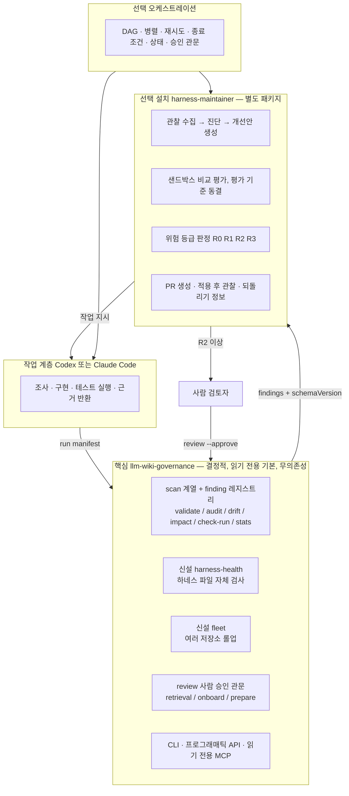
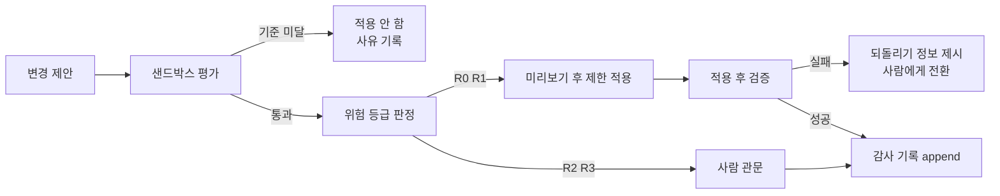

# 자기관리형 하네스 거버넌스 로드맵

> 이 문서는 2026-07-31 조사 결과에 기반한 **제안**입니다. 아직 승인되지 않았고, 아직 코드로 구현된 것이 없습니다.
> `status: needs_review` — 사람 검토 전에는 확정된 계획으로 인용하지 마십시오.
> 이미 배포된 기능의 이력은 `CHANGELOG.md`, 릴리스별 계획은 `ROADMAP.md`, 게이트 결정은 `GATE_REVIEW.md`가 소유합니다. 이 문서는 그 위에 얹는 **제품 방향** 문서입니다.

## 0. 읽는 방법과 근거 등급

각 장은 **쉬운 설명** 한 문장으로 시작합니다. 그 아래가 기술적 설계입니다.

모든 주장에 다음 등급을 붙입니다.

- **확인됨** — 소스 파일, 명령 실행 결과, 또는 git diff로 직접 확인했습니다.
- **정황상 추정됨** — 여러 정황은 있지만 직접 기록은 없습니다.
- **확인할 수 없음** — 판단할 근거가 없습니다.
- **needs confirmation** — 사람의 결정이나 추가 측정이 필요합니다.

측정하지 않은 개선 효과는 주장하지 않습니다. 토큰·속도 헤드라인 금지 정책은 이 문서에서도 유지됩니다(근거: `BENCHMARK.md`).

---

## A. 현재 상태 요약

> 쉬운 설명: 지금 이 도구는 **문서가 낡았는지 꽤 잘 찾아냅니다.** 문제는 찾아낸 것이 아무것도 막지 못한다는 점입니다.

### A-1. 실제 역할 (확인됨)

`llm-wiki-governance`는 AI가 쓴 프로젝트 문서를 **검증하고, 드리프트를 감지하고, CI에서 강제할 수 있게 하는** 무의존성 Node CLI입니다. 자기 자신에게 적용(dogfooding)되어 있고, 실사용 저장소 4곳에도 적용되어 있습니다.

- CLI 명령 29개(디스패치 맵 28 + `mcp` 특수 처리), 프로그래매틱 동결 맵 28키, MCP 도구 17개(전부 읽기 전용)
- finding 레지스트리 54룰 + 레지스트리 미등록 발행 8종
- 런타임 의존성 0, devDependency 0, Node 하한 `>=18.18.0`
- 테스트 393건(9파일), `node --check` 구문 게이트, CodeQL

### A-2. 이미 제공되는 감지·검증·갱신 기능 (확인됨)

| 축 | 수단 | 근거 |
| --- | --- | --- |
| 문서 계약 | frontmatter 필수 13필드·enum·날짜 형식·중복 키 | `src/frontmatter.js`, `src/frontmatter-schema.js` |
| 근거 무결성 | `source_files`/`evidence`의 파일·라인·심볼·섹션 실재 확인 | `src/commands/scans.js` |
| 낡음(날짜 앵커) | `evidence.stale` — 리뷰 기준일 이후 참조 소스가 커밋됨 | `src/commands/scans.js#symbol:verifiedSourceAnchors` |
| 낡음(diff 앵커) | `impact.source_changed` — 소스는 이 diff에 있고 문서는 없음 | 같은 앵커 추출기 공유 |
| 완료 계약 | run manifest + `check-run`의 `run.*` 6룰 | `src/commands.js#symbol:checkRunCommand` |
| 사람 승인 | `review`(기본 읽기 전용, `--approve-all`에 `--yes` 강제, blocked/error 있으면 거부, 3필드만 스탬프) | `src/commands.js` |
| 위험 다이얼 | `rules` 토글 + `rulesPreset` 3종, 민감 카테고리는 비토글 | `src/commands/findings.js#symbol:RULE_PRESETS`, `#symbol:NON_TOGGLEABLE_CATEGORIES` |
| 기계적 자동수정 | Tier A frontmatter 필드, `## Evidence` 정합, 깨진 링크 stub, block version 스탬프 | `src/commands/fix-migrate.js#symbol:runMechanicalRemediation` |
| 사용자 수정 보호 | 생성 스킬의 sha256 마커 — 한 글자만 고쳐도 영구 보존 | `src/commands/skills.js#symbol:isManagedUnmodified` |
| 에이전트 표면 | MCP가 쓰기 옵션을 **구조적으로 만들지 않음** | `src/mcp/tools.js#symbol:buildToolOptions` |
| 측정 | 프록시 벤치 + 실측 SDK 벤치 + 통제 arm | `BENCHMARK.md` |

### A-3. 기준선 실측 (2026-07-31, 확인됨)

자기 저장소:

- `stats`: 문서 51, health 77/100, verified 16(31%), needs_review 35, orphan 35
- `validate --strict`: finding 1건(`GLOSSARY.md`의 `evidence.stale`) → exit 1. **직전 커밋이 만든 진짜 드리프트를 도구가 스스로 잡았습니다.**
- `review`: needs_review 34건이 전부 `approvable` / `risk 0` / `findings 0` — 그중 33건이 릴리스 노트
- 선적재 하네스 footprint: 약 8.9k 토큰(chars/4 프록시, 진단용)

실사용 저장소 4곳:

| 저장소 | 브랜치 | 문서 | verified | health | run manifest | CI 강제 |
| --- | --- | --- | --- | --- | --- | --- |
| `sinkholemonitor-frontend` | `dev` | 22 | 22(100%) | 100 | 30(커밋됨) | 없음 |
| `roadmonitor-frontend` | `dev` | 33 | 33(100%) | 100 | 5 | 없음 |
| `csap-roadkeeper-frontend` | `aws-global` | 22 | 15(68%) | 86 | 15 | 없음 |
| `dotnine-project` | `main` | 22 | 12(55%) | 85 | 1 | 없음 |

형제 디렉터리 23개 중 위키를 가진 곳은 4곳입니다. **4곳 전부 `ci_governance: none detected`** — 4곳에서 직접 실행해 확인했습니다.

### A-3b. Phase 0 완료 시점 기준선 (2026-07-31, 읽기 전용 실측)

Phase 0 완료 조건인 "기준선 수치가 문서에 기록됨"을 채우는 값입니다. 전부 읽기 전용 측정이며, 도입 저장소에는 **아무것도 쓰지 않았습니다**(게이트 도입 후 초록 유지 여부 검증은 유지보수자 지시로 생략 — 별개 항목입니다).

자기 저장소:

| 항목 | 값 | 비고 |
| --- | --- | --- |
| `stats` | 문서 52, health 78/100, verified 17(33%), needs_review 35, orphan 35 | Phase 0 이전(51/77/16/35/35) 대비 문서 1건 증가 |
| `validate --strict` | 6건, 전부 `evidence.stale` | 사람 재기준선 대기분. **커밋 전 5건 → 커밋 후 6건**(`evidence.stale`은 git log를 보므로 미커밋 변경이 안 보임) |
| `ci_governance` | **4 blocking, 7 advisory — omission gate present** | Phase 0 이전에는 "1 found"(빈 임시 디렉터리를 검사하는 호출) |
| `needs_review` 경과일 | median 15일, mean 13일, 최장 17일 | **35건 중 31건이 릴리스 노트**(구조적 잔여). 실질 백로그는 4건 |
| 선적재 footprint(항상 로드) | **~1.44k 토큰** (CLAUDE.md 281 + index 428 + project-profile 736) | chars/4 프록시, 진단용 |
| 하네스 표면 전체(온디맨드 포함) | ~13.6k 토큰 (어댑터 1.0k + 스킬 12종 12.6k) | 스킬은 요청 시 로드 — 선적재가 아님 |
| run manifest | 11건 (gitignored) | 커밋 이력 0 |

> A-3의 "약 8.9k 토큰"과 위 두 수치는 **분모가 다릅니다**(무엇을 선적재로 셀지가 다름). 개선폭으로 비교하지 마십시오 — 앞으로는 위 두 줄(항상 로드 / 온디맨드 포함)을 기준으로 씁니다.

실사용 저장소 4곳(읽기 전용 재측정, 이번 라인에서 건드리지 않았으므로 A-3과 동일):

| 저장소 | 문서 | verified | health | needs_review | 경과일 median | 선적재 | 스킬 | manifest | ci_governance |
| --- | --- | --- | --- | --- | --- | --- | --- | --- | --- |
| `sinkholemonitor-frontend` | 22 | 22(100%) | 100 | 0 | — | ~3.8k | 6종 6.2k | 30(커밋됨) | **none detected** |
| `roadmonitor-frontend` | 33 | 33(100%) | 100 | 0 | — | ~1.9k | 12종 13.4k | 5 | **none detected** |
| `csap-roadkeeper-frontend` | 22 | 15(68%) | 86 | 7 | 1일 | ~3.4k | 12종 13.2k | 15 | **none detected** |
| `dotnine-project` | 22 | 12(55%) | 85 | 10 | 4일 | ~1.9k | 3종 2.1k | 1 | **none detected** |

이 측정에서 새로 드러난 사실 3가지:

1. **4곳 전부 여전히 `none detected`이고, 이제 그것은 더 강한 진술입니다.** 판정 기준이 "호출 존재"에서 "차단력"으로 바뀐 뒤에도 none이라는 것은, 자문용 호출만 있는 상태가 아니라 **문자 그대로 아무것도 없다**는 뜻입니다.
2. **도입 저장소의 선적재가 우리보다 큽니다**(sinkholemonitor ~3.8k, csap ~3.4k vs 우리 ~1.44k). 주범은 `index.md`입니다 — sinkholemonitor 2106 토큰 vs 우리 428. 1.27.2의 선적재 축소가 **우리 저장소에만 적용됐고 도입 저장소로 전파되지 않았다**는 뜻이며, 어댑터·진입 문서에 갱신 경로가 없다는 공백 5와 같은 뿌리입니다.
3. **"방치된 `needs_review`"는 현재 실측상 문제가 아닙니다.** csap 1일, dotnine 4일이고 우리 쪽 median 15일도 31/35가 릴리스 노트입니다. 백로그 11번(`needs_review` 드리프트 감시)의 근거를 이 수치가 **약화**시킵니다 — 우선순위를 낮출 근거입니다.

### A-4. 확인된 한계 — 5가지 구조적 공백

#### 공백 1: 경보기는 있는데 벨이 안 울린다 (확인됨)

누락(코드는 바뀌고 문서는 안 바뀜)을 exit code로 막는 명령은 `impact --since --strict` 하나입니다. 그런데 배포되는 도입 아티팩트 4종 전부 그것을 실행하지 않습니다.

| 채널 | 실제 실행 명령 | 누락 차단 |
| --- | --- | --- |
| `templates/git-hooks/pre-commit` | `validate --changed`(`--strict` 없음) | 불가 |
| `.github/actions/validate/action.yml` | `validate` 인자 배열 하드코딩 | 불가(다른 명령 실행 자체가 불가) |
| `templates/github-actions/llm-wiki-validate.yml` | `validate-frontmatter`, `validate --strict` | 불가 |
| `.github/workflows/ci.yml` | `validate-frontmatter`, `doctor` | 불가 |

`validate --changed`는 finding의 문서 경로로 필터하므로 "문서를 아예 안 고친" 누락을 원리적으로 볼 수 없습니다.

더 나쁜 점: `doctor`의 `ci_governance` 점검이 자기 저장소를 `1 found`로 보고합니다. 정규식에 걸리는 두 줄은 `consumer-install` 잡이 **빈 임시 디렉터리**를 대상으로 돌리는 tarball 스모크 테스트입니다. 나머지 스텝은 `node bin/llm-wiki.js` 형태여서 정규식에 걸리지 않습니다. 즉 **자기 위키를 검사하지도 않는 호출을 게이트로 오인**합니다(`src/commands.js#symbol:describeCiGovernance`). 없는 게이트를 있다고 보고하는 것은 안전하지 않은 방향이며, 이 기능은 아직 미릴리스라 지금 고칠 수 있습니다.

#### 공백 2: 낡음 판정이 `verified` 문서에만 걸려 있다 (확인됨)

`verifiedSourceAnchors`는 `status`가 `verified`가 아니면 즉시 `null`을 반환합니다. `drift`와 `impact`가 **둘 다** 이 함수에서 나옵니다.

- 자기 저장소는 51문서 중 35(69%)가 `needs_review` → 드리프트 감시 대상 밖입니다.
- 역설: `drift --downgrade`로 강등하면 그 문서는 **감시 대상에서 빠집니다.** 안전한 방향의 조치가 관측을 끕니다.
- `rulesPreset: strict`는 `impact.source_changed`를 승격하지 않습니다. "strict"라는 이름의 프리셋이 누락·신선도 규칙을 warning으로 둡니다.

#### 공백 3: "verified는 사람만"이 계약이 아니라 관례로 지켜진다 (확인됨)

파일럿 저장소에서 실제로 깨진 사례를 찾았습니다.

- 커밋 `a61691c`(제목이 API 수정인 커밋)가 도메인 문서 하나를 `needs_review`에서 `verified`로 되돌렸고, `reviewed_by`/`reviewed_at`은 변경되지 않았습니다. git diff로 직접 확인했습니다.
- 같은 저장소의 매니페스트 하나는 5건의 승격을 `docStatusChanges` 배열의 자유 텍스트 필드로 기록합니다. 그런데 `check-run`이 읽는 필드는 `task`/`changedSource`/`touchedDocs`/`logAppended`/`validated`/`testEvidence`뿐입니다 — **그 승격 기록은 아무도 검증하지 않습니다.**
- 도구는 `review --approve` 경로만 스탬프하지만, frontmatter를 직접 편집하는 우회 경로를 막거나 탐지하지 않습니다. 실사용에서 그 경로가 쓰였습니다.

#### 공백 4: 제안자와 검증자가 이미 같다 (확인됨)

run manifest는 에이전트가 스스로 씁니다(Gate 26에서 "새 쓰기 표면을 만들지 않는다"는 이유로 의도적으로 결정된 사항).

- `changedSource`를 빈 배열로 신고하면 `run.doc_gap`은 원리적으로 뜰 수 없습니다.
- `testEvidence` 계약이 실제로 검사하는 것은 red/green **두 개의 비어 있지 않은 문자열의 존재**뿐입니다. 값의 진위, 형식, 실행 여부는 전혀 검증하지 않습니다.
- Gate 26이 근거 목록에 적은 `changedFiles`와의 교차검증(`src/git.js#symbol:changedFiles`)은 **구현되지 않았습니다.**
- `check-run`은 매니페스트를 **파일명 사전순 마지막**으로 고릅니다. 파일명이 `run-<task>-<타임스탬프>` 형태라 **task 이름이 타임스탬프를 지배**합니다. 실측: 자기 저장소 매니페스트 6개 중 수정시각 최신은 2026-07-30 것인데 `check-run`은 2026-07-27 것을 "최신"이라며 검사합니다(`fix`가 `feature`보다 사전순 뒤).

#### 공백 5: 하네스 자체가 거버넌스 밖에 있다 (확인됨)

| 대상 | 현재 |
| --- | --- |
| 스캔 범위 | `listTargetMarkdown`이 `docs/llm-wiki/` 하위만 봅니다. 루트의 `ROADMAP.md`·`GATE_REVIEW.md`·`VERIFICATION.md`는 위키 frontmatter를 가졌는데 검사되지 않습니다 |
| 그 결과 | `VERIFICATION.md`의 `last_updated`가 15개 릴리스 전이고 `check-run`·`review`·`impact`·retrieval을 전혀 언급하지 않는데, npm `files`에 포함돼 배포됩니다 |
| 어댑터 파일 | 마커·체크섬이 없습니다. 사용자 수정 감지 0, **갱신 경로 자체가 없습니다**(존재하면 영구 skip) |
| 실측 드리프트 | 자기 저장소 스킬 6종이 마커 v4 3종 / v5 3종으로 갈라져 있습니다. 파일럿 한 곳은 4종이 마커 없음, 다른 곳은 어댑터가 v1(1.27.2 선적재 축소 미도달) |
| 길이 상한 | 없습니다. `estimated-tokens`를 스탬프만 하고 임계값·finding이 없습니다. 길이 규칙은 하한(본문 25단어)만 있습니다 |
| 중복·충돌 | 문서·규칙·스킬 간 중복 및 모순 비교 로직이 전무합니다. 어댑터 검사는 진입점 문자열 1개 포함 여부뿐입니다(`src/commands/adapters.js#symbol:scanAdapters`) |
| 사용 흔적 | 수집하지 않습니다. 유일한 프록시는 그래프 orphan이고, 자기 저장소 35건 중 33건이 릴리스 노트입니다 |
| 되돌리기 | 없습니다. 백업·diff·원자적 쓰기가 전무하고 복구 수단은 git뿐입니다 |
| 반복 실패·루프·비용 | 개념 자체가 없습니다. `check-run`은 매니페스트 1건만 봅니다 |

### A-5. 17개 감지 희망 항목 대비 커버 (확인됨)

- **강한 커버(5)**: 참조 무결성, frontmatter 계약, verified 문서의 코드 드리프트(양방향), 완료 계약, 민감정보
- **부분 커버(3)**: 낡은 문서, 근거 없는 설명, 방치된 `needs_review`(경과일 산술이 없어 목록화까지만)
- **미커버(9)**: 지시 간 의미 충돌, 문서·스킬 중복, 길이 상한, 무관해진 템플릿, 반복 실패, 종료 조건 없는 루프, 낡은 CLI·API 예제, 하네스 비용, 규칙 강도 자기진단

### A-6. 이번 조사에서 새로 확인된 결함 (확인됨)

| # | 결함 | 근거 |
| --- | --- | --- |
| 1 | `monorepo`가 `COMMAND_OPTION_RULES`에 누락 → 아무 옵션이나 무검증 통과(29개 명령 중 유일) | `src/cli.js#symbol:COMMAND_OPTION_RULES`, 실행 확인 |
| 2 | `help monorepo`가 `Unknown help topic`으로 exit 3 | 실행 확인 |
| 3 | `PUBLIC_API.md`와 CLI help의 `prompt --task` 목록이 6종(실제 8종) | 실행 확인 |
| 4 | `explain <rule> --cwd`가 지원되지 않아 exit 3(문서는 일반 옵션으로 제시) | 실행 확인 |
| 5 | `runMechanicalRemediation` 루프에 append-only 로그 가드가 없어 `fix --write`가 `log.md` frontmatter를 수정할 수 있음(현재 계획 0건이라 미발화, 잠재) | 소스 확인 |
| 6 | `review --approve`가 warning만 있는 문서를 승격 가능 → 보강되지 않은 스캐폴드도 verified 가능. 안전선이 `--strict` 사용 여부에 의존 | 소스 확인 |
| 7 | `ci_governance`가 차단력 없는 호출을 게이트로 계수(공백 1) | 소스 + 실행 확인 |
| 8 | `check-run`의 "최신" 매니페스트 선택이 task 이름 사전순에 지배됨(공백 4) | 실측 확인 |
| 9 | `drift`가 CI 게이트로 사용 불가 — `evidence.stale`이 `findings`가 아니라 별도 배열로 가고 `result`가 `pass`. 실측: findings 0건 / drift findings 1건. `--strict`도 받지 않음 | 실행 확인 |
| 10 | `impact --since <ref>`가 미추적 파일을 놓침(`--since` 없는 경로는 포함) → PR에서 새로 추가된 커밋 전 소스 파일은 누락 탐지 실패 | 소스 확인 |
| 11 | run manifest 위치 정책 불일치 — 자기 저장소는 gitignore(커밋 이력 0), 파일럿은 30개 커밋됨. Gate 26 결정과 실사용이 어긋남 | 확인 |
| 12 | 벤치 하네스에 회귀 테스트 0건이고, 프록시 arm이 배포 retrieval 코드를 호출하지 않고 재구현 | 확인 |

### A-7. 신선도 경고

- 이 문서는 `needs_review`입니다.
- `DOMAIN_FEATURES.md`, `PUBLIC_API.md`, `ROADMAP.md`, `VERIFICATION.md`도 현재 `needs_review`입니다. 확정된 사실로 인용하지 마십시오.
- `ARCHITECTURE_CONVENTIONS.md`, `BENCHMARK.md`는 `verified`이지만, 변경 작업 시에는 여전히 실제 소스를 읽어야 합니다.

---

## B. 제품 비전

> 쉬운 설명: AI에게 주는 **설명서와 규칙 자체가 낡고 뚱뚱해지는 것**을 감지하고, 고칠 방법을 제안하고, 시험해 본 뒤, 허락된 범위에서만 고치는 도구입니다.

### B-1. 한 문장 정의 (조사 결과를 반영한 수정안)

> `llm-wiki-governance`는 AI 하네스의 문서·규칙·스킬이 코드보다 낡거나 서로 모순되거나 지나치게 비대해지는 현상을 **근거와 함께 감지**하고, **개선안을 제안**하고, **변경 전후를 검증**하며, **위험 등급에 따라 사람의 승인을 요구**하는 자기관리형 거버넌스 계층입니다.

가설 문장에서 바꾼 부분과 이유:

- "안전하게 검증하여, 허용된 범위에서만 수정하도록 돕는다"를 **"위험 등급에 따라 사람의 승인을 요구한다"** 로 바꿨습니다. 조사에서 확인된 가장 큰 실제 실패는 자동 수정의 부재가 아니라 **사람 승인 경계가 강제되지 않는다는 점**(공백 3)이었습니다.
- "서로 모순되거나 지나치게 비대해지는"을 명시적으로 넣었습니다. 이 두 가지가 미커버 9항목의 핵심이고, 경쟁 도구와 구분되는 지점입니다.

### B-2. 경계

이 패키지는 하네스를 **대체하지 않습니다.** Codex·Claude Code(작업), 테스트·CI(검증), 권한 관리, 오케스트레이터(실행 제어)와 **함께 쓰는 거버넌스 계층**입니다. 이 경계는 모든 Phase에서 유지합니다.

### B-3. 주요 사용자

1. **AI 코딩 에이전트를 상시 쓰는 개발자** — 하네스가 조용히 썩는 것을 알아채지 못하는 사람
2. **저장소 유지보수자** — `verified` 승격 결정의 책임자
3. **CI** — 사람 없이 돌아야 하는 자동 관문
4. **여러 저장소를 함께 보는 운영자** — 현재 이 관점을 위한 수단이 없습니다

### B-4. 해결할 문제 / 해결하지 않을 문제

| 해결할 문제 | 해결하지 않을 문제 |
| --- | --- |
| 문서가 코드보다 낡았음을 근거와 함께 알림 | 문서 산문이 **의미상 옳은지** 판정(사람 검토 영역) |
| 지시·규칙·스킬의 모순과 중복 후보 제시 | 어떤 지시가 옳은지 최종 판정 |
| 하네스 크기·비용을 건강 지표로 관측 | 토큰·속도 절감 헤드라인 주장(측정 없이는 금지) |
| 완료 계약을 자기신고가 아니라 외부 사실로 검증 | 에이전트를 대신해 코드를 쓰는 것 |
| 위험 등급별 자동화 상한 강제 | 사람 승인의 대체 |
| 여러 저장소 거버넌스 상태 롤업 | 호스티드 서비스, 원격 run store |

### B-5. 성공한 상태의 모습

- 실사용 저장소에서 **소스만 바뀌고 문서가 안 바뀐 변경이 사람 눈에 닿기 전에 실패한다** (지금은 통과합니다)
- 하네스 파일 자체(어댑터·스킬·프롬프트)의 낡음과 비대함이 **명령 하나로 보인다** (지금은 어떤 명령도 보고하지 않습니다)
- `verified` 승격이 **우회 불가능하거나, 우회했을 때 반드시 탐지된다** (지금은 우회가 실제로 일어났습니다)
- 개선안이 **사람이 읽을 수 있는 PR**로 오고, 시험을 통과하지 못한 안은 오지 않는다
- 위 모든 것이 **무의존성·읽기 전용 기본·사람 승인 전용 `verified`** 불변식을 깨지 않고 성립한다

---

## C. 현재와 목표의 차이

> 쉬운 설명: 지금 되는 것, 되어야 하는 것, 그 사이에 빠진 것을 한 표로 정리했습니다.

| 영역 | 현재 기능 | 목표 기능 | 부족한 부분 | 위험 | 근거 |
| --- | --- | --- | --- | --- | --- |
| 누락 차단 | `impact --since --strict` 존재 | 배포 채널 전부가 그 게이트를 실행 | 4개 채널 모두 `validate` 계열만 실행. composite action은 명령이 하드코딩 | 도입해도 정확히 찾던 실패 위에서 초록 | 공백 1 |
| 거버넌스 자기진단 | `doctor`의 `ci_governance` | 차단력 기준 판정 | 호출 존재를 게이트 존재로 계수. 스모크 테스트를 게이트로 오인 | 없는 안전을 있다고 보고 | 결함 7 |
| 낡음 감시 범위 | `verified` 문서만 | 상태와 무관하게 감시 가능 | `verifiedSourceAnchors`가 비-verified를 즉시 배제. 자기 저장소 69%가 사각지대 | 강등이 관측을 끄는 역설 | 공백 2 |
| 프리셋 의미 | `rulesPreset` 3종 | 이름과 차단력이 일치 | `strict`가 `impact.source_changed`를 승격 안 함 | 사용자가 강제된다고 오인 | 공백 2 |
| 승인 경계 | `review --approve`가 3필드만 스탬프 | 우회 경로 탐지 또는 차단 | frontmatter 직접 편집을 아무도 보지 않음. 실사용에서 발생 | 제품의 존재 이유가 무력화 | 공백 3 |
| 승인 게이트 강도 | blocked/error 있으면 거부 | 보강 여부가 승격 조건에 포함 | warning만 있으면 통과 → 빈 스캐폴드도 verified 가능 | 신뢰할 수 없는 문서가 verified로 | 결함 6 |
| 완료 계약 | 자기신고 매니페스트 + `check-run` | 외부 사실과 교차검증 | git diff 교차검증 미구현. `changedSource` 빈 배열로 통과 가능 | 게이트가 게이트가 아님 | 공백 4 |
| 매니페스트 선택 | 사전순 마지막 | 실제 최신 | task 이름이 타임스탬프를 지배. 3일 전 것을 검사 | 잘못된 런을 검증 | 결함 8 |
| 이력·추세 | 매니페스트 1건 | 런 간 집계, 반복 실패 탐지 | 집계 명령 없음. 위치 정책도 저장소마다 갈림 | 반복 실패를 영원히 못 봄 | 결함 11 |
| 하네스 자기검사 | 없음 | 마커 드리프트·선적재 예산·중복·충돌 | 어댑터에 마커 없음, 길이 상한 없음, 충돌 비교 없음 | 하네스가 조용히 썩음 | 공백 5 |
| 스캔 범위 | `docs/llm-wiki/`만 | 위키 계약을 쓰는 문서 전체 | 루트 거버넌스 문서 미검사. 그중 하나는 낡은 채로 배포 | 자기 규칙의 예외 | 공백 5 |
| 여러 저장소 | `monorepo`(단일 workspaces) | 별개 저장소 롤업 | workspaces 0이면 아무것도 없는데 `pass` | 도입 현황을 볼 수단 없음 | 실행 확인 |
| 방치 탐지 | `review` 목록화 | 경과일 임계값 | 경과일 산술 자체가 없음 | 백로그가 무한 증가 | 공백 5 |
| 되돌리기 | 없음 | 백업·diff·복구 절차 | 원자적 쓰기도 아님 | 자동 쓰기 확대가 위험 | 공백 5 |
| 평가 기반 | 프록시·실측 벤치 | 회귀 방지된 평가 하네스 | 벤치에 테스트 0건, 프록시 arm이 배포 코드 미호출 | 평가가 평가를 못 함 | 결함 12 |
| 오탐 탈출구 | 민감 카테고리 비토글 | 문서별 예외 선언(사유·감사) | 권장 서식이 규칙에 걸리면 영구 차단 | 도입 자체가 막힘 | 소스 확인 |

---

## D. 권장 아키텍처

> 쉬운 설명: **심판(도구)** 과 **선수(에이전트)** 를 절대 같은 사람이 맡지 않게 하고, 심판은 계속 작고 예측 가능하게 둡니다.

### D-1. 계층 구조

### D-2. 데이터와 상태의 흐름

1. 핵심 CLI가 **사실**을 만듭니다: findings 배열 + `--format json`(`schemaVersion`). 판단은 하지 않습니다.
2. 정비 계층이 그 사실을 읽어 **진단과 개선안**을 만듭니다. 원본 파일을 직접 고치지 않습니다.
3. 작업 계층(에이전트)이 실제 변경을 수행하고 **run manifest**로 자기 행위를 신고합니다.
4. 핵심 CLI가 그 신고를 **외부 사실(git diff, 테스트 결과, validate)** 과 교차검증합니다.
5. 위험 등급이 R2 이상이면 **사람 관문**으로 갑니다. `verified` 승격은 사람만 합니다.
6. 적용 후 관찰에서 회귀가 보이면 **되돌리기 정보**를 제시합니다.

### D-3. 표면별 역할

| 표면 | 역할 | 제약 |
| --- | --- | --- |
| CLI | 사람과 CI의 주 진입점. exit code가 계약 | 명령·옵션·exit code는 승인 없이 불변 |
| 프로그래매틱 API | 정비 계층이 in-process로 소비 | 동결 맵 28키 불변 |
| MCP | 에이전트가 읽기 전용으로 질의 | 쓰기 옵션을 만들지 않는 성질 유지 |
| 정비 계층 | 제안·평가·PR | 핵심 계약을 소비만, 확장 금지 |
| 오케스트레이터 | 종료 조건·상한·상태 | 도구 밖. 이 저장소가 소유하지 않음 |

### D-4. 핵심 대 확장 경계 판단

**추천: 에이전트 계층을 별도 패키지로 분리 (needs confirmation — 사람 결정)**

| 기준 | 핵심에 모두 넣기 | 별도 패키지(추천) |
| --- | --- | --- |
| 무의존성 | 샌드박스·모델 호출·PR 생성은 사실상 의존성 필요 → 정체성 파괴 | 핵심 의존성 0 유지 |
| 동결 계약 | 28키 동결 맵·`schemaVersion`·exit code에 에이전트 개념 침투 | 핵심 계약 불변, 소비자로만 연결 |
| Node 하한 | 상위 Node를 요구하면 `>=18.18.0` 하한이 깨짐(1.27.1에서 유사 사례 발생) | 계층별 engines 분리 |
| 실패 격리 | 정비 계층 버그가 `validate`를 죽여 CI가 도구 때문에 실패 | 핵심은 계속 동작 |
| 보안 경계 | MCP가 구조적으로 쓰기를 못 하는 성질을 잃음 | 성질 보존 |
| 되돌리기 | 되돌리기 없는 코드베이스에 자동 쓰기를 얹는 셈 | 쓰기 책임을 한 계층에 모아 백업·diff를 거기 구현 |
| 테스트 가능성 | 393건이 결정적이라는 성질이 흐려짐 | 핵심은 결정적 유지 |
| 설치·운영 | 단일 설치로 단순 | 설치 단계 증가(이 방식의 유일한 실질 비용) |

**중요한 반전**: Phase 1과 2의 대부분은 에이전트가 필요 없습니다. 마커 버전 드리프트, 선적재 토큰 예산, 검토 경과일, 승격 우회, 중복 후보, 여러 저장소 롤업은 **전부 결정적 계산**입니다. 따라서 그것들은 핵심에 스캐너로 넣고, 에이전트가 꼭 필요한 것(문서 산문 수정안, 규칙 통합 제안, 샌드박스 비교)만 분리하는 것이 옳습니다.

### D-5. 실패와 복구 흐름

---

## E. 단계별 로드맵

> 쉬운 설명: 작은 것부터, **되돌릴 수 있는 것부터** 자동화합니다. 각 단계는 앞 단계가 끝나야 시작합니다.

### 자동화 위험 등급

| 등급 | 뜻 | 자동 실행 |
| --- | --- | --- |
| **R0** | 관찰 전용. 읽고 보고만 | 가능 |
| **R1** | 기계적으로 검증 가능한 수정 | 미리보기 기본, 검증 실패 시 금지, 되돌리기 가능해야 함 |
| **R2** | 의미가 달라질 수 있는 수정 | 금지. 제안·PR만 |
| **R3** | 안전·계약·권한 변경 | 금지. 명시적 사람 승인 필수 |

---

### Phase 0 — 배선과 기준선

**쉬운 설명**: 새 기능을 만들기 전에, 이미 달아둔 감지기를 **스피커에 연결**하고 지금 상태를 숫자로 적어둡니다.

**해결할 문제**: 감지 능력은 있는데 아무것도 막지 못합니다. 이 상태 위에 5개 층을 얹으면 전부 공허해집니다.

**범위**

- 배포 아티팩트 4종에 누락 차단 게이트 배선. composite action의 하드코딩된 명령 배열 해체
- `ci_governance`를 **차단력 기준**으로 재정의(호출 존재는 게이트 존재가 아님). 미릴리스라 지금이 최적기
- `rulesPreset: strict`가 `impact.source_changed`를 승격하도록 수정(이름과 동작 일치)
- `impact --since` 경로의 미추적 파일 누락 수정
- A-6의 결함 12건 처리
- 기준선 기록: 5개 저장소의 health, verified 비율, `needs_review` 경과일, 선적재 footprint, orphan, 매니페스트 수
- R3 자동 변경 금지 목록과 대표 실패 사례집 작성

**범위 밖**: 새 감지 규칙, 자동 수정, 에이전트 계층, 성능 주장

**사용자 가치**: 이미 만들어 둔 감지 능력이 **처음으로 실제로 무언가를 막습니다.** 새 기능 0개로 제품 서사가 성립합니다.

**구현 후보**: `.github/actions/validate/action.yml`(명령 파라미터화), `templates/git-hooks/pre-commit`, `templates/github-actions/llm-wiki-validate.yml`, `.github/workflows/ci.yml`, `src/commands.js`(`describeCiGovernance`), `src/commands/findings.js`(`RULE_PRESETS`), `src/git.js`(`changedFiles`), `src/cli.js`(`COMMAND_OPTION_RULES`)

**관련 문서 후보**: `DOMAIN_FEATURES.md`, `PUBLIC_API.md`, `docs/OPERATIONS.md`, `GATE_REVIEW.md`(새 게이트 기록), `VERIFICATION.md`(15개 릴리스분 갱신)

**관련 테스트 후보**: `tests/ci-governance-check.test.js`(차단력 기준 케이스 추가), `tests/config-presets.test.js`(strict 프리셋 승격), `tests/verification.test.js`의 impact·CLI 파싱 섹션

**위험**: 게이트를 켜면 도입 저장소 CI가 빨개질 수 있습니다. **2026-07-31에 4곳 전부 실측했습니다** — 오늘 기준으로는 전부 초록이지만, 문서를 갱신하지 않은 실존 커밋 9건은 전부 RED였고 허브 파일 하나가 문서 10건을 동시에 발화시킵니다. 즉 위험은 "지금 빨개진다"가 아니라 **"앞으로 자주, 그리고 한 번에 많이 빨개진다"** 쪽입니다. 아래 "게이트 도입처 예행 결과" 절을 보십시오.

**선행 조건**: 없음. 즉시 착수 가능

**완료 조건**

- 4개 채널이 실제로 exit 코드 0이 아닌 값을 낼 수 있음
- 파일럿 1곳 이상에서 게이트 초록 확인
- 측정하지 않은 개선 효과 주장 0건
- 공개 계약 변경 0건 또는 승인된 변경만
- `npm test` 전건 통과, `validate --strict` finding 0, `validate-frontmatter` 0

**평가 방법**: 4개 저장소에서 `doctor`의 `ci_governance`가 차단력 있는 게이트만 계수하는지 실측. 배선 전후 exit code 비교

**사람 승인 필요**: `impact --strict` 기본화, run manifest 커밋 정책, 어댑터 본문 언어 정책

**다음 단계 조건**: 위 완료 조건 전부 + 기준선 수치가 문서에 기록됨

#### Phase 0 진행 상황 (2026-07-31 갱신)

| 범위 항목 | 상태 |
| --- | --- |
| 배포 아티팩트 4종에 누락 차단 게이트 배선 (composite action 하드코딩 해체 포함) | **완료** — GATE_REVIEW "Phase 0 Gate Wiring" |
| `ci_governance`를 차단력 기준으로 재정의 | **완료** |
| `rulesPreset: strict`가 `impact.source_changed` 승격 | **완료** |
| `impact --since`의 미추적 파일 누락 수정 | **완료** |
| A-6의 결함 12건 처리 | **8건 완료** (#1~#6·#8~#10). 미처리 3건: #11 run manifest 커밋 정책(사람 결정 22번), #12 벤치 회귀 테스트(백로그 14번), 그리고 #7은 `ci_governance` 재정의로 해소 |
| 기준선 기록 | **완료** — A-3b |
| R3 자동 변경 금지 목록과 실패 사례집 | **완료** — F장 R3 목록, G-2 사례집(6건 전부 테스트로 고정) |

완료 조건 대비:

- ✅ 4개 채널이 실제로 exit 0이 아닌 값을 낼 수 있음
- ✅ **파일럿 초록 확인 완료** (2026-07-31 실측, 도입 4곳 전부) — 새로 배선한 두 게이트는 4곳 모두 exit 0입니다. 다만 **초록의 성격이 같지 않고, 다음 PR부터는 빨간불이 정상입니다.** 아래 "게이트 도입처 예행 결과" 절이 근거이며, 무의미한 초록 1건과 신규 결함 6건을 함께 기록했습니다
- ✅ 측정하지 않은 개선 효과 주장 0건
- ✅ 공개 계약 변경은 승인된 2건만 (`review` 승격 거부, `check-run` 선택 기준)
- ✅ `npm test` 전건 통과·`validate --strict` 0·`validate-frontmatter` 0

> **`validate --strict` 0을 어떻게 달성했는지 정확히 적습니다.** 드리프트된 `verified` 6건을 `drift --downgrade`로 `needs_review`로 내려서 0이 됐습니다 — **주장을 낮춰서 0이 된 것이지, 확신이 올라가서 0이 된 것이 아닙니다.** 그 대가로 verified 비율이 33%→19%, health 78→73으로 떨어졌고, 이 수치가 현재의 진짜 상태입니다. 사람이 `review --approve`로 재승인하면 되돌아옵니다. 이 방향(주장 제거)은 자동화가 해도 되는 안전한 방향이고, 반대 방향(승격)은 R3-1·R3-2·R3-3으로 금지돼 있습니다. **후속(2026-07-31): 유지보수자가 11건을 직접 승인해 `verified` 20/52(38%)로 회복했고, 강등 이전(33%)보다 높습니다.**

#### Phase 0에서 발견된 미기록 결함: `verified` 문서의 재기준선 경로가 없다

`reviewed_at`만 갱신하는(내용은 그대로인) **재기준선을 지원하는 명령이 없습니다.** `review --approve`는 이미 `verified`인 문서를 `already verified`로 거부하고 목록에도 넣지 않습니다. 그래서 실무에서 남는 선택지는 둘뿐입니다:

1. `drift --downgrade` → 사람이 `review --approve` (2단계 왕복, 도구 지원). 이번에 쓴 경로입니다.
2. frontmatter 직접 편집 — **이것이 사례집 GAP 3의 우회 경로 그 자체**입니다. 도구가 감지하지 못합니다.

즉 도구가 **정상 경로를 제공하지 않아서 사람을 우회 경로로 미는 구조**입니다. A-6에 없던 결함이며 Phase 1 후보(`review --rebaseline` 같은 명시적 재기준선 표면)로 올립니다.

관련 비대칭 하나가 게이트를 실제로 켜 보고 드러났습니다: **`drift`에는 `--downgrade`가 있는데 `impact`에는 대응 수단이 없습니다.** `impact`가 문서를 지목해도 그것을 해소하는 명령이 없어, 사람이 frontmatter를 직접 고치는 수밖에 없습니다(같은 우회 경로). 같은 Phase 1 후보로 묶습니다.

#### 게이트를 처음 켜서 배운 것 (2026-07-31, PR #1)

- **`drift`와 `impact`의 상보성이 실물로 확인됐습니다.** `VERSIONING.md`는 `drift`에 안 걸리고 `impact`에만 걸렸습니다. `RELEASE_CHECKLIST.md` 변경일(2026-07-30)과 문서의 `reviewed_at`(2026-07-30)이 같은 날이라 날짜 앵커는 "검토가 덮었다"고 보지만, diff 앵커는 pre-merge에서 봅니다. 설계 의도가 맞았다는 증거입니다.
- **기준 ref를 틀리면 게이트를 통과했다고 착각합니다.** 로컬에서 `impact --since main`으로 통과를 확인했으나 CI는 `origin/main` 기준이라 실패했습니다 — 로컬 `main`이 origin보다 **2커밋 앞서** 있었기 때문입니다. 게이트를 로컬에서 예행할 때는 **CI와 같은 ref**(`origin/<base>`)를 써야 합니다. 이 함정은 게이트를 켜지 않았다면 영원히 안 보였을 것입니다.

#### 게이트 도입처 예행 결과 (2026-07-31 실측, 백로그 19 해소)

> 쉬운 설명: 새로 단 게이트를 실제 도입 저장소 4곳에서 시험 삼아 돌려 봤습니다. 오늘은 전부 초록이지만, 초록인 이유가 저장소마다 다릅니다.

전부 읽기 전용으로 실행했습니다(쓰기·커밋·체크아웃 0건). 사용한 CLI는 이 브랜치의 `656bc5a`입니다.

| 저장소 | `validate --strict` | `drift --strict` | `impact --since origin/<base> --strict` | 초록의 성격 |
| --- | --- | --- | --- | --- |
| `sinkholemonitor-frontend` | 0 | 0 | 0 (변경 102파일) | 검증된 참 음성 |
| `roadmonitor-frontend` | 0 | 0 | 0 (변경 141파일) | **무의미한 초록** |
| `csap-roadkeeper-frontend` | 0 | 0 | 0 (변경 129파일) | 검증된 참 음성 |
| `dotnine-project` | **1** | 0 | **측정 불가** (HEAD == base, 변경 0파일) | — |

**이번에 배선한 두 게이트는 4곳 전부 exit 0입니다.** dotnine의 빨간불은 새 게이트가 아니라 기존 `validate --strict`(`frontmatter.duplicate_key` 1건 — `docs/llm-wiki/README.md`에 `last_edited_by`가 두 번 나오고 뒤엣것이 조용히 이깁니다)와 `check-run --strict`(`run.test_evidence_missing` 1건)에서 나왔고, 둘 다 실재하는 결함이며 각각 한 줄·한 필드로 닫힙니다. 오탐이 아닙니다.

**초록을 액면가로 받으면 안 되는 이유 세 가지:**

1. **`roadmonitor-frontend`의 초록은 무의미합니다(degenerate).** `origin/main`에는 위키가 19파일뿐이고 `dev` HEAD에는 33파일입니다 — 위키가 이 브랜치에서 자라나 **문서 33개가 전부 diff 안에** 있고, `scanReverseImpact`는 같은 diff에서 변경된 문서를 제외하므로 후보가 0이 됩니다. 게이트를 켜도 볼 대상이 없습니다. dev가 main에 머지되기 전까지 이 저장소의 `--since origin/main`은 신뢰할 수 없습니다.
2. **참 음성 2곳은 도구가 아니라 습관이 만든 것입니다.** csap은 도입 이후 `src/`를 건드린 커밋 **13건 전부**가 같은 커밋에서 위키를 갱신했고, sinkhole은 앵커가 diff에 걸린 문서가 전부 자기 자신도 같은 diff 안에서 바뀌었습니다. 두 저장소 모두 `source_files` × diff 교집합을 수동 대조해 **참 음성**임을 확인했습니다 — 매칭 기계는 살아 있습니다. 게이트가 무력해서 초록인 게 아니라, 게이트가 요구하는 것을 사람이 이미 하고 있어서 초록입니다.
3. **다음 PR부터는 빨간불이 정상입니다.** "소스만 바꾸고 문서는 안 건드린" 실존 커밋 9건을 현재 앵커에 대해 시뮬레이션한 결과 **9건 전부 RED**였습니다(sinkhole 4건 → 1~3 findings, roadmonitor 5건 → 1~16 findings). 이것이 게이트의 의도된 동작입니다.

시뮬레이션의 한계를 명시합니다: `scanReverseImpact`를 재구현해 계산했고 두 저장소의 `origin/main` 기준선에서 CLI 결과와 완전히 일치함을 확인했지만(changed_files 102/141, findings 0/0), **현재 시점의 프론트매터 앵커**를 씁니다. 따라서 "과거에 이랬을 것"의 재현이 아니라 "오늘 이 파일 묶음을 문서 수정 없이 PR하면 이렇게 된다"의 예측입니다. 저장소에 쓰기가 금지돼 실제 체크아웃 재현은 하지 않았습니다.

#### 새로 드러난 결함: 허브 파일 팬아웃 (게이트 피로의 최대 후보)

두 저장소에서 **독립적으로 같은 파일이 잡혔습니다.** `impact.source_changed`는 파일 단위로 매칭하므로, 여러 문서가 공통으로 인용하는 배럴/허브 파일 하나를 고치면 그 문서들이 동시에 전부 발화합니다.

- `csap-roadkeeper-frontend`: 워킹트리 `impact --strict`가 exit 1 / **10건**인데, 그중 **9건이 `src/utils/api/index.ts` 단 하나**에서 나옵니다(9개 verified 도메인 문서가 이 배럴 파일을 `source_files`에 올려두었습니다).
- `roadmonitor-frontend`: `545ea15`는 `any`를 제거한 **1파일 타입 리팩터**인데 **10건**을 발화시킵니다.

규칙상으로는 정확합니다 — 문서들이 진짜 그 파일을 인용합니다. 그러나 문서 내용을 실제로 무효화하지 않는 변경에도 전부 터지므로, 신호 대 노이즈가 나쁘고 **게이트를 끄고 싶게 만드는 첫 번째 이유**가 될 것입니다. `impact --strict` 기본화(사람 결정 21번)를 판단할 때 이 팬아웃이 비용의 대부분입니다. 완화 후보는 라인 범위 앵커 우선 사용(`src/git.js#symbol:lineRangeChangedSince`가 이미 지원), 배럴 파일 인용에 대한 경고, 문서당 대표 앵커 지정이며 **전부 미설계**입니다.

#### `needs_review` 감시 옵트인의 폭발 반경 (백로그 17 해소)

신선도 필터는 `src/commands/scans.js#symbol:verifiedSourceAnchors`의 **단 한 줄**(`status`가 `verified`가 아니면 `null`)이고, 이 한 함수가 `evidence.stale`(날짜 앵커)과 `impact.source_changed`(diff 앵커) **둘 다**의 게이트입니다. 이 필터를 `needs_review`까지 넓혔을 때:

| 저장소 | 문서 | verified | needs_review | 기준선 `evidence.stale` | 추가분 |
| --- | --- | --- | --- | --- | --- |
| `llm-wiki-governance`(우리) | 52 | 20 | 32 | 0 | **+65** (31개 문서) |
| `csap-roadkeeper-frontend` | 22 | 15 | 7 | 0 | **0** |
| `sinkholemonitor-frontend` | 22 | 22 | 0 | 0 | 0 (넓힐 대상 없음) |

**추가분 65건 중 65건(100%)이 `docs/llm-wiki/releases/v*.md`이고, 살아있는 문서의 추가 finding은 0건입니다.** 릴리스 노트 31건 전부가 `package.json`을 앵커로 잡는데 `package.json`은 릴리스마다 바뀌므로, 이 경고는 **본문 수정으로 해소가 불가능하고 재승인 스탬프로만 지워지는 영구 트레드밀**입니다. 이미 `verified`인 릴리스 노트 2건(`v0.1.7`·`v0.1.8`)이 그 트레드밀을 밟고 있고, 옵트인은 여기에 31건을 더 얹습니다.

따라서 백로그 11번의 실질 비용은 기능 자체가 아니라 **면제 규칙을 같이 내보내느냐**에 100% 좌우됩니다. 면제 키는 이미 프론트매터에 있습니다 — 릴리스 노트 33건 전부가 `doc_type: release_notes`입니다. 이 면제는 후속이 아니라 **기능의 일부로** 함께 나가야 합니다.

측정 방법과 한계: 저장소 헬퍼를 import한 로직 재현과, 임시 클론에서 `needs_review` 32건을 뒤집어 **수정하지 않은 실제 `scanEvidenceDrift`** 를 돌린 강검증 두 가지가 65/31/65/0으로 일치했습니다. 다만 (1) 기준선 0은 정상 상태가 아니라 **오늘 막 청소된 상태**이고(verified 20건 중 14건의 `reviewed_at`이 오늘), (2) 세 저장소 모두 히스토리가 정지해 있어 **활발히 개발 중인 저장소의 정상 상태 추가분은 측정하지 못했습니다.**

#### 파일럿 마찰 이력 (백로그 18 해소) — 관통하는 세 패턴

**패턴 1 — 게이트는 3곳 모두 0개이고, 규율은 전적으로 사람의 기억에 얹혀 있습니다.** pre-commit 훅·CI 워크플로·npm 스크립트 어디에도 `llm-wiki` 호출이 단 1건도 없습니다(roadmonitor의 `.husky/pre-commit`·`pre-push`는 본문 전체가 주석 처리돼 테스트 실행조차 꺼져 있습니다). 그 결과 **같은 도구·같은 유지보수자인데** 소스 커밋과 같은 커밋에서 위키를 갱신한 비율이 csap 13/13(100%), dotnine 15/16(94%), roadmonitor **0/13(0%)** 으로 갈렸습니다. run manifest 정책도 저장소마다 정반대입니다 — csap 14건 커밋, roadmonitor는 실수로 들어간 1건을 되돌리고(`189739b`) `.gitignore`로 금지, dotnine은 소스 커밋 16건 중 1건(6%). **사람 결정 22번(매니페스트 커밋 정책)이 미결이라는 사실이 실물로 세 갈래 분기를 만들었습니다.**

**패턴 2 — 도구가 앞서가면 도입처는 그 자리에 얼어붙고, 도구는 그것을 탐지하지 못합니다.** 현행 어댑터는 `wiki-block v2`/`llm-wiki-adapter v2`인데 실배치는 roadmonitor v2/v2, csap **v1**/v2, dotnine **v1**/부재입니다 — **3곳 중 2곳이 낡은 형식**입니다. dotnine의 v1 `CLAUDE.md`는 1.27.2가 제거한 **5문서 `@` 선적재** 그대로이고 2026-07-22 이후 한 번도 바뀌지 않았습니다. csap의 `.mcp.json`은 `llm-wiki-governance@1.25.0`에 핀이 고정돼 있고, 07-30의 "툴체인 1.27.2 정렬" 커밋조차 이 파일을 건드리지 않았습니다. 그런데 `src/commands/adapters.js#symbol:scanAdapters`는 **파일 존재 여부와 `docs/llm-wiki/index.md` 문자열 포함만** 검사하고 마커 버전을 읽지 않으므로, **v1 어댑터는 audit에서 영구히 clean으로 통과합니다.** 이것이 공백 5(어댑터 갱신 경로 없음)의 코드 앵커이며, 백로그 13번(어댑터 마커 도입)이 왜 Phase 5의 선행 조건인지를 실측으로 보여줍니다.

**패턴 3 — 위키는 브랜치에 갇혀 있고, 한 번은 통째로 버려졌습니다.** 3곳 중 2곳의 `main`이 위키를 보지 못합니다: roadmonitor `main`은 2026-06-30에서 정지(19파일, dev는 33파일, `main..dev` 35커밋이 30일째 미머지, **main에는 어댑터 파일 자체가 없음**), csap `main`은 2026-04-13에서 정지(**위키 0파일·어댑터 0개**, `main..aws-global` 48커밋). 그리고 csap은 위키를 두 번 지었습니다 — `dev/llm-wiki`의 **38파일**(ADR 4건·SKILL 3건·`PROMPT_BOOK.md`·`SECURITY_CONFIG.md` 포함)이 머지 없이 버려졌고(조상 관계 아님, 66커밋 분기), 07-22에 `aws-global`에서 22파일로 **from-scratch 재구축**됐습니다(1799줄 순수 삽입 / 0 삭제, ADR·스킬 미이월, 도메인 번호 체계도 완전히 다름). roadmonitor에서도 CLI가 자동 생성한 도메인 스텁 17개 중 16개가 같은 날 삭제됐고(−1189줄), 그 커밋은 "`init --write`를 다시 돌리면 16개가 재생성된다"고 스스로 적어 두었습니다.

**도구는 이 세 패턴 중 무엇도 보지 못합니다.** 셋 다 현재 체크아웃 안에서는 정상으로 보이기 때문입니다 — Phase 1 `harness-health`(R0)가 필요한 이유의 실측 근거입니다.

#### 이번 측정에서 새로 기록한 결함 (A-6에 없던 것)

| # | 결함 | 근거 | 성격 |
| --- | --- | --- | --- |
| N-1 | **허브 파일 팬아웃** — `impact.source_changed`가 파일 단위라 배럴 파일 1개 변경이 문서 9~10건을 동시에 발화 | csap 10건 중 9건이 `src/utils/api/index.ts`; roadmonitor `545ea15` 1파일 → 10건 | 설계 |
| N-2 | **`scanAdapters`가 어댑터 마커 버전을 읽지 않음** → v1 어댑터가 audit에서 영구 clean | 도입 3곳 중 2곳이 v1인데 finding 0 | 결함 |
| N-3 | **`validate-frontmatter --strict`의 보고와 종료코드 불일치** — 본문은 `result: pass`를 출력하는데 exit 1 | dotnine 실측 | 결함 |
| N-4 | **`review --approve`의 태그 미동기화가 도입처에서 실증됨** — dotnine의 `verified` 12건 **전부**가 `tags`에 `needs-review`를 그대로 달고 있음 | dotnine 12/22 문서 | 결함(기존 기록의 실증) |
| N-5 | **`reviewed_by` 표기가 검증되지 않아 세 갈래로 갈림** — 같은 사람이 `Dowon-Kim`·`Dowon-Kim7949`·`KIM DOWON`으로 스탬프됨 | 3개 저장소 프론트매터 | 결함 |
| N-6 | **`check-run`의 매니페스트 선택이 워킹트리에 의존** — csap 로컬은 **미추적** 최신 매니페스트로 초록, CI 클린 체크아웃은 최신 tracked를 집어 빨간불 | csap 실측 | 설계 |

N-1과 N-6은 **로컬 예행이 CI 결과를 예측하지 못하게 만드는** 같은 부류이며, PR #1에서 배운 "기준 ref를 틀리면 통과했다고 착각한다"와 함께 **로컬↔CI 재현성**이라는 하나의 주제를 이룹니다.

**남은 Phase 0 항목**: 사람 승인 3건(`impact --strict` 기본화·run manifest 커밋 정책·어댑터 본문 언어 정책). `needs_review` 승인 10건은 2026-07-31에 유지보수자가 `review --approve`로 직접 처리했습니다(11건 승인, 거부 0, finding 0) — `verified` 20/52(38%), `validate --strict` finding 0으로 회복됐습니다.

---

### Phase 1 — 읽기 전용 자동 화재경보기 (R0)

**쉬운 설명**: 설명서와 규칙이 낡았거나 서로 싸우고 있으면 **이유와 함께** 알려줍니다. 아무것도 고치지 않습니다.

**해결할 문제**: 하네스 자체(어댑터·스킬·프롬프트·템플릿)를 보는 눈이 전혀 없습니다.

**범위**

- 신설 `harness-health`(읽기 전용): 어댑터·스킬 마커 버전 드리프트, 사용자 수정 여부, 선적재 토큰 예산 초과, 스킬 길이 상한
- 검토 경과일 산술(현재 코드에 경과일 계산이 전무)
- **승격 우회 탐지**: `verified`인데 상태 변경 커밋과 `reviewed_at`이 어긋남 → 공백 3의 회귀를 잡는 규칙
- `needs_review` 문서도 드리프트 감시 대상에 넣는 옵트인
- 루트 거버넌스 문서를 스캔 범위에 옵트인 포함
- 중복·충돌 **후보** 탐지(결정적 텍스트 유사도 + 지시문 상충 패턴). 판정이 아니라 후보
- 신설 `fleet --repo <path>`: 여러 저장소 롤업. frontmatter 산술만 사용하므로 금지된 성능 주장에 의존하지 않음

**범위 밖**: 수정 제안, 자동 적용, 모델 호출, 의미 판정

**사용자 가치**: 하네스가 낡아지는 것이 처음으로 **관측 가능**해집니다. 지금은 자기 저장소 스킬이 v4와 v5로 갈라진 것조차 어떤 명령도 보고하지 못합니다.

**구현 후보**: `src/commands/` 신규 leaf 모듈, `src/commands/skills.js`(마커 비교 재사용), `src/commands/adapters.js`(마커 도입), `src/commands/findings.js`(신규 카테고리 등록), `src/commands/retrieval.js`(토큰 추정 재사용)

**관련 테스트 후보**: 신규 `tests/harness-health.test.js`, 신규 `tests/fleet.test.js`, `tests/skill-token-budget.test.js` 확장

**위험**: 오탐이 늘면 사용자가 전체를 무시합니다. 특히 중복·충돌 후보는 본질적으로 부정확합니다. 완화: 전부 warning 이하로 시작, 후보 어법 사용, 오탐률 측정 의무화

**선행 조건**: Phase 0 완료

**완료 조건**

- 파일 무변경(읽기 전용)
- 동일 입력에 동일 출력(결정적)
- 민감정보 미노출
- 준비한 실패 사례에서 기대한 문제 탐지
- **정상 저장소 오탐률 측정치 보고** — 숫자 없으면 미완
- 기계 판독 출력(`--format json`) 제공

**평가 방법**: 대표 실패 사례집 재현율 + 4개 실사용 저장소 오탐률. 두 수치를 함께 보고

**사람 승인 필요**: 신규 명령 2개, 신규 finding 카테고리, `needs_review` 감시 옵트인 기본값, 어댑터 마커 도입(기존 파일 미덮어씀 계약과의 정합)

**다음 단계 조건**: 재현율과 오탐률이 문서화됨 + 사람이 경고 목록을 실제로 유용하다고 판단

---

### Phase 2 — 근거 기반 정비 제안자 (R2, 제안만)

**쉬운 설명**: 찾는 데서 끝내지 않고 **어떻게 고치면 좋을지 초안**을 보여줍니다. 적용은 하지 않습니다.

**해결할 문제**: 경고를 받아도 무엇을 어떻게 고칠지는 매번 사람이 처음부터 생각해야 합니다.

**범위**

- 중복 규칙 통합안, 문서 갱신 초안, 스킬 분리·축소안, 템플릿 교체안, 폐기·격리 후보
- 각 제안에 영향 파일, 위험 등급, 사람이 확인할 항목, 되돌리기 계획, **제안하지 않은 이유**를 포함
- 안전 규칙은 사용 빈도만으로 폐기 후보가 되지 않음
- 수락·거절 사유를 남기는 append-only 결정 기록

**범위 밖**: 자동 적용, `verified` 승격, 공개 계약 변경 제안의 자동 확정

**사용자 가치**: 정비 비용이 "생각하는 시간"에서 "검토하는 시간"으로 내려갑니다.

**구현 후보**: 별도 패키지의 제안 생성기. 핵심에는 finding → 제안 매핑 메타데이터만 추가

**위험**: 그럴듯하지만 틀린 제안이 사람의 시간을 낭비하고 신뢰를 깎습니다. 완화: 근거 필수, 제안 수락률을 지표로 추적

**선행 조건**: Phase 1의 오탐률이 수용 가능하다고 사람이 판단

**완료 조건**

- 자동 적용 0건
- 모든 제안이 실제 근거 1개 이상 포함(코드, git diff, 테스트 결과, 검증 결과, 실행 실패 기록, `source_files`/`evidence`, 사용자 피드백 중 하나)
- 제안하지 않은 선택도 설명
- 사용 흔적 부재만으로 안전 규칙을 삭제 후보에 넣지 않음
- 사람이 수락·거절 사유를 기록 가능

**사람 승인 필요**: 제안 생성이 별도 패키지인지 핵심인지(D-4 결정에 종속)

**다음 단계 조건**: 제안 수락률이 기록되고 사람이 계속할 가치가 있다고 판단

---

### Phase 3 — 샌드박스 평가와 안전한 스프링클러

**쉬운 설명**: 고치기 전에 연습장에서 시험해 보고, **더 나빠지면 적용하지 않습니다.**

**해결할 문제**: 제안이 실제로 개선인지 확인할 방법이 없고, 제안자가 자기 결과를 스스로 승인합니다.

**범위**

- 대표 업무 회귀 세트로 변경 전후 동일 작업 재실행(기존 실측 벤치 하네스 재사용)
- **평가 기준 동결**: 수정 런 안에서 테스트·성공 조건·안전 규칙을 느슨하게 바꾸지 못하게 함
- **제안자와 검증자 분리 강제**: 별도 검증자 실행 + `check-run`에 git diff 교차검증 추가
- 매니페스트 선택을 실제 최신 기준으로 수정
- 매니페스트 `validated` 필드의 표현력 보강 — 이 문서를 작성한 실행에서 드러난 문제다. 이번 작업이 만든 finding은 0건인데 위키 전체에는 무관한 기존 경고 1건이 있었고, 계약에 "통과했으나 무관한 기존 경고가 있음"을 적을 방법이 없어 정직하게 적으면 `run.unvalidated`가 뜬다. 자기 변경에 귀속되는 finding과 기존 finding을 구분할 수단이 필요하다
- 중단 조건: 최대 시도 횟수, 비용 상한, 시간 상한
- 스프링클러: 낡은 `verified`를 후보 표시, 검증 실패 시 완료 처리 차단, 위험 변경은 사람 관문으로 이동
- 벤치 하네스에 회귀 테스트 도입, 프록시 arm이 배포 코드를 호출하도록 정합

**범위 밖**: 자동 적용 확대, 검사 기준 완화, 실패 은닉

**사용자 가치**: "고쳤더니 더 나빠졌다"가 사람에게 도달하기 전에 걸러집니다.

**위험**: 평가 자체가 비싸질 수 있습니다. 완화: 상한을 먼저 정하고, 비용을 건강 지표로 기록

**선행 조건**: Phase 2 제안이 존재하고, Phase 0의 기준선이 있음

**완료 조건**

- 제안자와 검증자가 분리됨
- 평가 기준을 수정 작업이 바꾸지 못함(시도가 탐지됨)
- 검증 실패 시 미적용
- 비용·시간·반복 횟수 상한 존재
- 결과가 재현 가능하거나 변동 범위가 보고됨
- 벤치 하네스 자체에 회귀 테스트 존재

**사람 승인 필요**: `check-run` git diff 교차검증(**동작 변경** — 기존에 통과한 매니페스트가 실패로 바뀔 수 있음), 유료 평가 실행 예산

**다음 단계 조건**: 검증 실패가 실제로 적용을 막은 사례가 기록됨

---

### Phase 4 — 사람 승인형 정비 로봇

**쉬운 설명**: 시험을 통과한 수정안을 **PR로 만들어** 사람이 확인하고 적용하게 합니다.

**범위**: 변경 이유·근거·전후 평가·위험 등급·영향 문서/스킬/규칙·관련 테스트·되돌리는 방법을 한 PR에 담기. 결과물은 `needs_review` 유지

**범위 밖**: 자동 병합, `verified` 자동 생성, 공개 계약 변경 포함

**사용자 가치**: 검토 단위가 "경고 목록"에서 "읽고 승인 가능한 변경"으로 올라갑니다.

**위험**: PR이 너무 크면 검토되지 않습니다. 완화: 변경 범위 상한과 단일 관심사 원칙

**선행 조건**: Phase 3의 평가가 실제로 동작

**완료 조건**

- R2 이상 자동 병합 0건
- `verified` 자동 생성 0건
- 공개 계약 변경은 별도 승인 없이 미포함
- 실패한 검증 미은닉
- 변경 범위를 벗어난 파일 0건

**사람 승인 필요**: PR 생성 권한 범위, 대상 저장소 목록

**다음 단계 조건**: 승인된 PR과 거절된 PR의 사유가 누적되어 R1 허용 목록을 근거로 만들 수 있음

---

### Phase 5 — 제한적 자동 정비 (R1 허용 목록만)

**쉬운 설명**: 결과가 확실하고 쉽게 되돌릴 수 있는 **작은 것만** 자동으로 고칩니다.

**범위(자동 적용 후보)**: 명확한 내부 링크 수정, 사용자 수정 없는 생성 아티팩트 갱신, 형식 정규화, 이미 승인된 기계적 변환, 검증 가능한 단순 경로 변경

**범위 밖(자동 적용 제외)**: 의미가 달라지는 문서 수정, 규칙 삭제, 안전 규칙 완화, 테스트 변경, 공개 계약 변경, 권한 확대, `verified` 승격

**선행 조건 (강한 제약)**

1. **되돌리기 인프라 신설.** 현재 백업·diff·원자적 쓰기가 전무하고 복구 수단이 git뿐입니다. 이것 없이 자동 쓰기를 늘리는 것에 반대합니다.
2. **어댑터 마커 도입.** 마커가 없으면 사용자 수정 여부를 알 수 없어 자동 갱신 자체가 불가합니다.
3. Phase 4에서 누적된 승인·거절 사유가 허용 목록의 근거가 됨

**완료 조건**

- 허용 목록에 있는 R1 작업만 자동 적용
- 기본 미리보기 제공
- 변경 전후 검증
- 감사 기록
- 자동 되돌리기 또는 명확한 복구 절차
- 자동 변경 실패 시 사람에게 전환

**사람 승인 필요**: 허용 목록의 각 항목, 되돌리기 설계

---

### Phase 6 — 지속형 오케스트레이션과 실전 운영

**쉬운 설명**: 여러 AI 작업자가 정해진 길로 정기 점검하고, **필요할 때만** 사람을 부릅니다.

**범위**: 정기 건강 점검, 작업 DAG, 병렬 조사, 상태 저장, 재시도, 실패 격리, 사람 승인 관문, 프로젝트별 정책 상한, 적용 후 관찰, 회귀 감지, 자동 롤백 후보, 여러 저장소 운영

**범위 밖**: 호스티드 서비스, 원격 run store, 프로젝트별 권한 상한 없는 자동화

**선행 조건**: Phase 5의 자동 적용이 실사용에서 사고 없이 동작, 런 이력 집계가 존재

**완료 조건**

- 실제 프로젝트 1곳 이상에서 운영
- 에이전트가 중단되어도 상태 복구 가능
- 같은 업무가 중복 실행되지 않음
- 자동화 범위와 권한이 프로젝트별로 제한됨
- 운영자가 모든 변경과 판단 근거를 추적 가능

**사람 승인 필요**: 오케스트레이터 선택, 저장소별 권한 상한

---

## F. 위험 등록부

> 쉬운 설명: **자동화가 하네스를 망치는 방법**을 미리 적어두고, 각각을 어떻게 막고 어떻게 알아채고 누가 책임지는지 정합니다.

| 위험 | 예방 | 탐지 | 대응 | 담당 |
| --- | --- | --- | --- | --- |
| AI가 검사 기준을 약화 | 평가 기준 동결(Phase 3), 테스트 삭제·약화 금지 | 런 내 평가 기준 diff 감시 | 런 무효 처리 | 검증자 |
| AI가 자기 변경을 자기 승인 | 제안자와 검증자 분리, AI의 `review --approve` 금지 유지 | 승격 우회 탐지(Phase 1) — **실사용에서 이미 1건 발생** | `needs_review` 강제 복귀 | 사람 |
| 오탐으로 중요한 규칙 제거 | 사용 빈도만으로 폐기 금지, 관찰 기간 | 오탐 신고 경로 + 오탐률 측정 | 격리 후 복원 | 사람 |
| 드문 안전 규칙을 불필요로 판정 | 규칙마다 존재 이유·위험 기록 | 안전 카테고리 폐기 후보 차단 | 승인 없이 삭제 불가 | 사람 |
| 실행 기록에 민감정보 | 매니페스트 상한 계약, 자유 텍스트 필드에 민감정보 스캔 | 민감 카테고리 비토글(blocked) | 쓰기 차단 | 도구 |
| 민감정보 오탐으로 도입 자체가 막힘 | 문서별 예외 선언(사유 필수·감사 기록). 규칙 끄기는 계속 금지 | 검증이 exit 2로 고정되는 현상 관측 | 예외 선언 | 사람 |
| 자동 루프가 끝나지 않음 | 종료 조건·시도·비용·시간 상한 | 런 간 집계(현재 없음) | 강제 중단 | 오케스트레이터 |
| 여러 에이전트가 같은 파일 수정 | 워크트리 격리, 한 워크트리 한 목표 | 충돌 탐지 | 직렬화 | 오케스트레이터 |
| 평가 데이터 과적합 | 대표 업무를 파일럿 외부에서도 선정 | 통제 arm(선례 있음) | 헤드라인 금지 유지 | 사람 |
| 비용이 절감 효과보다 큼 | 하네스 footprint를 건강 지표로 관리 | 선적재 토큰 계측(기준선 확보) | 프롬프트 축소 | 유지보수자 |
| 핵심 패키지가 다시 복잡해짐 | 에이전트 계층 분리(D-4) | 무의존성·테스트 수·결정성 유지 | 분리 강제 | 유지보수자 |
| 기존 사용자 호환성 파괴 | 동결 맵·`schemaVersion`·exit code 불변 | 계약 테스트 | 승인 없이 변경 금지 | 사람 |
| 선택형 기능이 사실상 필수화 | 기본 off 유지 | 도입 문서에 명시 | 기본값 재검토 | 유지보수자 |
| 되돌리기 부재 상태의 자동 쓰기 | Phase 5 선행 조건으로 인프라 신설 | 원자적 쓰기 부재 확인됨 | 그때까지 자동 쓰기 확대 금지 | 유지보수자 |
| 게이트를 켜서 도입 저장소 CI가 마비 | 파일럿 1곳 선행 검증, 단계적 확대 | 배선 후 exit code 관측 | 저장소별 옵트인 | 유지보수자 |

### 모든 Phase에서 유지하는 불변 조건

- Node `>=18.18.0` 지원
- 핵심 CLI의 런타임 의존성 0
- AI가 생성·수정한 문서는 `needs_review`
- `verified`는 사람만 승인
- AI의 `review --approve` 및 `--approve-all` 실행 금지
- 민감정보 원문을 문서·로그·실행 기록에 저장하지 않음
- 기존 문서와 사용자 수정 스킬을 함부로 덮어쓰지 않음
- 모든 쓰기 기능은 기본 미리보기
- 변경 기록은 append-only
- 테스트를 삭제하거나 약하게 만들어 통과시키지 않음
- 실패한 테스트를 숨기지 않음
- 근거 없는 자동 수정 금지
- 위험한 변경은 사람이 판단
- 되돌릴 수 없는 변경 자동 실행 금지

### 사람의 명시적 승인 없이 변경하지 않는 공개 계약

- CLI 명령어와 옵션
- `--format json`의 구조와 `schemaVersion`
- exit code
- 프로그래매틱 API의 동결 `commands` 맵
- MCP 도구 이름과 입출력 형식

### R3 자동 변경 금지 목록 (2026-07-31 Phase 0에서 확정)

> 쉬운 설명: **자동화가 절대로 스스로 바꾸면 안 되는 것들**입니다. 사람이 명시적으로 승인해야만 바뀝니다.

R3은 "안전·계약·권한 변경"입니다. 아래 항목을 바꾸는 변경은 **에이전트가 제안까지만** 할 수 있고, 실행은 사람의 승인이 있어야 합니다. 위험 등급표(E장)의 R3을 구체적 목록으로 편 것입니다.

| # | 절대 자동 변경 금지 | 왜 R3인가 | 자동화가 할 수 있는 최대치 |
| --- | --- | --- | --- |
| 1 | 문서의 `status`를 `verified`로 올리는 것 | 이 도구의 존재 이유. `verified`는 "사람이 읽고 소스와 맞음을 확인했다"는 가장 강한 주장이다 | needs_review로 두고 검토 요청 |
| 2 | `reviewed_by` / `reviewed_at` 기입 | 사람의 서명을 대신 쓰는 것 = 날조 | 비워 두고 거부 사유를 보고 |
| 3 | `review --approve` / `--approve-all` 실행 | 위 두 항목의 실행 경로 | 승격 후보 목록 제시 |
| 4 | 공개 계약(위 절의 5종: 명령·옵션·JSON shape·exit code·API·MCP) | 하위 호환을 깨면 도입 저장소가 조용히 망가진다 | GATE_REVIEW에 결정 기록 초안 작성 |
| 5 | 게이트를 끄거나 약화시키는 것 (`--strict` 제거, 규칙 `off`, 게이트 스텝 삭제) | 경보가 울렸다고 경보기를 끄는 것 | 오탐 근거를 제시하고 판단을 요청 |
| 6 | `sensitive.*` 규칙 토글 | 민감정보 검출은 안전선이다 (`NON_TOGGLEABLE_CATEGORIES`로 코드에도 박혀 있음) | 오탐 사례를 보고 |
| 7 | 테스트 삭제·약화·skip 처리 | 통과시키려고 증거를 없애는 행위 | 실패를 그대로 보고 |
| 8 | `docs/llm-wiki/log.md`의 기존 항목 수정·삭제 | append-only 계약 | 새 항목 추가만 |
| 9 | 기존 어댑터 파일·사용자 수정 스킬 덮어쓰기 | 사람의 커스터마이즈를 지우는 것 | 차이를 보고하고 승인 요청 |
| 10 | 되돌리기 수단이 없는 상태의 자동 쓰기 확대 | Phase 5 선행 조건. 지금은 백업·원자적 쓰기·diff가 전무하다 | 미리보기 출력 |
| 11 | 릴리스·태그·publish 실행 | 외부로 나가면 되돌릴 수 없다 | 릴리스 노트 초안 작성 |
| 12 | 측정하지 않은 성능·토큰 절감 수치를 문서에 기재 | 근거 없는 주장은 신뢰를 소모한다 (기존 금지 정책) | 측정 계획 제안 |

**2026-07-31 시점 준수 현황**: 1·2·3·6·7·8은 코드 또는 어댑터 규칙으로 강제됩니다. 4·5·9·10·11·12는 **관례로만 지켜집니다** — 강제 수단이 없다는 것이 공백 3과 같은 종류의 위험이며, 실제로 파일럿 저장소에서 1번이 우회된 커밋이 발견됐습니다(G-2 사례집 참조).

---

## G. 평가 계획

> 쉬운 설명: **좋아졌다는 것을 어떻게 증명할지** 미리 정합니다. 기준선을 먼저 재고, 목표값은 사람이 정합니다.

### G-1. 기준선

**A-3b**(Phase 0 완료 시점 실측)를 기준선으로 사용합니다. A-3은 Phase 0 착수 전 값으로 보존합니다.

2026-07-31에 채워진 항목: **`needs_review` 대기 일수** — 자기 저장소 median 15일/mean 13일(단 35건 중 31건이 릴리스 노트라 실질 백로그는 4건), `csap-roadkeeper-frontend` 1일, `dotnine-project` 4일, 나머지 2곳 0건. 이 수치는 "방치된 `needs_review`"가 현재 실제 문제가 **아니라는** 증거이며, 백로그 11번의 우선순위를 낮출 근거입니다.

아직 없는 기준선(needs confirmation): 오탐률, 제안 수락률, 롤백률. 셋 다 제안·수정 기능이 생기는 Phase 2 이후에야 측정 대상이 생깁니다.

### G-2. 대표 업무와 실패 사례

- 대표 업무: 파일럿 저장소의 실제 기능 개발·버그 수정 사례에서 선정. 기존 실측 벤치의 태스크 세트를 출발점으로 사용
- 실패 사례집: A-4와 A-6에서 확인된 실패를 재현 가능한 형태로 고정.

**실패 사례집 (2026-07-31 Phase 0에서 작성 완료).** G-2가 최소 포함을 요구한 6건이 전부 **실행 가능한 테스트로 고정**됐습니다. 산문이 아니라 테스트인 이유는, 산문은 코드가 바뀌어도 조용히 낡지만 테스트는 소리를 내기 때문입니다.

| 사례 | 상태 | 고정 위치 |
| --- | --- | --- |
| 공백 1 — 배포 채널에 게이트 없음 | **해결됨** | `tests/ci-governance-check.test.js`의 "shipped artifacts" 4건이 배포 아티팩트 4종에 차단 게이트가 있는지 파일 내용으로 검사 |
| 결함 8 — 매니페스트를 파일명 사전순으로 선택 | **해결됨** | `tests/phase0-defects.test.js` — `timestamp` 우선, mtime 폴백 2건 |
| 결함 9 — `drift`가 드리프트를 증명하고도 `pass` 반환 | **해결됨** | `tests/phase0-defects.test.js` — findings 배선·`--strict` exit 1 3건 |
| 공백 2 — 신선도 검사가 `verified` 문서에만 적용 | **미해결, 고정됨** | `tests/known-gaps.test.js` — `drift`/`impact` 각 1건 |
| 공백 3 — frontmatter 직접 편집으로 승격 우회 | **미해결, 고정됨** | `tests/known-gaps.test.js` — 그럴듯한 검토 메타를 단 우회는 `validate --strict`를 통과함 |
| 공백 4 — 자기신고 매니페스트를 그대로 신뢰 | **미해결, 고정됨** | `tests/known-gaps.test.js` — 빈 `changedSource` 2건 + `testEvidence` 진위 미검증 1건 |

`tests/known-gaps.test.js`는 **현재의 바람직하지 않은 동작을 단언하는 characterization test**입니다. 이 파일이 실패하면 그것은 **좋은 소식**이며(공백이 닫혔다는 뜻), 올바른 대응은 단언을 뒤집어 정상 스위트로 옮기는 것입니다 — 약화시키는 것이 아닙니다. 파일 상단에 그 지시를 적어 뒀습니다.

미해결 3건을 Phase 0에서 고치지 않은 이유: 셋 다 이 도구에 **아직 없는 탐지 능력**을 필요로 합니다(비-verified 문서로 앵커 확장, status 줄의 git 이력 추적, 선언된 변경집합과 `changedFiles`의 교차검증). 각각 Phase 1 이후의 별도 승인 대상이고, 그중 교차검증은 Gate 26 결정을 뒤집는 사안이라 사람 결정 23번으로 열려 있습니다. Phase 0의 몫은 **낡지 않는 형태로 적어 두는 것**이었습니다.

### G-3. 지표

**안전성 — 기본 목표는 전부 0**

- 허가되지 않은 공개 계약 변경 수
- 자동 `verified` 승격 수
- 삭제되거나 약해진 테스트 수
- 민감정보 노출 수
- 검증 실패 후 잘못 적용된 변경 수
- 되돌릴 수 없는 자동 변경 수

**탐지 품질**

- 실제 문제 탐지율(실패 사례집 재현율)
- 오탐률(정상 저장소에서 발생한 경고 중 사람이 거절한 비율)
- 문제 발견까지 걸린 시간
- 낡은 문서가 방치된 기간
- 사람이 경고를 수락한 비율

**수정 품질**

- 제안 승인율
- 수정 후 재발 건수
- 롤백률
- 수정 후 테스트 통과 여부
- 변경 범위를 벗어난 파일 수

**생산성** — 측정 방법이 확립되기 전에는 목표값을 정하지 않습니다

- 작업 완료 시간, 후속 프롬프트 수, 재작업 횟수
- 입력 토큰과 전체 비용
- 최신 위키와 낡은 위키의 결과 차이

**유지보수성**

- 문서·스킬 전체 크기 변화(선적재 footprint 포함)
- 중복 규칙 수, 충돌 지시 수
- 검토 대기 문서 수와 평균 대기 시간
- 폐기 후보가 실제로 정리된 비율
- 하네스 자체 관리에 든 시간

### G-4. 변경 전후 비교법

같은 대표 업무를 변경 전후로 실행하고, 평가 기준은 실행 **전에** 고정합니다. 채점은 제안자가 아닌 별도 검증자가 수행합니다. 결과는 불리한 것도 포함해 기록합니다. 채점자가 사람이 아닌 경우 그 사실을 표기합니다.

### G-5. 사용자 검토 방법과 파일럿 종료 조건

- 사람은 경고 목록과 제안을 표본으로 검토하고 수락·거절 사유를 남깁니다
- 파일럿 종료 조건: 안전성 지표 전부 0 + 실패 사례집 재현율과 오탐률이 문서화됨 + 사람이 계속할 가치가 있다고 판단

### G-6. 측정에 관한 규율

- 토큰·속도 헤드라인은 실제 다중 저장소·다중 모델 측정이 뒷받침할 때까지 계속 금지합니다
- 문자수 기반 토큰 추정치는 진단용 프록시이며 실측 토큰이 아닙니다
- 벤치 하네스 자체에 회귀 테스트가 없다는 사실을 Phase 3에서 먼저 해결합니다

---

## H. 우선순위 백로그

> 쉬운 설명: 지금 할 것, 다음에 할 것, 아직 근거가 부족한 것, 사람이 정해야 하는 것, 하지 않기로 제안하는 것으로 나눴습니다.

### 지금 해야 함

1. 배포 아티팩트 4종에 누락 차단 게이트 배선(composite action의 명령 하드코딩 해체 포함)
2. `ci_governance`를 차단력 기준으로 재정의 — 미릴리스라 지금이 최적기
3. `rulesPreset: strict`에 `impact.source_changed` 승격 포함
4. `impact --since`의 미추적 파일 누락 수정
5. `check-run`의 매니페스트 선택을 실제 최신 기준으로 수정
6. `drift`가 CI 게이트로 쓰일 수 없다는 사실을 문서화하거나 수정
7. A-6의 나머지 결함 처리(`monorepo` 옵션 무검증, `help monorepo`, `prompt --task` 목록, `explain --cwd`, `fix`의 append-only 로그 가드, `review`의 warning-only 승격)
8. 기준선 기록과 R3 금지 목록 문서화

### 다음 단계에서 해야 함

9. `harness-health`(R0) — 마커 드리프트, 선적재 예산, 경과일, 승격 우회 탐지
10. `fleet --repo` 롤업
11. `needs_review` 문서 드리프트 감시 옵트인
12. 루트 거버넌스 문서를 스캔 범위에 옵트인 포함
13. 어댑터 마커 도입(Phase 5 선행 조건)
14. 벤치 하네스 회귀 테스트와 배포 코드 정합
15. `VERIFICATION.md`를 15개 릴리스분 갱신

### 근거가 더 필요함

16. 중복·충돌 후보 탐지의 오탐률 — 설계 전에 소규모 실험 필요. **여전히 미측정**이며 이번 라인에서 다루지 않았습니다
17. ~~`needs_review` 감시를 켰을 때의 경고 증가량~~ — **2026-07-31 측정 완료**: 우리 저장소 **+65건, 그중 100%가 릴리스 노트, 살아있는 문서 0건**. `doc_type: release_notes` 면제를 함께 내보내면 3개 저장소 전부 추가분 0. 백로그 11번의 설계 입력으로 이동
18. ~~파일럿 3곳의 마찰 이력~~ — **2026-07-31 조사 완료**: 세 패턴(게이트 0개·도입처 어댑터 동결·위키 브랜치 격리와 1회 전면 폐기). 아래 37~41번의 근거
19. ~~게이트를 켰을 때 파일럿 3곳이 초록으로 남는지~~ — **2026-07-31 측정 완료**: 도입 4곳 전부 오늘은 초록. 단 roadmonitor는 무의미한 초록이고, 문서를 갱신하지 않은 실존 커밋 9건은 전부 RED

### 이번 측정으로 새로 올라온 항목 (2026-07-31)

37. **N-3 `validate-frontmatter --strict`의 `result`/exit 불일치 수정** — 본문은 `pass`인데 exit 1. CI 로그를 읽는 사람이 오독합니다. 지금 해야 함
38. **N-4 `review --approve`의 `tags` 동기화** — 도입처 한 곳에서 `verified` 12건 전부가 `needs-review` 태그를 달고 있습니다. 지금 해야 함
39. **N-5 `reviewed_by` 표기 검증 또는 정규화** — 같은 사람이 `Dowon-Kim`·`Dowon-Kim7949`·`KIM DOWON` 세 이름으로 스탬프됩니다. 다음 단계
40. **N-1 허브 파일 팬아웃 완화 설계** — 배럴 파일 1개 변경이 문서 10건을 발화시킵니다. **사람 결정 21번(`impact --strict` 기본화)의 실질 선행 조건**이며, 완화안이 전부 미설계라 근거가 더 필요합니다
41. **N-6 `check-run`의 워킹트리 의존 제거** — 추적 파일만 보도록. 사람 결정 22번(매니페스트 커밋 정책)과 묶어서 결정해야 합니다

**13번(어댑터 마커 도입)은 실측으로 우선순위가 올라갔습니다** — N-2가 그 근거입니다(도입 3곳 중 2곳이 v1인데 audit은 clean).

### 사람의 결정이 필요함

20. 에이전트 계층의 별도 패키지 분리(D-4)
21. `impact --strict` 기본화
22. run manifest 커밋 정책 — Gate 26 결정을 뒤집는 사안
23. `check-run` git diff 교차검증 — 동작 변경
24. 승격 우회를 finding으로 잡을지 — 기존 위키에 소급 경고 발생
25. 민감정보 오탐 탈출구(문서별 예외 선언)
26. 어댑터 본문 언어 정책(영어 통일 유지 여부)
27. 신규 명령 2개 승인
28. `needs_review` 감시 옵트인의 기본값
29. 자동화 상한 — 이번 라인을 R0/R1까지로 제한할지
30. 이 문서를 `index.md` 읽기 순서에 넣을지 — 넣으면 `verified`인 `index.md`를 편집해야 하므로 규칙상 `needs_review`로 강등됩니다

### 하지 않기로 제안함

31. **되돌리기 인프라 없이 자동 쓰기 확대** — Phase 5 선행 조건으로 못 박습니다
32. **핵심 CLI에 모델 호출·샌드박스 도입** — 무의존성 정체성 파괴
33. **`verified` 자동 승격** — 어떤 형태로도 반대
34. **사용 흔적 부재만으로 안전 규칙 삭제** — 신호로만 사용
35. **측정 없는 토큰·속도 헤드라인** — 기존 금지 정책 유지
36. **텔레메트리 수집으로 문서 사용 흔적 추적** — 프라이버시 비용이 얻는 신호보다 큽니다. 대안은 run manifest와 그래프 orphan

---

## I. 용어 사전

> 쉬운 설명: 이 문서에 나오는 어려운 말을 쉬운 말로 풀었습니다.

| 용어 | 쉬운 설명 |
| --- | --- |
| **하네스** | AI에게 주는 작업 환경 전체. 설명서(문서), 규칙, 스킬, 도구, 권한을 묶어 부르는 말 |
| **하네스 드리프트** | 코드는 바뀌었는데 설명서와 규칙은 그대로 남아 서로 어긋나는 현상 |
| **하네스 부채** | 낡고 중복되고 서로 싸우는 지시가 쌓여, 고치는 비용이 계속 커지는 상태 |
| **루프** | 같은 일을 조건이 만족될 때까지 반복하는 것. 조건이 없으면 영원히 돕니다 |
| **그래프** | 문서와 문서가 어떻게 연결되어 있는지 그린 지도. 아무도 가리키지 않는 문서를 orphan이라 부릅니다 |
| **오케스트레이터** | 여러 AI 작업자에게 일을 나눠주고 순서·재시도·중단을 관리하는 지휘자 |
| **검증기** | 결과가 규칙을 지켰는지 기계적으로 확인하는 프로그램. 이 저장소에서는 검증 명령과 테스트 |
| **피드백** | 결과를 다시 입력으로 넣어 다음 판단을 고치는 것 |
| **종료 조건** | "여기까지 하면 끝"이라고 미리 정해둔 기준. 없으면 루프가 멈추지 않습니다 |
| **회귀** | 잘 되던 것이 변경 때문에 다시 안 되게 된 것 |
| **샌드박스** | 실제 환경을 건드리지 않는 연습장. 여기서 먼저 시험합니다 |
| **롤백** | 변경을 되돌려 이전 상태로 돌아가는 것 |
| **canary** | 전체에 적용하기 전에 아주 일부에만 먼저 적용해 보는 방식. 광부가 데려간 새에서 온 말 |
| **거버넌스** | 누가 무엇을 승인하고 무엇이 금지되는지 정해두고 실제로 지키게 만드는 체계 |
| **evidence** | 문서의 주장이 어느 파일·줄·함수·섹션에 근거하는지 적어둔 것 |
| **needs_review** | 사람이 아직 확인하지 않은 상태. AI가 만들거나 고친 문서는 항상 이 상태입니다 |
| **verified** | 사람이 읽고 맞다고 승인한 상태. **사람만** 만들 수 있습니다 |
| **R0 R1 R2 R3** | 자동화 위험 등급. R0은 보기만, R1은 기계적으로 확인 가능한 작은 수정, R2는 의미가 달라질 수 있어 제안만, R3은 안전·계약 변경이라 사람 승인 필수 |
| **드리프트 앵커** | 낡음을 판정하는 기준점. 날짜 앵커는 리뷰 날짜 이후 커밋을, diff 앵커는 지금 변경 집합을, intent 앵커는 실행 기록의 신고 내용을 봅니다 |
| **run manifest** | 에이전트가 자기 작업을 마치고 "무엇을 바꿨고 무엇을 갱신했다"고 적어 남기는 작은 기록 파일 |
| **프록시 수치** | 실제 값이 아니라 대신 재는 어림값. 문자수를 4로 나눈 토큰 추정치가 그 예이고, 실측 토큰이 아닙니다 |

---

## Evidence

- `src/commands/wiki-files.js#symbol:listTargetMarkdown` — 스캔 범위가 `docs/llm-wiki/` 하위로 한정되는 지점. 루트 거버넌스 문서가 검사되지 않는 근거
- `src/commands/scans.js#symbol:verifiedSourceAnchors` — `status`가 `verified`가 아니면 즉시 `null`을 반환. 낡음 판정이 verified에만 걸리는 구조적 근거
- `src/commands/findings.js#symbol:RULE_PRESETS` — 명명 프리셋의 단일 소스. `strict`가 누락·신선도 규칙을 승격하지 않는 근거
- `src/commands/findings.js#symbol:NON_TOGGLEABLE_CATEGORIES` — 민감 카테고리가 토글 불가인 근거. 오탐 탈출구가 없는 이유
- `src/commands/adapters.js#symbol:scanAdapters` — 어댑터 검사가 진입점 문자열 포함 여부뿐인 근거. 마커·체크섬 부재
- `src/commands/skills.js#symbol:isManagedUnmodified` — 생성 스킬의 해시 기반 사용자 수정 감지. 어댑터에는 없는 대조 사례
- `src/commands/fix-migrate.js#symbol:runMechanicalRemediation` — 기계적 자동수정 엔진. append-only 로그 가드가 루프에 없는 근거
- `src/commands.js#symbol:checkRunCommand` — 완료 계약 검증기. 읽는 필드 목록과 매니페스트 선택 규칙의 근거
- `src/commands.js#symbol:describeCiGovernance` — CI 거버넌스 자기진단. 차단력 없는 호출을 계수하는 근거
- `src/mcp/tools.js#symbol:buildToolOptions` — MCP가 쓰기 옵션을 구조적으로 만들지 않는 근거
- `src/cli.js#symbol:COMMAND_OPTION_RULES` — 명령별 옵션 화이트리스트. `monorepo` 누락의 근거
- `src/git.js#symbol:changedFiles` — 변경 집합 추출. `--since` 경로가 미추적 파일을 놓치는 근거이자 Gate 26 교차검증의 재료
- `src/commands/scans.js#symbol:scanReverseImpact` — diff 앵커 스캔. 같은 diff에서 변경된 문서를 제외하는 규칙의 근거이자 roadmonitor의 "무의미한 초록"이 발생하는 지점
- `src/git.js#symbol:lineRangeChangedSince` — 라인 범위 앵커 지원. 허브 파일 팬아웃(N-1) 완화 후보의 근거
- `.github/actions/validate/action.yml` — 배포 composite action이 검증 명령만 감싸고 인자 배열이 하드코딩된 근거
- `templates/git-hooks/pre-commit` — 배포 훅 템플릿이 변경 문서 한정 검증만 실행하는 근거
- `templates/github-actions/llm-wiki-validate.yml` — 배포 워크플로 템플릿이 누락 차단 게이트를 실행하지 않는 근거
- `.github/workflows/ci.yml` — 자기 저장소 CI가 frontmatter 검증과 환경 점검만 실행하는 근거

## Review Notes

- 2026-07-31: 2026-07-31 조사(도구 실행 12종, 소스 36파일, 실사용 저장소 4곳, 파일럿 git 이력)를 근거로 신규 작성했다. 에이전트(Claude Code) 작성이므로 `needs_review`다. 승인 전에는 확정 계획으로 인용하지 않는다.
- 2026-07-31: 가설 문장을 수정 제안했다. 조사에서 확인된 최대 실패는 자동 수정의 부재가 아니라 사람 승인 경계의 미강제였다(B-1).
- 2026-07-31: Phase 0의 첫 항목을 기준선 측정이 아니라 **게이트 배선**으로 바꿀 것을 제안했다. 근거는 실사용 4곳 전부 강제 장치가 없고, 배포 아티팩트 4종 전부가 누락을 못 보는 명령만 실행한다는 실측이다.
- 2026-07-31: 이 문서는 아직 어떤 문서에서도 링크되지 않아 orphan에 들어간다. 다만 실측 결과 orphan 총계는 35건으로 변하지 않았다 — 이 문서의 `related`가 `BENCHMARK.md`에 inbound 링크를 만들어 그 문서를 orphan에서 빼냈기 때문이다. `index.md` 읽기 순서에 넣으려면 `verified` 문서를 편집해야 하므로 규칙상 `needs_review`로 강등된다 — 백로그 30번의 사람 결정 사항으로 남겼다.
- 2026-07-31: 이 문서를 작성한 실행 자체가 계약의 빈틈 하나를 드러냈다. 이번 작업이 만든 finding은 0건인데 위키 전체에는 무관한 기존 경고가 1건 있어, 매니페스트의 검증 결과를 정직하게 적으면 `run.unvalidated`가 뜬다. Phase 3 범위에 반영했다.
- 2026-07-31(백로그 17·18·19 측정): 게이트를 도입 저장소 4곳에 읽기 전용으로 예행하고(쓰기·커밋·체크아웃 0건), `needs_review` 감시 옵트인의 폭발 반경을 재고, 파일럿 3곳의 마찰 이력을 git 이력에서 조사했다. **Phase 0의 마지막 미충족 완료 조건("파일럿 초록 확인")이 이것으로 닫혔다.** 핵심 결과 네 가지: (1) 새 게이트는 4곳 전부 오늘 초록이지만 **roadmonitor의 초록은 무의미**하고(위키 33개가 전부 diff 안), 문서를 갱신하지 않은 실존 커밋 9건은 **전부 RED**다 — 즉 다음 PR부터 울리는 것이 정상이다. (2) **허브 파일 팬아웃**이 두 저장소에서 독립적으로 확인됐다(배럴 파일 1개 → 문서 10건) — 사람 결정 21번의 실질 선행 조건으로 올렸다. (3) `needs_review` 옵트인 추가분 65건이 **100% 릴리스 노트**이고 살아있는 문서는 0건 — `doc_type: release_notes` 면제를 기능의 일부로 함께 내보내면 3곳 전부 0이다. (4) 마찰 이력에서 세 패턴이 나왔고, 그중 **도입처 어댑터 동결을 도구가 영구히 탐지하지 못한다**는 사실에 코드 앵커(`scanAdapters`)를 붙였다. 신규 결함 6건(N-1~N-6)과 백로그 37~41번을 신설했다. 측정 한계를 그대로 남겼다: 백로그 16번은 여전히 미측정, 실존 커밋 RED 9건은 재구현 시뮬레이션이자 현재 앵커 기준 예측이며, 세 저장소 모두 히스토리가 정지해 정상 상태 추가분은 못 쟀다. 에이전트(Claude Code) 편집이라 `verified`→`needs_review`로 강등 — 사람 검토 후 재승인 예정, 허위 검토 메타 미기입.
- 2026-07-31(Phase 0 잔여 완료, 유지보수자 지시): 백로그 8번(기준선 기록·R3 금지 목록·실패 사례집)을 채우고 Phase 0 진행 상황 표를 추가했다. **A-3b**(Phase 0 완료 시점 읽기 전용 실측, 5개 저장소), **F장 R3 자동 변경 금지 목록 12항목**(항목별로 "자동화가 할 수 있는 최대치"를 함께 적었고, 12건 중 6건은 관례로만 지켜진다는 사실을 명시), **G-2 실패 사례집**(요구된 6건 전부 실행 가능한 테스트로 고정 — 3건은 이번 라인에서 해결됐고 3건은 신규 `tests/known-gaps.test.js`의 characterization test로 고정)을 작성했다. 측정에서 새로 드러난 것 3가지: (1) 도입 4곳이 **차단력 기준으로 재판정해도 여전히 `none detected`** — 자문용 호출조차 없다, (2) **도입 저장소의 선적재가 우리보다 크다**(최대 ~3.8k vs 우리 ~1.44k; `index.md`가 주범) — 1.27.2의 선적재 축소가 도입처로 전파되지 않았다는 뜻이고 공백 5와 같은 뿌리다, (3) **"방치된 `needs_review`"는 실측상 문제가 아니다**(csap 1일·dotnine 4일; 우리 median 15일도 35건 중 31건이 릴리스 노트) — 백로그 11번의 근거를 이 수치가 약화시킨다. A-3의 "약 8.9k 토큰"과 A-3b의 선적재 수치는 **분모가 달라 비교 불가**임을 문서에 명시했다. 429 tests. 에이전트(Claude Code) 편집이라 `verified`→`needs_review`로 강등 — 사람 검토 후 재승인 예정, 허위 검토 메타 미기입.
